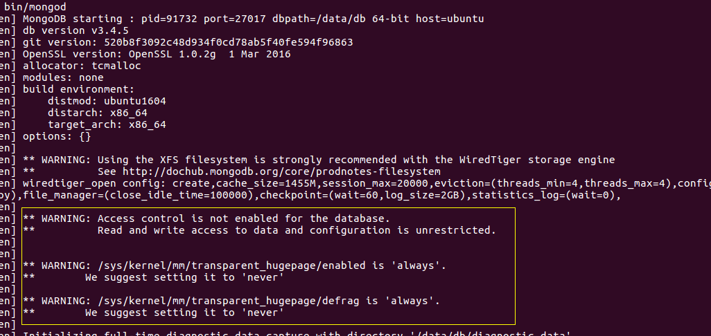

MongoDB安装
==================================================================
`MongoDB`的二进制文件可用于`Linux`、`Mac OS X`、`Windows`和`Solaris`系统。
这意味着在大部分平台中，均可从`http://www.mongodb.org/downloads`下载一份代码，
解压并运行二进制文件。

`MongoDB`的运行需要一个 **目录** 来写入数据库文件，并需要一个 **端口** 来监听连接。

提及“安装`MongoDB`”时，我们通常指的是对 **`mongod`** 进行配置。大多数时候，**`mongod`是我们
使用的`MongoDB`进程**。

### 选择一个版本
`MongoDB`所使用的版本管理相当简单：**偶数号为稳定版，奇数号为开发版**。例如，以`2.4`开头的版本都是稳定版，
如：`2.4.0`、`2.4.1`、`2.4.15`。以`2.5`开头的则是开发版，如：`2.5.0`、`2.5.2`和`2.5.10`。
**若在生产环境中运行，则应该使用稳定版本**。

### 在POSIX系统（Linux、Mac OS X、Solaris）中安装
**必须创建一个目录以便数据库写入文件。数据库会默认使用`/data/db`目录，也可指定其他目录**。如建立了默认目录，
则应 **确保拥有正确的写权限**。可通过如下命令，创建目录并设置权限：
```shell
$ mkdir -p /data/db
$ chown -R $USER:$USER /data/db
```
如有必要，可使用`mkdir -p`命令，建立指定目录及所有父目录（例如，如果`/data`目录不存在，则会先建立`/data`目录，
然后再建立`/data/db`目录）。使用`chown`命令，可改变`/data/db`的所有权，以便实现用户对其的写入。当然，
也可在`home`文件夹中建立一个目录，并在启动数据库时指定其作为`MongoDB`的数据目录，从而避开权限问题。

将从`http://www.mongodb.org`下载的`.tar.gz`文件解压缩。
```shell
$ tar zxf mongodb-linux-x86_64-ubuntu1604-3.4.5.tgz
$ cd mongodb-linux-x86_64-ubuntu1604-3.4.5/
```
现在可启动数据库：
```shell
$ bin/mongod
```
启动日志，如下：



**注：目录有三个警告，还不了解，后面再说**！！！！

如果想改变数据库的位置，可使用 **`--dbpath`选项** 指定位置，例如：
```shell
$ bin/mongod --dbpath ~/db
```
有关最常用的选项内容，也可运行 **`mongod --help`** 来查看所有选项。


