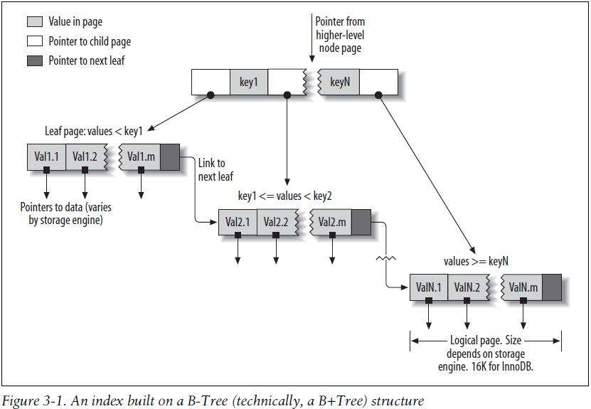
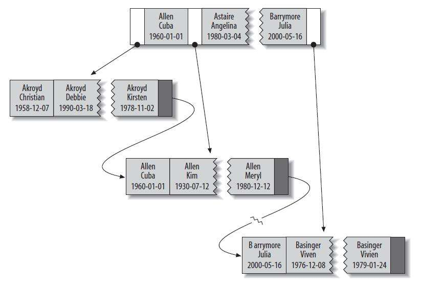

索引的类型
================================================================================
**索引有很多种类型**，可以为不同的场景提供更好的性能。**在MySQL中，索引是在存储引擎层** 而不是
服务器层实现的。所以，并没有统一的索引标准：不同存储引擎的索引的工作方式并不一样，也不是所有的存储
引擎都支持所有类型的索引。即使多个存储引擎支持同一种类型的索引，其底层的实现也可能不同。

## B-Tree索引
**当人们谈论索引的时候，如果没有特别指明类型，那多半说的是B-Tree索引**，它使用 **B-Tree数据结
构** 来存储数据。大多数MySQL引擎都支持这种索引。**Archive引擎是一个例外**：5.1之前Archive不支
持任何索引，直到`5.1`才开始支持单个自增列（AUTO INCREMENT）的索引。

我们使用术语“**B-Tree**”，是因为MySQL在`CREATE TABLE`和其他语句中也使用该关键字。不过，**底
层的存储引擎也可能使用不同的存储结构**，例如，`NDB`集群存储引擎内部实际上使用了`T-Tree`结构存储
这种索引，即使其名字是`BTREE`，**InnoDB则使用的是B+Tree**。

存储引擎以不同的方式使用`B-Tree`索引，性能也各有不同，各有优劣。例如，**MyISAM** 使用 **前缀压
缩技术** 使得索引更小，但 **InnoDB则按照原数据格式进行存储**。再如`MyISAM`索引通过数据的物理位
置引用被索引的行，而 **InnoDB则根据主键引用被索引的行**。

**B-Tree通常意味着所有的值都是按顺序存储的，并且每一个叶子页到根的距离相同**。



**上图大致反映了InnoDB索引是如何工作的**。MyISAM使用的结构有所不同，但基本思想是类似的。

`B-Tree`索引能够加快访问数据的速度，因为存储引擎不再需要进行全表扫描来获取需要的数据，取而代之的是
**从索引的根节点（图中并未画出）开始进行搜索。根节点的槽中存放了指向子节点的指针，存储引擎根据这些
指针向下层查找。通过比较节点页的值和要查找的值可以找到合适的指针进入下层子节点，这些指针实际上定义了
子节点页中值的上限和下限。最终存储引擎要么是找到对应的值，要么该记录不存在。叶子节点比较特别，它们
的指针指向的是被索引的数据，而不是其他的节点页（不同引擎的“指针”类型不同）**。上图中仅绘制了一个节点
和其对应的叶子节点，**其实在根节点和叶子节点之间可能有很多层节点页。树的深度和表的大小直接相关**。

**B-Tree对索引列是顺序组织存储的，所以很适合查找范围数据**。例如，在一个基于文本域的索引树上，按字
母顺序传递连续的值进行查找是非常合适的，所以像“找出所有以`I`到`K`开头的名字”这样的查找效率会非常高。

假如有如下数据表：
```sql
CREATE TABLE Perple (
    last_name varchar(50) not null,
    first_name varchar(50) not null,
    dob date not null,
    gender enum('m', 'f') not null,
    key(last_name, first_name, dob)
);
```
对于表中的每一行数据，索引中包含了last_name、first_name和dob列的值，下图显示了该索引是如何组织
数据的存储的：



请注意，**索引对多个值进行排序的依据是CREATE TABLE语句中定义索引时列的顺序**。看一下最后两个条目，
两个人的姓和名都一样，则根据他们的出生日期来排列顺序。

**可以使用B-Tree索引的查询类型。B-Tree索引适用于全键值、键值范围或键前缀查找**。其中 **键前缀查找**
只适用于根据 **最左前缀** 的查找。

**前面所述的索引对如下类型的查询有效**。

### 1.全值匹配
**全值匹配指的是和索引中的所有列进行匹配**，例如前面提到的索引可用于查找姓名为`Cuba Allen`、出生
于`1960-01-01`的人。

### 2.匹配最左前缀
前面提到的索引可用于查找所有 **姓** 为`Allen`的人，**即只使用索引的第一列（last_name）**。

### 3.匹配列前缀
也可以 **只匹配某一列的值的开头部分**。例如前面提到的索引可用于查找所有以J开头的 **姓** 的人。
**这里也只使用了索引的第一列**。

### 4.匹配范围值
例如前面提到的索引可用于查找 **姓** 在Allen和Barrymore **之间** 的人。**这里也只使用了索引的
第一列**。

### 5.精确匹配某一列并范围匹配另外一列
前面提到的索引也可用于查找所有 **姓** 为Allen，并且 **名字** 是字母K **开头**（比如Kim、Karl等）
的人。**即第一列last_name全匹配，第二列first_name范围匹配**。

### 6.只访问索引的查询
**B-Tree通常可以支持“只访问索引的查询”，即查询只需要访问索引，而无须访问数据行**。后面我们将单独
讨论这种“**覆盖索引**”的优化。

**因为索引树中的节点是有序的，所以除了按值查找之外，索引还可以用于查询中的ORDER BY操作（按顺序查找）**。
一般来说，**如果B-Tree可以按照某种方式查找到值，那么也可以按照这种方式用于排序**。所以，**如果
ORDER BY子句满足前面列出的几种查询类型，则这个索引也可以满足对应的排序需求**。

下面是一些 **关于B-Tree索引的限制**：
+ **如果不是按照索引的最左列开始查找，则无法使用索引**。例如上面例子中的索引无法用于查找 **名字**
为`Bill`的人，也无法查找某个特定 **生日** 的人，因为 **这两列都不是最左数据列**。类似地，也无法
查找 **姓氏** 以某个字母 **结尾** 的人。
+ **不能跳过索引中的列**。也就是说，前面所述的索引无法用于查找姓为Smith并且在某个特定日期出生的
人（**注：跳过了名字直接使用出生日期了**）。如果不指定名（`first_name`），则MySQL **只能使用索
引的第一列**。
+ **如果查询中有某个列的范围查询，则其右边所有列都无法使用索引优化查找**。例如有查询
`WHERE last_name = 'Smith' AND first_name LIKE 'J%' AND dob = '1976-12-23'`，**这个
查询只能使用索引的前两列**，因为这里LIKE是一个范围条件（但是服务器可以把其余列用于其他目的）。
**如果范围查询列值的数量有限，那么可以通过使用多个等于条件来代替范围条件**。

到这里读者应该可以明白，前面提到的 **索引列的顺序是多么的重要**：这些限制都和索引列的顺序有关。**在优
化性能的时候，可能需要使用相同的列但顺序不同的索引来满足不同类型的查询需求**。

**也有些限制不是B-Tree本身导致的**，而是MySQL优化器和存储引擎使用索引的方式导致的，这部分限制在未
来的版本中可能就不再是限制了。

## 哈希索引
未完待续......

## 空间数据索引（R-Tree）
未完待续......

## 全文索引
未完待续......

## 其他索引类别
未完待续......
