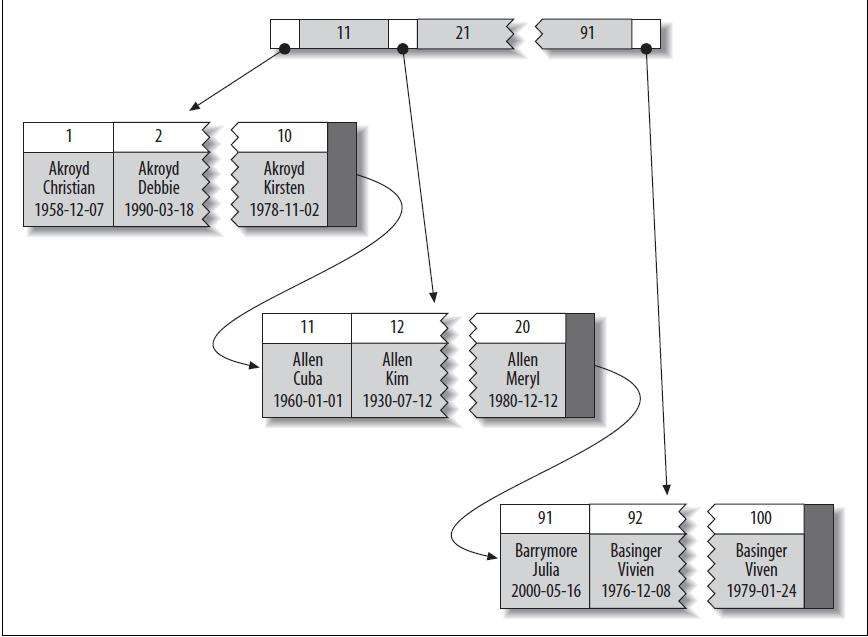

聚簇索引
================================================================================
**聚簇索引并不是一种单独的索引类型，而是一种数据存储方式**。具体的细节依赖于其实现方式，**但InnoDB
的聚簇索引实际上在同一个结构中保存了B-Tree索引和数据行**。

**当表有聚簇索引时，它的数据行实际上存放在索引的叶子页（leaf page）中**。术语“**聚簇**”表示 **数
据行和相邻的键值紧凑地存储在一起**。因为无法同时把数据行存放在两个不同的地方，**所以一个表只能有一个
聚簇索引**（不过，**覆盖索引可以模拟多个聚簇索引** 的情况，本章后面将详细介绍）。

因为是存储引擎负责实现索引，因此不是所有的存储引擎都支持聚簇索引。本节我们主要关注`InnoDB`，但是这里
讨论的 **原理对于任何支持聚簇索引的存储引擎都是适用的**。

下图展示了聚簇索引中的记录是如何存放的。注意到，**叶子页包含了行的全部数据，但是节点页只包含了索引列**。
**在这个案例中，索引列包含的是整数值**。

一些数据库服务器允许选择哪个索引作为聚簇索引，但直到本书写作之际，还没有任何一个MySQL内建的存储引擎
支持这一点。**InnoDB将通过主键聚集数据，这也就是说上图中的“被索引的列”就是主键列**。

**如果没有定义主键，InnoDB会选择一个唯一的非空索引代替。如果没有这样的索引，InnoDB会隐式定义一个主
键来作为聚簇索引**。InnoDB只聚集在同一个页面中的记录。包含相邻键值的页面可能会相距甚远。

**聚簇主键可能对性能有帮助，但也可能导致严重的性能问题**。所以需要仔细考虑聚簇索引，尤其是将表的存储
引擎从InnoDB改成其他引擎的时候（反过来也一样）。

**聚集的数据** 有一些重要的 **优点**：
+ **可以把相关数据存储在一起**。例如实现电子邮箱时，可以根据用户ID来聚集数据，这样只需要从磁盘读取
少数的数据页就能获取某个用户的全部邮件。**如果没有使用聚簇索引，则每封邮件都可能导致一次磁盘I/O**。
+ **数据访问更快。聚簇索引将索引和数据保存在同一个`B-Tree`中**，因此从聚簇索引中获取数据通常比在非
聚簇索引中查找更快。
+ **使用覆盖索引扫描的查询可以直接使用页节点中的主键值**。

dd
