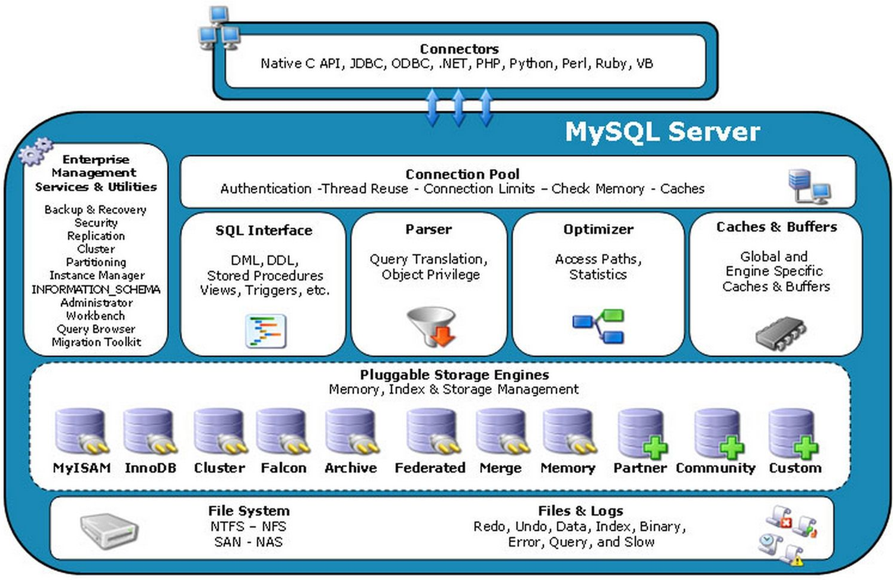

MySQL的基础架构和版本
================================================================================
## 1.MySQL的基础架构
数据库产品的架构一般可以分为 **应用层、逻辑层、物理层**，对于MySQL，同样可以理解为如下的3个层次。

### 1.1.应用层
负责和客户端、用户进行交互，需要和不同的客户端和中间服务器进行交互，建立连接，记住连接的状态，响应
它们的请求，返回数据和控制信息（错误信息、状态码等）。

### 1.2.逻辑层
负责具体的 **查询处理、事务管理、存储管理、恢复管理**，以及其他的附加功能。查询处理器负责查询的解析、
执行。当接收到客户端的查询时，**数据库就会分配一个线程来处理它。先由查询处理器（优化器）生成执行计划，
然后交由计划执行器来执行，执行器有时需要访问更底层的事务管理器、存储管理器来操作数据，事务管理器、存储
管理器主要负责事务管理、并发控制、存储管理。这其中，将由事务管理器来确保“`ACID`”特性，通过锁管理器来
控制并发，由日志管理器来确保数据持久化，存储管理器一般还包括一个缓冲管理器，由它来确定磁盘和内存缓冲之
间的数据传输**。

### 1.3.物理层
实际物理磁盘（存储）上的数据库文件，比如，数据文件、日志文件等。

### MySQL官方基础架构图

其中`Connetors`可以理解为各种客户端、应用服务器；`Connection Pool`可以理解为应用层，负责连接、
验证等功能；`Management Services & Utilities`、`SQL Interface`、`Parser`、`Optimizer`、
`Caches & Buffers`、`Pluggable Storage Engines`可以理解为数据库的大脑——逻辑层；最下方的
`Files & Logs`可以理解为物理层。

## 2.MySQL的版本及特性

### 2.1.MySQL许可协议
`Oracle`以 **双重授权** 的方式发布`MySQL`，它们是 **`GPL`** 和 **商业许可协议**。
如果你在一个遵循`GPL`的自由（开源）项目中使用`MySQL`，那么你可以遵循`GPL`协议使用`MySQL`，无论
是否将其用作商用。

如果某些商业软件中结合了`MySQL`或修改了`MySQL`源码，但又不愿意按`GPL`协议公开软件源码，那么就必须
和`Oracle`公司达成商业许可协议。

需要注意的是，**`GPL`只限制了对外分发的软件，也就是说，如果该软件只在内部使用，无论开不开源都没有关
系**。如何使用开源软件并不受`GPL`的约束，只有在你基于开源软件，修改开源软件的源码时才受`GPL`约束，
**如果你的应用程序只是用到了`MySQL`，无论是否商用，都不需要考虑开源**。

### 2.2.MySQL版本
`MySQL`目前可分为4个版本：**`MySQL`社区版、`MySQL`标准版、`MySQL`企业版、`MySQL`集群版**。

#### 2.2.1.MySQL社区版
可免费下载使用的开源版本，遵循`GPL`协议，包括如下的这些特性。
+ **可插拔的存储引擎架构**
+ **多存储引擎支持`InnoDB`、`MyISAM`、`NDB`（`MySQL Cluster`即采用`NDB`存储引擎）、`Memory`、
`Merge``Archive`、`CSV`等**
+ **复制**
+ **分区**
+ **存储过程、触发器、视图**
+ **信息数据库（`Information-Schema`）**
+ **MySQL连接器**
+ **MySQL工作台（`MySQL Workbench`）**

目前已经发布了`MySQL5.0`、`MySQL5.1`、`MySQL5.5`、`MySQL5.6`、`MySQL5.7`一共5个GA版本。
一般来说，后面的版本比前面的版本功能更强，扩展性更好。

以下3个版本是给商业用户使用的，商业客户可灵活选择多个版本，以满足特殊的商业和技术需求。

#### 2.2.2.MySQL标准版
和社区版差别不大，提供社区版所支持的各种特性。

#### 2.2.3.MySQL企业版
`MySQL`企业版提供7*24小时的技术支持服务，用户可直接联系`MySQL`专业支持工程师，获取关于`MySQL`应
用程序开发、部署和管理的全方位支持。

`MySQL`企业版提供了更全面的高级功能、管理工具和技术支持，例如：`MySQL`企业级备份可为数据库提供在线
“热”备份，从而降低数据丢失的风险。它支持完全、增量和部分备份，以及时间点恢复和备份压缩。

`MySQL`线程池提供了一个高效的线程处理模型，旨在降低客户端连接和语句执行线程的管理开销。

`MySQL`企业级安全性提供了一些立即可用的外部身份验证模块，可将`MySQL`轻松集成到现有的安全基础架构中。

其他特性还有`MySQL`企业级审计、`MySQL`企业级监视器和`MySQL`查询分析器等。

`MySQL`的一些新特性出现在了企业版中，但并没有出现在社区版，这导致很多人对于`MySQL`产生了疑虑，但
`MySQL`的生态已经建立成熟，官方版本和其他分支也都在稳定地发展改进中，**一般的中小公司选择社区版即可**。
一些行业、领域要求更好的服务，更高的稳定性，或者有其他复杂的业务需求，对于它们企业版是一个很好的选择。

#### 2.2.4.MySQL集群版
`Oracle`收购`MySQL`之后，对`MySQL Cluster`做了大量改进，这也是`Oracle`力推的产品。集群版是一种
分布式、无共享（`share-nothing`）的架构，也就是说把数据分布在各个节点的内存里。据官方宣称，集群版可
比单机数据库提供更高的可用性，高达99.99%。它还有一些好处，比如自动分片、动态添加节点、支持跨IDC复制、
减少维护成本等。但这个产品比较复杂，国内也缺少精通`MySQL Cluster`的专家，如果一定要使用，建议做好充
分的测试验证工作。

据说现在的`MySQL Cluster`版本已经允许存储部分数据到硬盘上，**但由于主要数据需要存放在内存中**，因此
其部署成本会比较高。另外，随着`MySQL Cluster`节点的增多，节点之间通信、同步的代价也越来越大，所以其
扩展性也是有限的。**对于海量数据，`MySQL Cluster`可能不是很好的方案，从理论上来讲，仅仅把热点数据加
载到内存是更经济的做法**。
