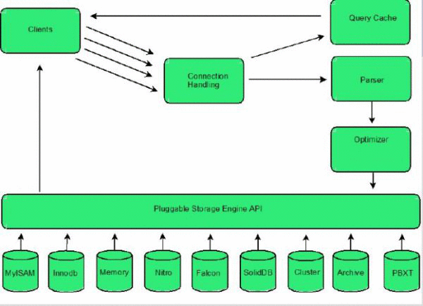

查询执行过程概述
================================================================================

如图所示，客户端（`Clients`）发布查询的流程如下，**首先连接`MySQL`（`Connection Handling`），
然后发布查询，如果缓存（`Query Cache`）中有结果集，则直接返回结果集。如果结果没有被缓存，那么，
`MySQL`解析查询（`Parser`）将通过优化器（`Qptimizer`）生成执行计划，然后运行执行计划通过API
（`Pluggable Storage Engine API`）从存储引擎获取数据，并返回给客户端**。

**什么是执行计划（查询计划 ）呢？执行计划就是一系列的操作步骤。`SQL`是声明性语言，它只告诉数据库
要查询什么，但并不告诉数据库如何去查。数据库所要做的就是基于算法和统计信息计算出一条最佳的访问路径。
这个工作是由优化器来完成的。优化器会比较不同的执行计划，然后选择其中最优的一套**。
