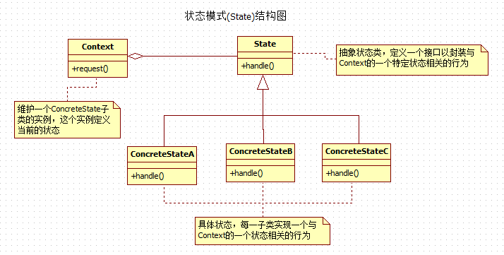

用State替换状态改变条件语句（状态模式）
========================================================================

### 动机
**重构实现`State`模式的主要原因，是为了对付过度复杂的状态改变条件逻辑。这种逻辑往往散布在整个类中，
控制对象的状态以及状态之间的转换**。在实现`State`模式的时候，需要创建代表对象特殊状态和状态间转换的类。
在《设计模式》中，**包含状态改变的对象称为上下文**。上下文会 **把状态相关的行为委托到状态对象上**。
通过使上下文引用不同的状态对象，状态对象可以在运行时实现状态转换。 
```
State和Strategy不同。State模式作用于必须能够很方便地在一系列状态类的实例间转换的类，而Strategy模式
作用于把算法的执行委托到一系列策略类的实例的类。由于这种差异，重构到这两种模式的动机和做法也不尽相同。
```

### 优点与缺点
+ (＋)减少或去除状态改变条件逻辑；
+ (＋)简化了复杂的状态改变逻辑；
+ (＋)提供了观察状态改变逻辑的很好的鸟瞰图；
+ (－)当状态转换逻辑已经易于理解的时候，会增加设计的复杂度；

### 做法



这里以一个贴近现实生活的例子来展示如何使用该设计模式。例子，某人去银行新开一个帐户，该帐户可以用来存钱或者取钱，
我们可以以帐户中的总资金来判断显示某用户帐户的状态：红色状态（`RedState`）、银色状态（`SliverState`）、
金色状态（`GoldState`）。其实就好比银行中根据我们存储卡中的资金来给客户某种身份的识别，例如普通用户、VIP用户、
公司客户...等等。

