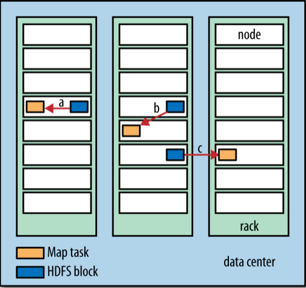
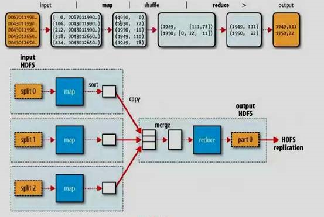
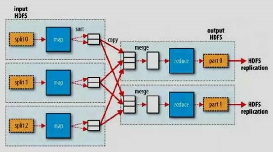
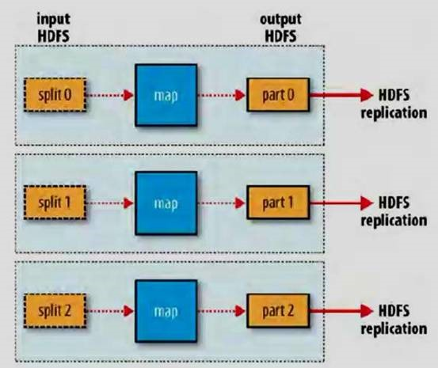

横向扩展
================================================================================
**为了实现横向扩展，我们需要把数据存储在分布式文件系统中（典型的为HDFS）。通过使用Hadoop资源管
理系统YARN，Hadoop可以将MapReduce计算转移到存储有部分数据的各台机器上**。

## 数据流
**MapReduce作业（job）** 是客户端需要执行的一个工作单元：它包括 **输入数据、MapReduce程序和
配置信息**。**Hadoop将作业分成若干个任务（task）来执行**，其中包括两类任务：**map任务** 和
**reduce任务**。这些任务运行在集群的节点上，并通过YARN进行调度。**如果一个任务失败，它将在另一
个不同的节点上自动重新调度运行**。

Hadoop将MapReduce的 **输入数据划分成等长的小数据块**，称为输入分片（input split）或简称“
**分片**”。**Hadoop为每个分片构建一个map任务，并由该任务来运行用户自定义的map函数** 从而处理
分片中的每条记录。

拥有许多分片，意味着处理每个分片所需要的时间少于处理整个输入数据所花的时间。因此，**如果我们并行
处理每个分片，且每个分片数据比较小，那么整个处理过程将获得更好的负载平衡**，因为一台较快的计算机
能够处理的数据分片比一台较慢的计算机更多，且成一定的比例。即使使用相同的机器，失败的进程或其他并
发运行的作业能够实现满意的负载平衡，并且随着分片被切分得更细，负载平衡的质量会更高。

另一方面，**如果分片切分得太小，那么管理分片的总时间和构建map任务的总时间将决定作业的整个执行时
间**。对于大多数作业来说，**一个合理的分片大小趋向于HDFS的一个块的大小，默认是128MB**，不过可
以针对集群调整这个默认值（对所有新建的文件），或在每个文件创建时指定。

**Hadoop在存储有输入数据（HDFS中的数据）的节点上运行map任务，可以获得最佳性能，因为它无需使用
宝贵的集群带宽资源**。这就是所谓的“**数据本地化优化**”。但是，**有时对于一个map任务的输入分片来
说，存储该分片的HDFS数据块复本的所有节点可能正在运行其他map任务，此时作业调度需要从某一数据块所
在的机架中的一个节点上寻找一个空闲的map槽（slot）来运行该map任务分片。仅仅在非常偶然的情况下（
该情况基本上不会发生），会使用其他机架中的节点运行该map任务，这将导致机架与机架之间的网络传输**。
见下图：



**现在我们应该清楚为什么最佳分片的大小应该与块大小相同：因为它是确保可以存储在单个节点上的最大输
入块的大小。如果分片跨越两个数据块，那么对于任何一个HDFS节点，基本上都不可能同时存储这两个数据块，
因此分片中的部分数据需要通过网络传输到map任务运行的节点**。与使用本地数据运行整个map任务相比，
这种方法显然效率更低。
```
我的疑问：

为什么任何一个HDFS节点基本上都不可能同时存储两个数据块？？？？？？？？？？？？？？？？？？？？
```

**map任务将其输出写入本地硬盘，而非HDFS。这是为什么？因为map的输出是中间结果：该中间结果由reduce
任务处理后才产生最终输出结果，而且一旦作业完成，map的输出结果就可以删除。因此，如果把它存储在HDFS
中并实现备份，难免有些小题大做。如果运行map任务的节点在将map中间结果传送给reduce任务之前失败，
Hadoop将在另一个节点上重新运行这个map任务以再次构建map中间结果**。

**reduce任务并不具备数据本地化的优势，单个reduce任务的输入通常来自于所有mapper的输出**。在本
例中，我们仅有一个reduce任务，其输入是所有map任务的输出。因此，**排过序的map输出需通过网络发送
到运行reduce任务的节点。数据在reduce端合并，然后由用户定义的reduce函数处理**。reduce的输出通
常存储在HDFS中以实现可靠存储。**对于reduce输出的每个HDFS块，第一个复本存储在本地节点上，其他复
本出于可靠性考虑存储在其他机架的节点中**。因此，**将reduce的输出写入HDFS确实需要占用网络带宽**，
但这与正常的HDFS管线写入的消耗一样。

**一个reduce任务** 的完整数据流如下图：



虚线框表示节点，虚线箭头表示节点内部的数据传输，而实线箭头表示不同节点之间的数据传输。

**reduce任务的数量并非由输入数据的大小决定，相反是独立指定的**。后面章节会介绍如何为指定的作业
选择reduce任务的数量。

**如果有好多个reduce任务，每个map任务就会针对输出进行分区（partition），即为每个reduce任务建
一个分区。每个分区有许多键（及其对应的值），但每个键对应的键-值对记录都在同一分区中。分区可由用户
定义的分区函数控制，但通常用默认的partitioner通过哈希函数来分区，很高效**。

一般情况下，**多个reduce任务** 的数据流如下图：



该图清楚地表明了 **为什么map任务和reduce任务之间的数据流称为shuffle（混洗），因为每个reduce
任务的输入都来自许多map任务**。shuffle一般比图中所示的更复杂，**而且调整混洗参数对作业总执行时
间的影响非常大**。

最后，**当数据处理可以完全并行（即无需混洗时），可能会出现无reduce任务的情况**，见下图：



在这种情况下，唯一的非本地节点数据传输是map任务将结果写入HDFS。

## combiner函数
**集群上的可用带宽限制了MapReduce作业的数量，因此尽量避免map和reduce任务之间的数据传输是有利
的。Hadoop允许用户针对map任务的输出指定一个combiner（就像mapper和reducer一样），combiner
函数的输出作为reduce函数的输入。由于combiner属于优化方案，所以Hadoop无法确定要对一个指定的map
任务输出记录调用多少次combiner（如果需要）。换而言之，不管调用combiner多少次，0次、1次或多次，
reduce的输出结果都是一样的**。

**combiner的规则制约着可用的函数类型**。这里最好用一个例子来说明。还是假设以前计算最高气温的例
子，1950年的读数由两个map任务处理（因为它们在不同的分片中）。假设第一个map的输出如下：
```
(1950, 0)
(1950, 20)
(1950, 10)
```
第二个map的输出如下：
```
(1950, 25)
(1950, 15)
```
reduce函数被调用时，输入如下：
```
(1950, [0, 20, 10, 25, 15])
```
因为25为该列数据中最大的，所以它的输出如下：
```
(1950, 25)
```
我们可以像使用reduce函数那样，**使用combiner找出每个map任务输出结果中的最高气温**。如此一来，
reduce函数调用时将被传入
以下数据：
```
(1950, [20, 25])
```
reduce输出的结果和以前一样。更简单地说，我们可以通过下面的表达式来说明气温数值的函数调用：
```
max(0, 20, 10, 25, 15) = max(max(0, 20, 10), max(25, 15)) = max(20, 25) = 25
```
并非所有函数都具有该属性。例如，如果我们计算平均气温，就不能用求平均函数mean作为我们的combiner
函数，因为：
```
mean(0, 20, 10, 25, 15) = 14
```
但是又有：
```
mean(mean(0, 20, 10), mean(25, 15)) = mean(10, 20) = 15
```
**combiner函数不能取代reduce函数。为什么呢？我们仍然需要reduce函数来处理不同map输出中具有相
同键的记录。但combiner函数能帮助减少mapper和reduce之间的数据传输量，因此，单纯就这点而言，在
MapReduce作业中是否使用combiner函数还是值得斟酌的**。

### 指定一个combiner
让我们回到Java MapReduce程序，combiner是通过Reducer类来定义的，并且在这个例子中，它的实现与
MaxTemperatureReducer中的reduce函数相同。唯一的改动是在Job中设置combiner类：
```java
//用combiner函数快速找出最高气温
public class MaxTemperatureWithCombiner {
    public static void main(String[] args) throws Exception {
        if(args.length != 2) {
            System.err.println("Usage: MaxTemperatureWithCombiner <input path> " + "<output path>");
            System.exit(-1);
        }

        Job job = new Job();
        job.setJarByClass(MaxTemperatureWithCombiner.class);
        job.setJobName("Max temperature");

        FileInputFormat.addInputPath(job, new Path(args[0]));
        FileOutputFormat.setOutputPath(job, new Path(args[1]));

        job.setMapperClass(MaxTemperatureMapper.class);
        //注意这一句，combiner是通过Reducer类来定义的
        job.setCombinerClass(MaxTemperatureReducer.class);
        job.setReducerClass(MaxTemperatureReducer.class);

        job.setOutputKeyClass(Text.class);
        job.setOutputValueClass(IntWritable.class);

        System.exit(job.waitForCompletion(true) ? 0 : 1);
    }
}
```

## 运行分布式的MapReduce作业
这个程序用不着修改便可以在一个完整的数据集上直接运行。这是MapReduce的优势：**它可以根据数据量的
大小和硬件规模进行扩展**。
