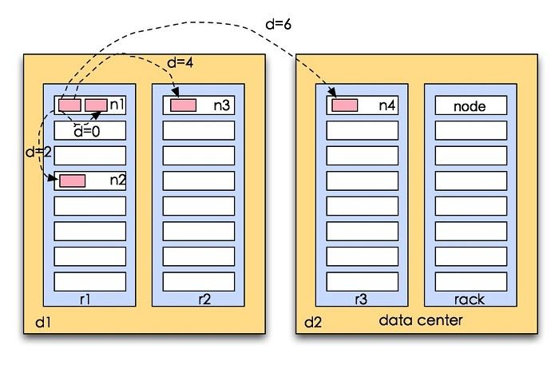

数据流
================================================================================
## 1.剖析文件读取
为了了解客户端及与之交互的HDFS、namenode和datanode之间的数据流是什么样的，我们可以 参考下图，
该图显示了在读取文件时事件的发生顺序。

客户端通过调用 *FileSystem* 对象的 *open()* 方法来打开希望读取的文件，对于HDFS来说，这个对
象是：*DistributedFileSystem* 的一个实例（**步骤1**）。*DistributedFileSystem* 通过使
用远程过程调用（*RPC*）来调用 *namenode*，以确定文件起始块的位置（**步骤2**）。对于每一个块，
*namenode* 返回存在该块副本的 *datanode* 地址。此外，这些 *datanode* 根据它们与客户端的距
离来排序（**根据集群的网络拓扑**）。如果该客户端本身就是一个 *datanode*（比如，在一个
*MapReduce* 任务中），那么该客户端将会从保存有相应数据块复本的本地 *datanode* 读取数据。


*DistributedFileSystem* 类返回一个 *FSDataInputStream* 对象（一个支持文件定位的输入流）
给客户端以便读取数据。*FSDataInputStream* 类转而封装 *DFSInputStream* 对象，该对象管理着
*datanode* 和 *namenode* 的`I/O`。

接着，客户端对这个输入流调用 *read()* 方法（**步骤3**）。存储着文件起始几个块的 *datanode*
地址的 *DFSInputStream* 随即连接距离最近的文件中第一个块所在的 *datanode*。通过对数据流反复
调用 *read()* 方法，可以将数据从 *datanode* 传输到客户端（**步骤4**）。到达块的末端时，
*DFSInputStream* 关闭与该 *datanode* 的连接，然后寻找下一个块的最佳 *datanode*（**步骤5**）。
所有这些对于客户端都是透明的，在客户看来它一直在读取一个连续的流。

客户端从流中读取数据时，块是按照打开 *DFSInputStream* 与 *datanode* 新建连接的顺序读取的。
它也会根据需要询问 *namenode* 来检索下一批数据块的 *datanode* 的位置。一旦客户端完成读取，就
对 *FSDataInputStream* 调用 *close()* 方法（**步骤6**）。

在读取数据的时候，如果 *DFSInputStream* 在与 *datanode* 通信时遇到错误，会尝试从这个块的另
外一个最邻近 *datanode* 读取数据。它也记住那个故障 *datanode*，以保证以后不会反复读取该节点
上后续的块。*DFSInputStream* 也会通过校验和确认从 *datanode* 发来的数据是否完整。如果发现有
损坏的块，*DFSInputStream* 会试图从其他 *datanode* 读取其复本，也会将被损坏的块通知给
*namenode*。

这个设计的一个重点是，客户端可以直接连接到 *datanode* 检索数据，且 *namenode* 告知客户端每个
块所在的最佳 *datanode*。由于数据流分散在集群中的所有 *datanode*，所以这种设计能使HDFS扩展到
大量的并发客户端。同时 *namenode* 只需要响应块位置的请求（这些信息存储在内存中，因而非常高效），
无需响应数据请求，否则随着客户端数量的增长，*namenode* 会很快成为瓶颈。
```
网络拓扑与Hadoop

在本地网络中，两个节点被称为“彼此近邻”是什么意思？在海量数据处理中，其主要限制因素是节点之间数据的传输速率————带宽很稀
缺。这里的想法是将两个节点间的带宽作为距离的衡量标准。
不用衡量节点之间的带宽，实际上很难实现（它需要一个稳定的集群，并且在集群中两两节点对数量是节点数量的平方），Hadoop为此
采用一个简单的方法：把网络看作一棵树，两个节点间的距离是它们到最近共同祖先的距离总和。该树中的层次是没有预先设定的，但是
相对于数据中心、机架和正在运行的节点，通常可以设定等级。具体想法是针对以下每个场景，可用带宽依次递减：

+ 同一节点上的进程
+ 同一机架上的不同节点
+ 同一数据中心中不同机架上的节点
+ 不同数据中心中的节点

例如，假设有数据中心d1、机架r1、节点n1，该节点可以表示为：/d1/r1/n1。利用这种标记，这里给出四种距离描述：

- distance(/d1/r1/n1, /d1/r1/n1) = 0 （同一节点上的进程）
- distance(/d1/r1/n1, /d1/r1/n2) = 2 （同一机架上的不同节点）
- distance(/d1/r1/n1, /d1/r2/n3) = 4 （同一数据中心中不同机架上的节点）
- distance(/d1/r1/n1, /d2/r3/n4) = 6 （不同数据中心中的节点）
```
下面的示例图是一个测量距离的例子：



最后，我们必须意识到Hadoop无法自动发现你的网络拓扑结构。它需要一些帮助（我们将在10.1.2节的“网
络拓扑”中讨论如何配置网络拓扑）。

## 2.剖析文件写入


dd
