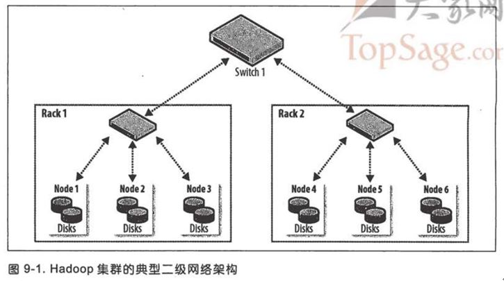

集群规范
=================================================================================
Hadoop运行在商业硬件上。用户可以选择普通硬件供应商生产的标准化的、广泛有效的硬件来构建集群，无需使
用特定供应商生产的昂贵、专有的硬件设备。

硬件规格很快就会过时。但为了举例说明，下面列举一下硬件规格。**在2014年，运行Hadoop的datanode和YARN
节点管理器的典型机器有以下规格**：
+ **处理器，两个六核/八核 3 GHz CPU**
+ **内存，64G～512GB ECC RAM**
+ **存储器，12～24 ＊ 1～4TB  SATA 硬盘**
+ **网络，带链路聚合的千兆以太网**

尽管各个集群采用的硬件规格肯定有所不同，但是Hadoop一般使用多核CPU和多磁盘，以充分利用硬件的强大功能。
```
为何不使用RAID？

尽管建议采用RAID（磁盘阵列）作为namenode的存储器以保护元数据，但是若将RAID作datanode的存储设备则不会给HDFS带来益处。HDFS
所提供的节点间数据复制技术已可满足数据备份需求，无需使用RAID的冗余机制。

此外，尽管RAID条带化技术（RAID 0）被广泛用于提升性能，但是其速度仍然比用在HDFS里的JBOD（Just a Bunch Of Disks）配置慢。
JBOD在所有磁盘之间循环调度HDFS块。RAID 0的读/写操作受限于磁盘阵列中响应最慢的盘片的速度，而JBOD的磁盘操作均独立，因而平均
读/写速度高于最慢盘片的读/写速度。

最后，若JBOD配置的某一磁盘出现故障，HDFS可以忽略该磁盘，继续工作。而RAID的某一盘片故障会导致整个磁盘阵列不可用，进而使相应
节点失败。
```

### 集群规模
一个Hadoop集群到底应该多大？这个问题并无确切的答案。但是，**Hadoop的魅力在于用户可以在初始阶段构建
一个小集群（大约10个节点），并随存储与计算需求增长持续扩充**。从某种意义上讲，更恰当的问题是“**你的
集群需要增长得多快？**”，用户可以通过下面这个关于存储的例子得到更深的体会。

假如数据每天增长1TB。如果采用 **三路HDFS复制技术**，则每天需要增加3TB存储能力。**再加上一些中间文件
和日志文件（约占30％）所需空间**，基本上相当于每周添设一台机器（2014年的典型机器）。实际上，用户一般
不会每周买一台新机器并将其加入集群。类似粗略计算的意义在于让用户了解集群的规模。本例中，一个集群保存两
年的数据大致需要100台机器。

#### Master 节点场景
**集群的规模不同，运行master守护进程的配置也不同**，包括：namenode、辅助namenode、资源管理器及历史
服务器。**对于一个小集群（几十个节点）而言，在一台master机器上同时运行namenode和资源管理器通常是可接
受的（只要至少一份namenode的元数据被另存在远程文件系统中）**。然而，随着集群规模增大，完全有理由分离他们。

**由于namenode在内存中保存整个命名空间中的所有文件元数据和块元数据，其内存需求很大。辅助namenode在大
多数时间里空闲，但是它在创建检查点时的内存需求与主namenode差不多。一旦文件系统包含大量文件，单台机器的
物理内存便无法同时运行主namenode和辅助namenode**。

除了简单的资源需求，在分开的机器上运行master的主要理由是为了 **高可用性**。**HDFS和YARN都支持以主备方
式运行master的配置**。如果主master故障，在不同硬件上运行的备机将接替主机，且几乎不会对服务造成干扰。
在HDFS中，**辅助namenode的检查点功能由备机执行**，所以不需要同时运行备机和辅助namenode。
```
注明：配置和运行Hadoop HA不是本书的内容。
```

### 网络拓扑
Hadoop集群架构通常包含两级网络拓扑，如下图：



一般来说，各机架装配30～40个服务器，共享一个10GB的交换机（该图中各机架只画了3个服务器），各机架的
交换机又通过上行链路与一个核心交换机或路由器（至少为10GB或更高）互联。**该架构的突出特点是同一机架
内部的节点之间的总带宽要远高于不同机架上的节点为间的带宽**。

#### 机架的注意事项
**为了达到Hadoop的最佳性能，配置Hadoop系统以让其了解网络拓扑状况就极为关键**。如果集群 **只包含一
个机架**，就无需做什么，因为这是 **默认配置**。但是对于多机架的集群来说，描述清楚节点-机架的映射关系
就是很有必要。**这使得Hadoop将MapReduce任务分配到各个节点时，会倾向于执行机架内的数据传输（拥有更多
带宽），而非跨机架数据传输**。HDFS还能够更加智能地放置复本（replica），以取得性能和弹性的平衡。


ddd
