namenode配置HA方案
================================================================================
HDFS的namenode的健康关系整个集群是否能正常运行。生产环境中，为了集群的高可用必须开启HA。**社区
版需要手动修改配置文件进行开启**。使用Cloudera Manager只需在界面根据向导执行即可。

## 1.在HDFS界面上操作（选择启用HA）

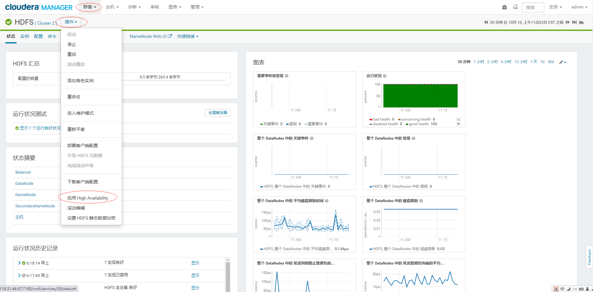

## 2.填写nameservice名称

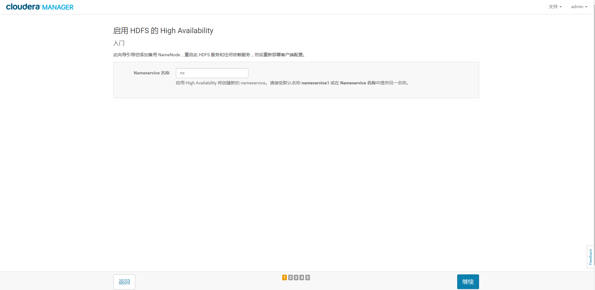

## 3.分配角色

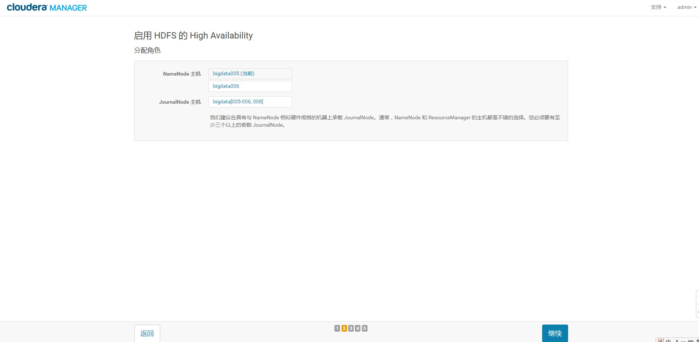

> 注意：这里我用bigdata006作为namenode的standby节点，JournalNode节点有：bigdata005,bigdata006,bigdata008

## 4.审核更改

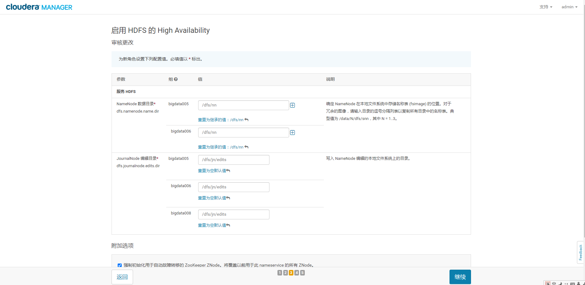

> 注意：这里我把HDFS的数据目录设置为：/dfs/nn，把JournalNode的编辑目录设为：/dfs/jn/edits

## 5.启用High Availability命令

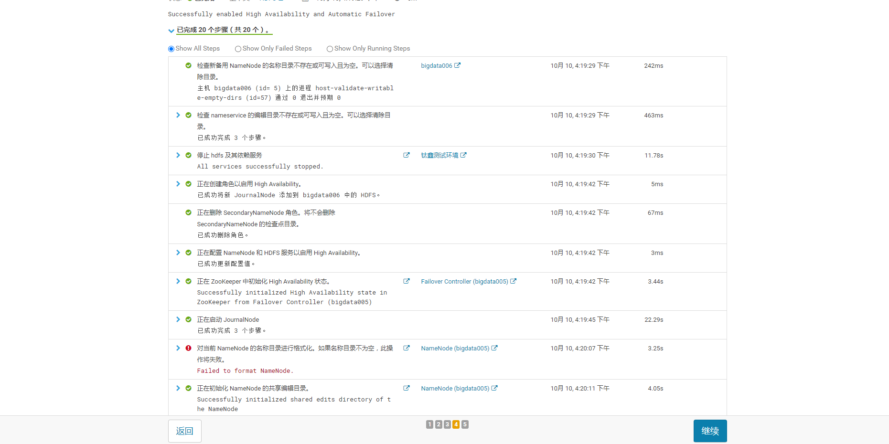

### 5.1.HA方案中经常出现的问题
对当前NameNode（bigdata005）的名称目录进行格式化。**但据观察，发现并没有什么问题！！！！**

**解决：删除data、namenode数据后，重新格式化**。每个节点上删除/dfs/dn目录，/dfs/nn目录 (这
是我当前的配置路径)。这个在结束namenode的HA方案操作后再来调整。

## 6.后续操作 

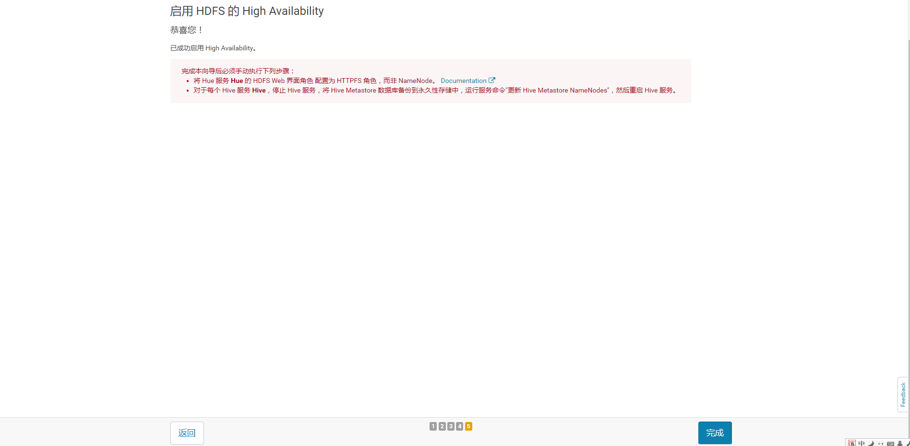

### 6.1.HDFS实例查看

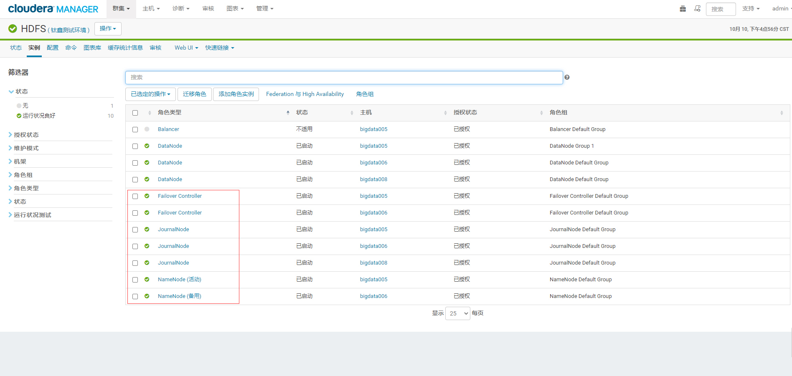

通过实例列表可以看到启用HDFS HA后增加了`NameNode`、`Failover Controller`及`JouralNode`
服务并且服务都正常启动，至此已完成了HDFS HA的启用，接下来进行HDFS HA功能的可用性测试。

### 6.2.CM上HDFS HA的使用（可以通过界面进行手动切换）

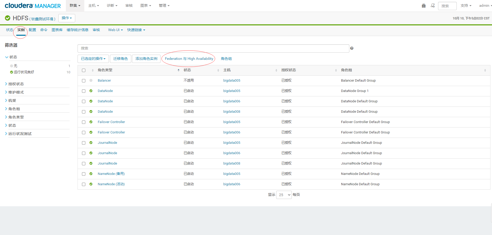

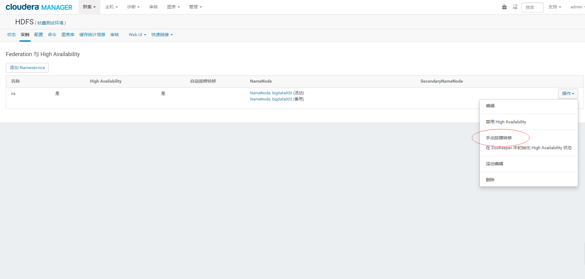

### 6.3.更新Hive MetaStore NameNode

#### 停止Hive的所有服务（以及Hue,oozie）

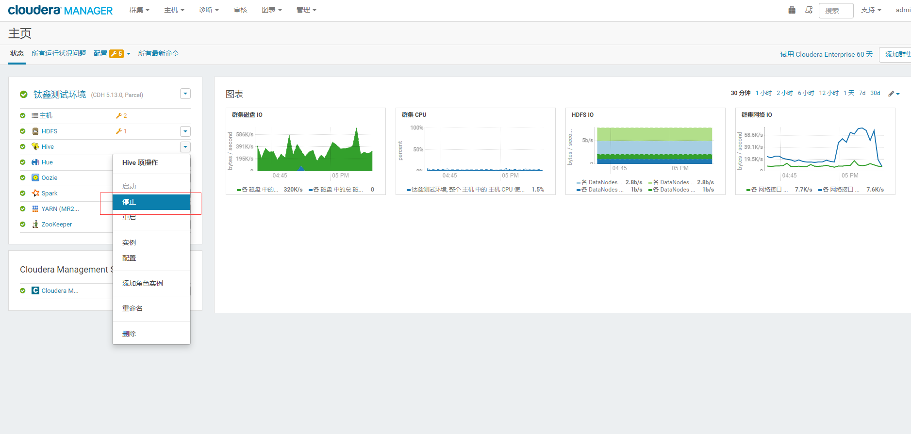

#### 更新Hive Metastore NameNode

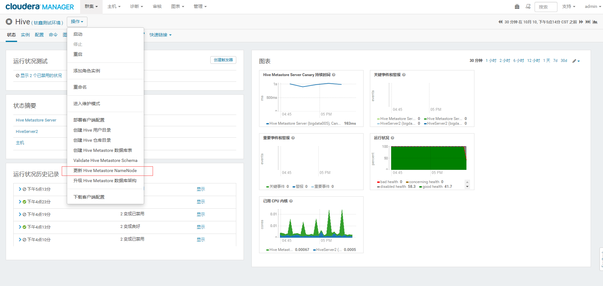

接下来 **启动Hive（以及Hue,oozie）服务**。