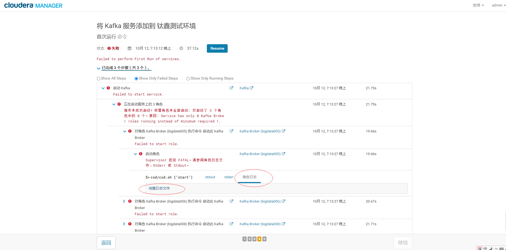
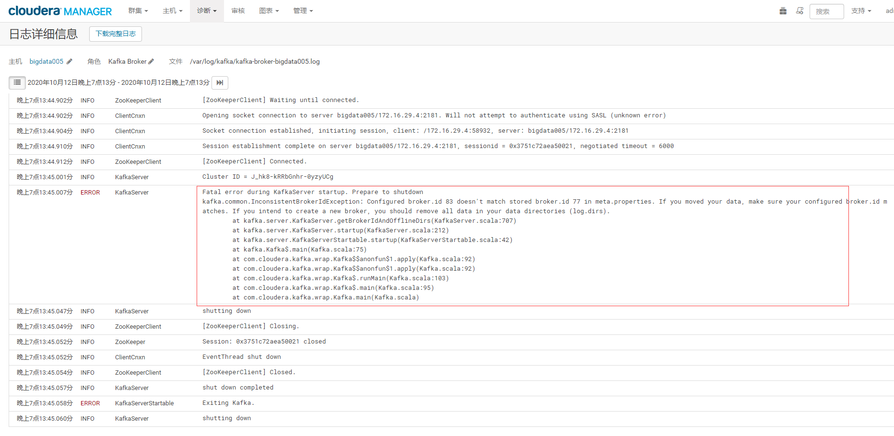
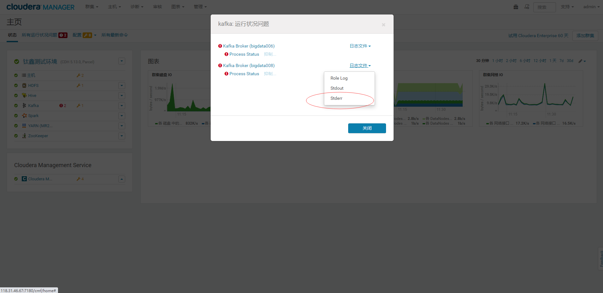

新增Kafka组件
================================================================================
**在3个节点上都部署**

## 1.添加Parcel


**下载**


**分配并激活**


**选择Kafka**


**三个节点都作为broker**


## 2.可能遇到的异常（一）





**异常信息如下**：
```
Fatal error during KafkaServer startup. Prepare to shutdown
kafka.common.InconsistentBrokerIdException: Configured broker.id 83 doesn't match stored broker.id 77 in meta.properties. If you moved your data, make sure your configured broker.id matches. If you intend to create a new broker, you should remove all data in your data directories (log.dirs).
	at kafka.server.KafkaServer.getBrokerIdAndOfflineDirs(KafkaServer.scala:707)
	at kafka.server.KafkaServer.startup(KafkaServer.scala:212)
	at kafka.server.KafkaServerStartable.startup(KafkaServerStartable.scala:42)
	at kafka.Kafka$.main(Kafka.scala:75)
	at com.cloudera.kafka.wrap.Kafka$$anonfun$1.apply(Kafka.scala:92)
	at com.cloudera.kafka.wrap.Kafka$$anonfun$1.apply(Kafka.scala:92)
	at com.cloudera.kafka.wrap.Kafka$.runMain(Kafka.scala:103)
	at com.cloudera.kafka.wrap.Kafka$.main(Kafka.scala:95)
	at com.cloudera.kafka.wrap.Kafka.main(Kafka.scala)
    ......
```

### 2.1.原因
bigdata005节点上的`log.dirs`参数指定的目录（**默认：`/var/local/kafka/data`**）下生成了
`meta.properties`文件，而另外两个节点（bigdata006,bigdata008）上相对应的目录并没有生成
`meta.properties`文件。

查看异常信息：

### 2.2.解决方案
停止Kafka服务，进入到`log.dirs`参数指定的目录（**默认：`/var/local/kafka/data`**）下
删除里面所有的文件（**三个节点都要操作**），再重启Kafka服务。

## 3.可能遇到的异常（二）
经过上面的操作并重启后，还是会报异常！




### 3.1.原因
主要是 **`broker_max_heap_size`** 参数值设置太小，**默认为：50G**。因为这个原因造成
bigdata005节点上的`log.dirs`参数指定的目录（**默认：`/var/local/kafka/data`**）下生成了
`meta.properties`文件，而另外两个节点（bigdata006,bigdata008）上相对应的目录并没有生成
`meta.properties`文件。

### 3.2.解决方案
1. 停止Kafka服务，进入到`log.dirs`参数指定的目录（**默认：`/var/local/kafka/data`**）下
删除里面所有的文件（**三个节点都要操作**）。
2. 在Cloudara Manager的Kafka配置页面上，**设置`broker_max_heap_size`参数的值为：256G**。


