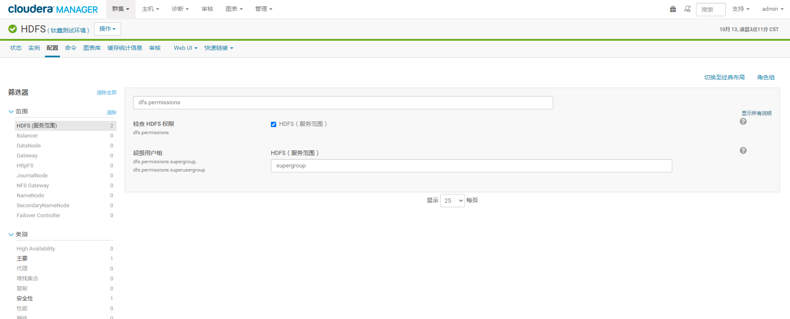

给admin用户设置权限
================================================================================
CDH环境下Hadoop平台最高权限用户是 **hdfs**，属于 **supergroup组**。



## 设置
通常会把 **admin** 或者需要的用户添加到supergroup组，**但Linux下默认是没有supergroup组**。
所以，先在Linux添加supergroup组，把admin用户添加到supergroup组里，再同步权限到HDFS。

**注意：在所有节点上操作**
```shell
# 使用root帐号
# Linux添加supergroup组
groupadd supergroup
 
# 将admin添加到supergroup
usermod -a -G supergroup admin
 
# 同步系统权限信息到HDFS,会自动同步其他节点权限
su - hdfs -s /bin/bash -c "hdfs dfsadmin -refreshUserToGroupsMappings"
```

## 注意
如果在`hdfs-site.xml`中配置了：
```xml
<!-- 取消向hdfs上写数据的用户权限设置 -->
<property>
        <name>dfs.permissions.enabled</name>
        <value>false</value>
</property>
```
**可能就不用这样做用户操作HDFS的权限设置了，不过没有验证，记录一下**。
