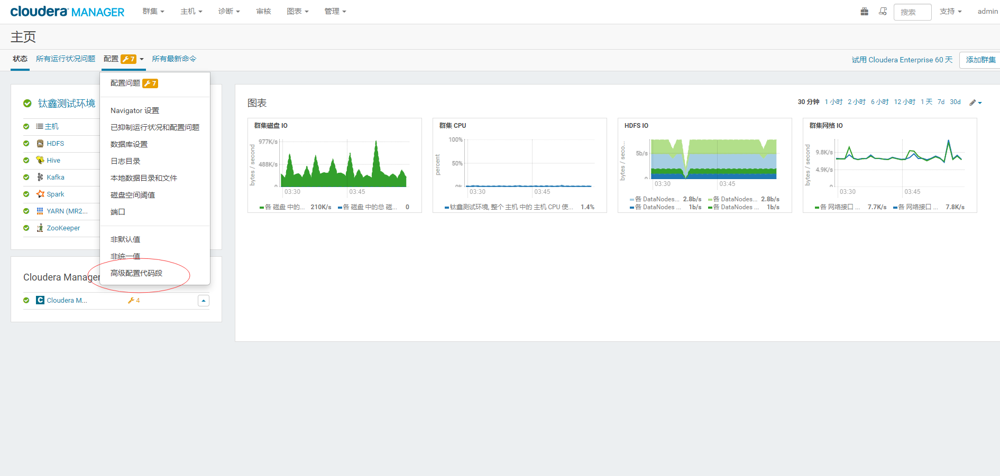
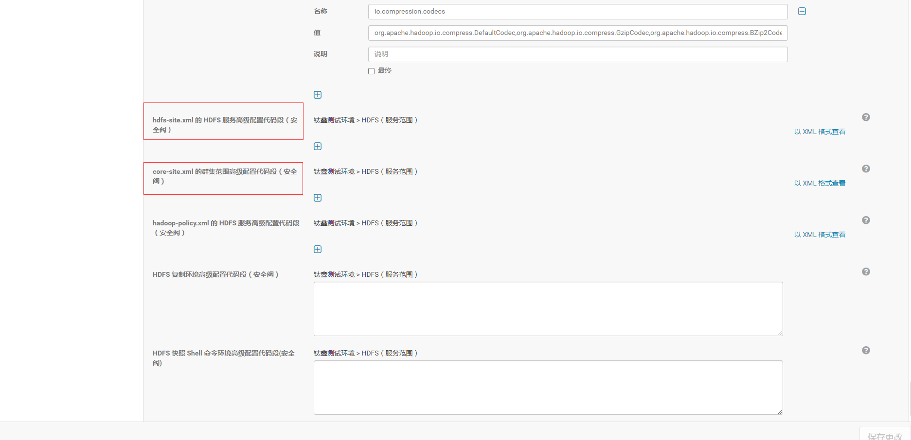
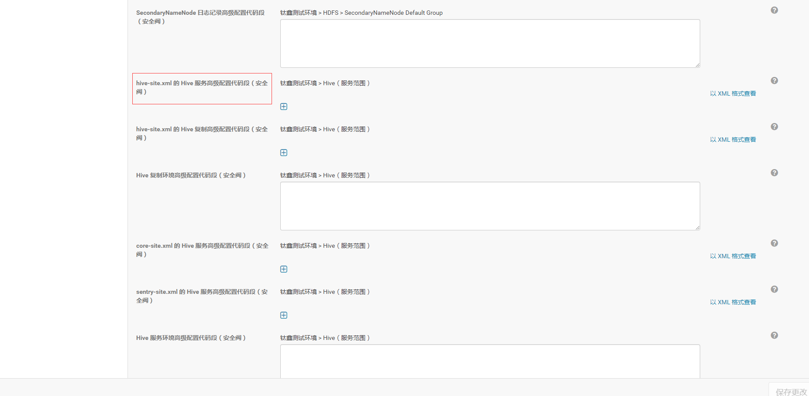
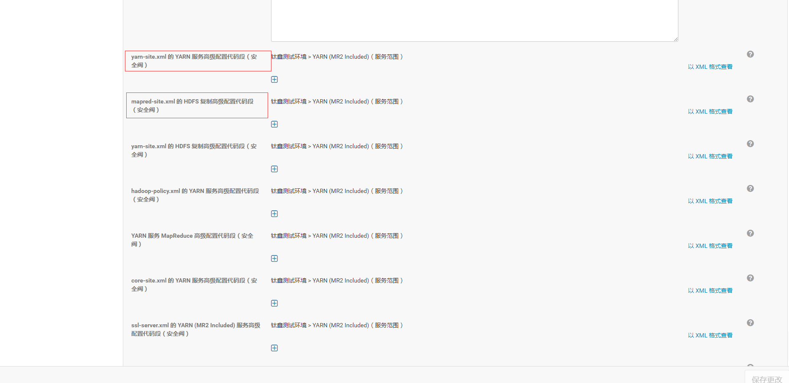

修改Hadoop相关的配置文件
================================================================================
如果需要修改Hadoop相关的配置文件：
+ core-site.xml
+ hdfs-site.xml
+ mapred-site.xml
+ yarn-site.xml
+ hive-site.xml

**必须通过Cloudera Manager的web界面进行，不要手工去Linux环境下修改配置**。

## 修改方法
**注意：填写时，最好把 *最终* 全部勾选上，最后修改完一定把客户端配置重新部署一遍**。

图1：


图2：


图3：


图4：



## 配置项
```xml

```

## 注意事项
这个目录是一定要替换的。
```xml
<property>
        <name>hadoop.tmp.dir</name>
        <value>/bigdata/tmp</value>
</property>
```
**创建`/bigdata/tmp`后，指定owner为：hdfs:hdfs，修改此目录时，最好把NameNode,DataNode,
JournalNode, SecondaryNameNode都备份一下，如果出错了还可以恢复**。

