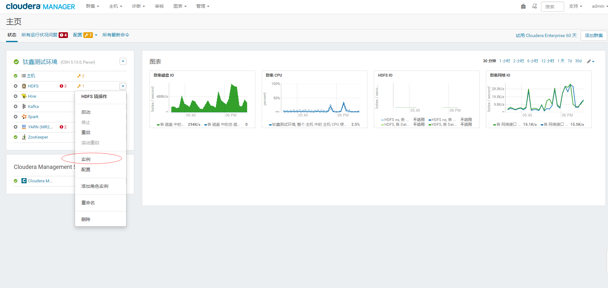
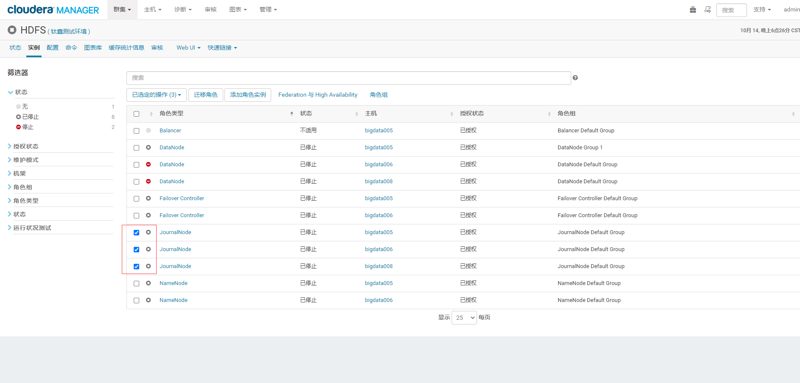
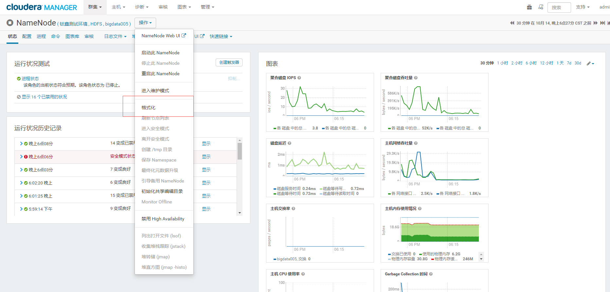

备注：关于namenode格式化问题
================================================================================
## 1.通过Cloudera Manager界面进行格式化
该案例针对 **NameNode做了HA方案** 的场景。

### 1.1.停止所有服务
略

### 1.2.格式化namenode 

第一步:


第二步：
进入到Linux的控制台去删除namenode,datanode,tmp，journalnode相对应的目录中的数据。我的示例
是：
+ **hadoop.tmp.dir**：`/bigdata/tmp`
+ **dfs.datanode.data.dir**：`/dfs/dn`
+ **dfs.journalnode.edits.dir**：`/dfs/jn/edits`
+ **dfs.namenode.name.dir**：`/dfs/nn`

第三步：首先要启动JournalNode服务（三个节点）


第四步：点击上图中其中一个namenode服务进入。


**不知道为什么，只能格式化操作的那个NameNode节点？？？？ 那只能手工把当前节点的`hadoop.tmp.dir`
指定的目录下的所有文件复制到另一个节点的相同目录中**。

第五步：重启服务，一切正常 ！！


## 2.常见异常示例
```
Encountered exception loading fsimage
java.io.IOException: NameNode is not formatted.
	at org.apache.hadoop.hdfs.server.namenode.FSImage.recoverTransitionRead(FSImage.java:232)
	at org.apache.hadoop.hdfs.server.namenode.FSNamesystem.loadFSImage(FSNamesystem.java:1144)
	at org.apache.hadoop.hdfs.server.namenode.FSNamesystem.loadFromDisk(FSNamesystem.java:796)
	at org.apache.hadoop.hdfs.server.namenode.NameNode.loadNamesystem(NameNode.java:614)
	at org.apache.hadoop.hdfs.server.namenode.NameNode.initialize(NameNode.java:676)
	at org.apache.hadoop.hdfs.server.namenode.NameNode.<init>(NameNode.java:844)
	at org.apache.hadoop.hdfs.server.namenode.NameNode.<init>(NameNode.java:823)
	at org.apache.hadoop.hdfs.server.namenode.NameNode.createNameNode(NameNode.java:1547)
	at org.apache.hadoop.hdfs.server.namenode.NameNode.main(NameNode.java:1615)
```
如果在NameNode做了HA方案的场景下，很可能通过上面的操作解决问题。 