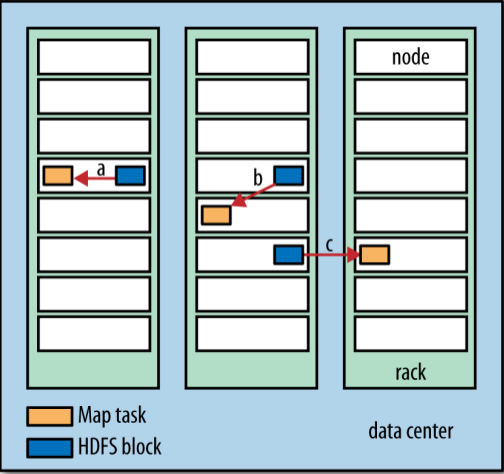
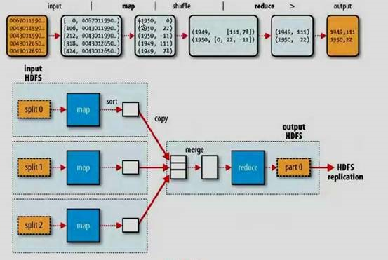
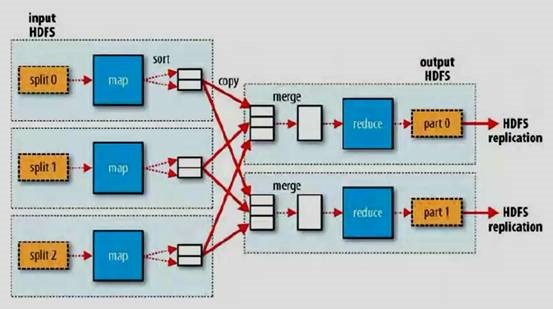
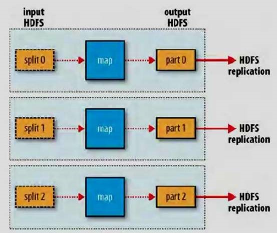

横向扩展
=======================================================================
**为了实现横向扩展，我们需要把数据存储在分布式文件系统中（典型的为`HDFS`）。通过使用`Hadoop`资源管理系统`YARN`，
`Hadoop`可以将`MapReduce`计算转移到存储有部分数据的各台机器上**。

### 数据流
**`MapReduce`作业（`job`）** 是客户端需要执行的一个工作单元：它包括 **输入数据、`MapReduce`程序和配置信息**。
**`Hadoop`将作业分成若干个任务（`task`）来执行**，其中包括两类任务：**`map`任务** 和 **`reduce`任务**。
这些任务运行在集群的节点上，并通过`YARN`进行调度。**如果一个任务失败，它将在另一个不同的节点上自动重新调度运行**。

`Hadoop`将`MapReduce`的 **输入数据划分成等长的小数据块**，称为输入分片（`input split`）或简称“ **分片**”。
**`Hadoop`为每个分片构建一个`map`任务，并由该任务来运行用户自定义的`map`函数** 从而处理分片中的每条记录。

拥有许多分片，意味着处理每个分片所需要的时间少于处理整个输入数据所花的时间。因此，**如果我们并行处理每个分片，
且每个分片数据比较小，那么整个处理过程将获得更好的负载平衡**，因为一台较快的计算机能够处理的数据分片比一台较慢
的计算机更多，且成一定的比例。即使使用相同的机器，失败的进程或其他并发运行的作业能够实现满意的负载平衡，并且
随着分片被切分得更细，负载平衡的质量会更高。

另一方面，**如果分片切分得太小，那么管理分片的总时间和构建`map`任务的总时间将决定作业的整个执行时间**。对于大多数作者来说，
**一个合理的分片大小趋向于`HDFS`的一个块的大小，默认是`128MB`**，不过可以针对集群调整这个默认值（对所有新建的文件），
或在每个文件创建时指定。

**`Hadoop`在存储有输入数据（`HDFS`中的数据）的节点上运行`map`任务，可以获得最佳性能，因为它无需使用宝贵的集群带宽资源**。
这就是所谓的“**数据本地化优化**”。但是，**有时对于一个`map`任务的输入分片来说，存储该分片的`HDFS`数据块复本的所有节点可能
正在运行其他`map`任务，此时作业调度需要从某一数据块所在的机架中的一个节点上寻找一个空闲的`map`槽（`slot`）来运行该`map`
任务分片。仅仅在非常偶然的情况下（该情况基本上不会发生），会使用其他机架中的节点运行该`map`任务，这将导致机架与机架之间的
网络传输**。见下图：



**现在我们应该清楚为什么最佳分片的大小应该与块大小相同：因为它是确保可以存储在单个节点上的最大输入块的大小。如果分片跨越两个数据块，
那么对于任何一个`HDFS`节点，基本上都不可能同时存储这两个数据块，因此分片中的部分数据需要通过网络传输到`map`任务运行的节点**。
与使用本地数据运行整个`map`任务相比，这种方法显然效率更低。
```
我的疑问：
为什么任何一个HDFS节点基本上都不可能同时存储两个数据块？？？？？？？？？？？？？？？？？？？？？？？？？？？？？？？？？
```

**`map`任务将其输出写入本地硬盘，而非`HDFS`。这是为什么？因为`map`的输出是中间结果：该中间结果由`reduce`任务处理后才产生最终
输出结果，而且一旦作业完成，`map`的输出结果就可以删除。因此，如果把它存储在`HDFS`中并实现备份，难免有些小题大做。如果运行`map`
任务的节点在将`map`中间结果传送给`reduce`任务之前失败，`Hadoop`将在另一个节点上重新运行这个`map`任务以再次构建`map`中间结果**。

**`reduce`任务并不具备数据本地化的优势，单个`reduce`任务的输入通常来自于所有`mapper`的输出**。在本例中，我们仅有一个`reduce`任务，
其输入是所有`map`任务的输出。因此，**排过序的`map`输出需通过网络发送到运行`reduce`任务的节点。数据在`reduce`端合并，然后由用户定义
的`reduce`函数处理**。`reduce`的输出通常存储在`HDFS`中以实现可靠存储。**对于`reduce`输出的每个`HDFS`块，第一个复本存储在本地节点上，
其他复本出于可靠性考虑存储在其他机架的节点中**。因此，**将`reduce`的输出写入`HDFS`确实需要占用网络带宽**，但这与正常的`HDFS`
管线写入的消耗一样。

**一个`reduce`任务** 的完整数据流如下图：



虚线框表示节点，虚线箭头表示节点内部的数据传输，而实线箭头表示不同节点之间的数据传输。

**`reduce`任务的数量并非由输入数据的大小决定，相反是独立指定的**。后面章节会介绍如何为指定的作业选择`reduce`任务的数量。

**如果有好多个`reduce`任务，每个`map`任务就会针对输出进行分区（`partition`），即为每个`reduce`任务建一个分区。每个分区有许多
键（及其对应的值），但每个键对应的键-值对记录都在同一分区中。分区可由用户定义的分区函数控制，但通常用默认的`partitioner`通过
哈希函数来分区，很高效**。

一般情况下，**多个`reduce`任务** 的数据流如下图：



该图清楚地表明了 **为什么`map`任务和`reduce`任务之间的数据流称为`shuffle`（混洗），因为每个`reduce`任务的输入都来自许多
`map`任务**。`shuffle`一般比图中所示的更复杂，**而且调整混洗参数对作业总执行时间的影响非常大**。

最后，**当数据处理可以完全并行（即无需混洗时），可能会出现无`reduce`任务的情况**，见下图：



在这种情况下，唯一的非本地节点数据传输是`map`任务将结果写入`HDFS`。

### combiner函数
**集群上的可用带宽限制了`MapReduce`作业的数量，因此尽量避免`map`和`reduce`任务之间的数据传输是有利的。`Hadoop`允许用户针对`map`任务
的输出指定一个`combiner`（就像`mapper`和`reduce`一样），`combiner`函数的输出作为`reduce`函数的输入。由于`combiner`属于
优化方案，所以`Hadoop`无法确定要对一个指定的`map`任务输出记录调用多少次`combiner`（如果需要）。换而言之，不管调用`combiner`多少次，
`0`次、`1`次或多次，`reduce`的输出结果都是一样的**。

**`combiner`的规则制约着可用的函数类型**。这里最好用一个例子来说明。还是假设以前计算最高气温的例子，`1950`年的读数由两个`map`任务处理
（因为它们在不同的分片中）。假设第一个`map`的输出如下：
```
(1950, 0)
(1950, 20)
(1950, 10)
```
第二个`map`的输出如下：
```
(1950, 25)
(1950, 15)
```
`reduce`函数被调用时，输入如下：
```
(1950, [0, 20, 10, 25, 15])
```


