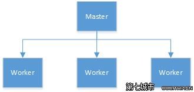

示例：主-从应用
================================================================================
在分布式系统设计中一个得到广泛应用的架构：**主/从（master-worker）架构**。如图：



遵循这个架构的一个重要例子是 **HBase**————一个Google的数据存储系统（**BigTable**）模型的实
现。

一般在这种构架中，主节点进程负责跟踪从节点状态和任务的有效性，并分配任务到从节点。对ZooKeeper来
说，这个架构风格具有代表性，阐述了大多数流行的任务，如 **选举主节点，跟踪有效的从节点，维护应用
元数据**。

要实现主/从模式的系统，我们必须解决以下三个关键问题：
+ **主节点崩溃**：如果主节点发生错误并失效，系统将无法分配新的任务或重新分配已失败的任务。
+ **从节点崩溃**：如果从节点崩溃，已分配的任务将无法完成。
+ **通信故障**：如果主节点和从节点之间无法进行信息交换，从节点将无法得知新任务分配给它。

## 1.主节点失效
**主节点失效时，我们需要有一个备份主节点（backup master）。当主要主节点（primary master）崩
溃时，备份主节点接管主要主节点的角色，进行故障转移，然而，这并不是简单开始处理进入主节点的请求。
新的主要主节点需要能够恢复到旧的主要主节点崩溃时的状态。对于主节点状态的可恢复性，我们不能依靠从
已经崩溃的主节点来获取这些信息，而需要从其他地方获取，也就是通过ZooKeeper来获取**。

**状态恢复并不是唯一的重要问题。假如主节点有效，备份主节点却认为主节点已经崩溃。这种错误的假设可
能发生在以下情况，例如主节点负载很高，导致消息任意延迟（关于这部分内容请参见1.1.4节），备份主节
点将会接管成为主节点的角色，执行所有必需的程序，最终可能以主节点的角色开始执行，成为第二个主要主
节点。更糟糕的是，如果一些从节点无法与主要主节点通信，如由于网络分区错误导致，这些从节点可能会停
止与主要主节点的通信，而与第二个主要主节点建立主从关系。针对这个场景中导致的问题，我们一般称之为
脑裂：系统中两个或者多个部分开始独立工作，导致整体行为不一致性**。我们需要找出一种方法来处理主节
点失效的情况，关键是我们需要避免发生脑裂的情况。

## 2.从节点失效
**客户端向主节点提交任务，之后主节点将任务派发到有效的从节点中。从节点接收到派发的任务，执行完这
些任务后会向主节点报告执行状态。主节点下一步会将执行结果通知给客户端**。

**如果从节点崩溃了，所有已派发给这个从节点且尚未完成的任务需要重新派发。其中首要需求是让主节点具
有检测从节点的崩溃的能力。主节点必须能够检测到从节点的崩溃，并确定哪些从节点是否有效以便派发崩溃
节点的任务。一个从节点崩溃时，从节点也许执行了部分任务，也许全部执行完，但没有报告结果。如果整个
运算过程产生了其他作用，我们还有必要执行某些恢复过程来清除之前的状态**。

## 3.通信故障 
**如果一个从节点与主节点的网络连接断开**，比如网络分区导致，**重新分配一个任务可能会导致两个从节
点执行相同的任务。如果一个任务允许多次执行，我们在进行任务再分配时可以不用验证第一个从节点是否完
成了该任务。如果一个任务不允许多次执行，那么我们的应用需要适应多个从节点执行相同任务的可能性**。
```
关于“仅一次”和“最多一次”的语义

对任务加锁并不能保证一个任务执行多次，比如以下场景中描述的情况：
1. 主节点M1派发任务T1给从节点W1。
2. W1为任务T1获取锁，执行任务，然后释放锁。
3. M1怀疑W1已经崩溃，所以再次派发任务T1给从节点W2。
4. W2为任务T1获取锁，执行任务，然后释放锁。

在这里，T1的锁并没有阻止任务被执行两次，因为两个从节点间运行任务时没有步骤交错。处理类似情况就需要“仅一次”和“最多一次”
的语义学，而这又依赖于应用的特定处理机制。例如，如果应用数据使用了时间戳数据，而假定任务会修改应用数据，那么该任务的执行
成功就取决于这个任务所取得的这个时间戳的值。如果改变应用状态的操作不是原子性操作，那么应用还需要具有局部变更的回退能力，
否则最终将导致应用的非一致性。

之所以讨论这些问题，最主要的原因是想说明实现这些语义学的应用是非常困难的。
```
**通信故障导致的另一个重要问题是对锁等同步原语的影响**。因为节点可能崩溃，而系统也可能网络分区，
锁机制也会阻止任务的继续执行。**因此Zookeeper也需要实现处理这些情况的机制。首先，客户端可以告诉
Zookeeper某些数据的状态是临时状态；其次，同时Zookeeper需要客户端定时发送是否存活的通知，如果一
个客户端未能及时发送通知，那么所有从属于这个客户端的临时状态的数据将全部被删除。通过这两个机制，
在崩溃或通信故障发生时，我们就可以预防客户端独立运行而发生的应用宕机**。

## 4.任务总结
根据之前描述的这些，我们可以得到以下主/从架构的需求。

### 主节点选举
这是关键的一步，使得主节点可以给从节点分配任务。

### 崩溃检测
主节点必须具有检测从节点崩溃或失去连接的能力。

### 组成员关系管理
主节点必须具有知道哪一个从节点可以执行任务的能力。

### 元数据管理
主节点和从节点必须具有通过某种可靠的方式来保存分配状态和执行状态的能力。 

**理想的方式是，以上每一个任务都需要通过原语的方式暴露给应用，对开发者完全隐藏实现细节**。Zookeeper
提供了实现这些原语的关键机制，因此，开发者可以通过这些实现一个最适合他们需求、更加关注应用逻辑的
分布式应用。

