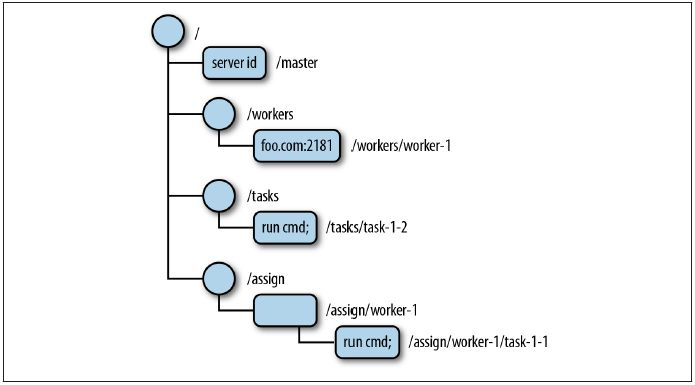

ZooKeeper基础
================================================================================
**很多用于协作的原语常常在很多应用之间共享**。因此，设计一个用于协作需求的服务的方法往往是提供原
语列表。暴露出每个原语的实例化调用方法，并直接控制这些实例。**比如，我们可以说分布式锁机制组成一
个重要的原语**，同时暴露出创建（`create`）、获取（`acquire`）和释放（`release`）三个调用方法。

**这种设计存在一些重大的缺陷**：首先，我们要么预先提出一份详尽的原语列表，要么提供API的扩展，以
便引入新的原语；其次，以这种方式实现原语的服务使得应用丧失了灵活性。

因此，**在ZooKeeper中我们另辟蹊径。ZooKeeper并不直接暴露原语，取而代之，它暴露了由一小部分调
用方法组成的类似文件系统的API，以便允许应用实现自己的原语**。我们通常使用菜谱（`recipes`）来表
示这些原语的实现。**菜谱包括ZooKeeper操作和维护一个小型的数据节点，这些节点被称为`znode`，采用
类似于文件系统的层级树状结构进行管理**。下图描述了一个 **znode树的结构**，根节点包含4个子节点，
其中三个子节点拥有下一级节点，叶子节点存储了数据信息。

**针对一个znode，没有数据常常表达了重要的信息**。比如，**在 *主－从* 模式的例子中，主节点的znode
没有数据，表示当前还没有选举出主节点**。而图中涉及的一些其他znode节点在 *主－从* 模式的配置中非
常有用：
+ **`/workers`节点作为父节点，其下每个znode子节点保存了系统中一个可用从节点信息**。如上图所示，
有一个从节点（`foot.com:2181`）。
+ **`/tasks`节点作为父节点，其下每个znode子节点保存了所有已经创建并等待从节点执行的任务的信息**，
*主－从* 模式的应用的客户端在`/tasks`下添加一个znode子节点，用来表示一个新任务，并等待任务状态
的znode节点。
+ **`/assign`节点作为父节点，其下每个znode子节点保存了分配到某个从节点的一个任务信息**，当主
节点为某个从节点分配了一个任务，就会在`/assign`下增加一个子节点。

## 1.API概述

