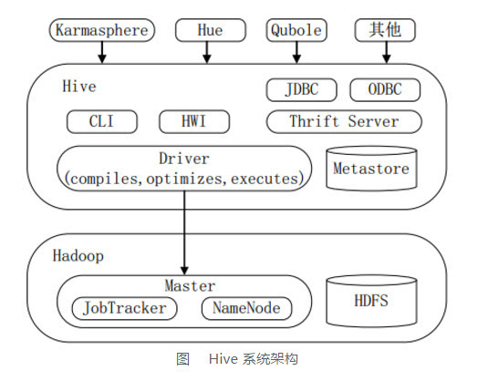

Hadoop生态系统中的Hive
=================================================================================
当用户真正使用Hadoop的API来实现WordCount算法（见原书中的示例）时，甚至有更多底层细节需要用户自己
来控制。这是一个只适用于有经验的Java开发人员的工作，因此也就将Hadoop潜在地放在了一个非程序员用户无
法触及的位置，即使这些用户了解他们想使用的算法。

这也就是引用Hive的原因。**Hive不仅提供了一个熟悉SQL的用户所能熟悉的编程模型，还消除了大量的通用代码**，
甚至是那些有时是不得不使用Java编写的令人棘手的代码。

**这就是为什么Hive对于Hadoop是如此重要的原因**，无论用户是DBA还是Java开发工程师。Hive可以让你花
费相当少的精力就可以完成大量的工作。

下图显示了Hive的主要“模块”以及Hive是如何与Hadoop交互工作的。

有好几种方式可以与Hive进行交互。本书中，我们将主要关注于 **CLI，也就是命令行界面**。

**Hive发行版本中附带的模块有CLI，一个称为Hive网页界面（HWI）的简单网页界面，以及可通过JDBC、ODBC
和一个Thrift服务器进行编程访问的几个模块**。

**所有的命令和查询都会进入到Driver（驱动模块），通过该模块对输入进行解析编译，对需求的计算进行优化，
然后按照指定的步骤执行（通常是启动多个MapReduce任务（job）来执行）。当需要启动MapReduce任务（job）
时，Hive本身是不会生成Java MapReduce算法程序的。相反，Hive通过一个表示“job执行计划”的XML文件驱
动执行内置的、原生的Mapper和Reduce模块。换句话说，这些通用的模块函数类似于微型的语言翻译程序，而这个
驱动计算的“语言”是以XML形式编码的**。

**Hive通过和JobTracker通信来初始化MapReduce任务（job），而不必部署在JobTracker所在的管理节点上
执行**。在大型集群中，通常会有网关机专门用于部署像Hive这样的工具。在这些网关机上可远程和管理节点上的
JobTracker通信来执行任务（job）。通常，**要处理的数据文件是存储在HDFS中的，而HDFS是由NameNode进行
管理的**。

**Metastore（元数据存储）是一个独立的关系型数据库（通常是一个MySQL实例），Hive会在其中保存表模式和
其他系统元数据**。

尽管本书是关于Hive的，不过还是有必要提及其他的一些高级工具，这样用户可以根据需求进行选择。**Hive最适
合于数据仓库程序，对于数据仓库程序不需要实时响应查询，不需要记录级别的插入、更新和删除**。当然，Hive也
非常适合于有一定SQL知识的用户。

### Pig
**Hive的替代工具中最有名的就是Pig了**（`http://pig.apache.org`）。Pig是由Yahoo!开发完成的，
而同时期Facebook正在开发Hive。Pig现在同样也是一个和Hadoop紧密联系的顶级Apache项目。

**假设用户的输入数据具有一个或者多个源，而用户需要进行一组复杂的转换来生成一个或者多个输出数据集。
如果使用Hive，用户可能会使用嵌套查询来解决这个问题，但是在某些时刻会需要重新保存临时表（这个需要
用户自己进行管理）来控制复杂度**。

**Pig被描述成一种数据流语言**，而不是一种查询语言。**在Pig中，用户需要写一系列的声明语句来定义某
些关系和其他一些关系之间的联系，这里每个新的关系都会执行新的数据转换过程。Pig会查找这些声明，然后创
建一系列有次序的MapReduce任务（job），来对这些数据进行转换，直到产生符合用户预期的计算方法所得到
的最终结果**。

这种步进式的数据“流”可以比一组复杂的查询更加直观。也因此，**Pig常用于ETL（数据抽取，数据转换和数
据装载）过程的一部分**，也就是将外部数据装载到Hadoop集群中，然后转换成所期望的数据格式。

**Pig的一个缺点就是其所使用的定制语言不是基于SQL的**。这是可以理解的，因为Pig本身就不是被设计为一
种查询语言的，但是这也意味着不适合将SQL应用程序移植到Pig中，而经验丰富的SQL用户可能需要投入更高的
学习成本来学习Pig。

然而，**Hadoop团队通常会将Hive和Pig结合使用，对于特定的工作选择合适的工具**。

### HBase
**如果用户需要Hive无法提供的数据库特性（如行级别的更新，快速的查询响应时间，以及支持事务）的话，
那么该怎么办呢**?

**HBase是一个分布式的、可伸缩的数据存储，其支持行级别的数据更新、快速查询和行级事务（但不支持多
行事务）**。

HBase的设计灵感来自于谷歌的BigTable，不过HBase并没有实现BigTable的所有特性。**HBase支持的一个
重要特性就是列存储，其中的列可以组织成列族。列族在分布式集群中物理上是存储在一起的。这就使得当查询场
景涉及的列只是所有列的一个子集时，读写速度会快得多。因为不需要读取所有的行然后丢弃大部分的列，而是只
需读取需要的列**。

**可以像键/值存储一样来使用HBase**，其每一行都使用了一个唯一键来提供非常快的速度读写这一行的列或
者列族。**HBase还会对每个列保留多个版本的值（按照时间戳进行标记），版本数量是可以配置的**，因此，
如果需要，可以“时光倒流”回退到之前的某个版本的值。

最后，HBase和Hadoop之间是什么关系？**HBase使用HDFS（或其他某种分布式文件系统）来持久化存储数据。
为了可以提供行级别的数据更新和快速查询，HBase也使用了内存缓存技术对数据和本地文件进行追加数据更新操
作日志。持久化文件将定期地使用附加日志更新进行更新等操作**。

**HBase没有提供类似于SQL的查询语言，但是Hive现在已经可以和HBase结合使用了**。
