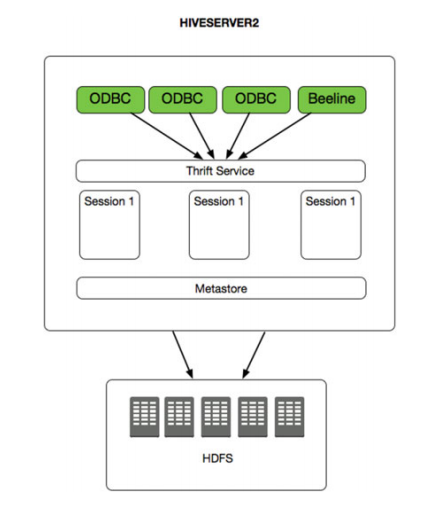

HiveServer2
===================================================================================
虽然Hive为运行MapReduce提供一个SQL抽象层有很多好处，但是同样也存在一些重要限制。一个限制就是客户
端使用标准ODBC和JDBC连接到Metastore的能力。开源社区通过创建Hive服务器克服了这种限制。**Hive服务
器允许客户端使用ODBC和JDBC连接访问Metastore**。有了Hive服务器，客户端可以通过像Excel这样的商业智
能应用或Toad这样的效率型应用连接到HCatalog。

Hive服务器仍然存在一些限制，主要包括用户并发性限制以及与LDAP的安全性集成。这些组件都是通过HiveServer2
的实现来解决的。**HiveServer2架构基于一个Thrift Server和任意数量由驱动程序、编译器和执行器组成的会
话。Metastore也是HiveServer2的一个重要组成部分**。

**HiveServer2支持Kerberos、自定义身份验证以及通过LDAP身份验证。所有连接组件——JDBC、ODBC和Beeline
——都可以使用这些身份验证方法中的任何一种。此外，HiveServer2既可以在HTTP模式下工作，也可以在TCP
（二进制）模式下工作。如果你需要使用HiveServer2作为代理或实现负载均衡，那么HTTP模式就非常有用**。
在Ambari中，你可以在Hive service and Advanced配置选项下对HiveServer2的配置进行设置。

**如果要从TCP模式切换到HTTP模式，需要将`hive.server2.transport.mode`的值从`binary`更改为`http`**。

