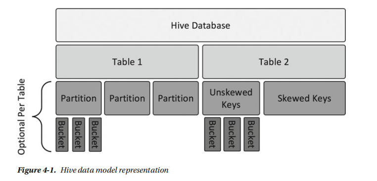

表之分区和分桶
===================================================================================
Hive表可以进一步划分成若干逻辑块，以便于管理和改进性能。在Hive中有好几种可用于抽象数据的
方式，如下图：



## 分区
**分区在关系数据库领域中通常用于提高性能和实现更好的数据管理。Hive中分区的概念并无差别**。

**Hive中的分区表有一个或多个分区键，基于这些键，数据被分割成若干逻辑块并存放在单独的路径中。
每个分区键都为表的存储添加了一个目录层结构**。让我们来看一个含有一些分区键的客户事务处理表。
```sql
CREATE EXTERNAL TABLE shopping.transactions (
	transdate		DATE,
	transid			INT,
	custid			INT,
	fname			STRING,
	lname			STRING,
	item			STRING,
	qty				INT,
	price			FLOAT
)
PARTITIONED BY(store STRING);
```
本例中的表基于一个名为STORE（存放商店的名称）的字符串列进行分区。**注意，在分区中用到的列
实际上在`CREATE TABLE`结构中并不存在。这一点和大多数关系数据库不同**，在关系数据库中，必
须要将实际`CREATE TABLE`结构中的列或者分区键指定为表的一列。

**当你查询一个分区表时，分区的值会作为该分区中所有行在这一列的值**。例如，
`SELECT * FROM shopping.transactions`将返回STORE列的值，即使数据文件中并没有存储这样
的数据。

**创建分区表需要你预先为底层分区创建目录结构。对于内部表的情形，当你使用`INSERT`命令将数据
插入新分区时，分区目录是自动创建的**。示例：
```sql
INSERT INTO shopping.transactions PARTiTION(store = 'new york')
	VAlUES('01/25/2016', 101, 'A109', 'MATTHEW', 'SMITH', 'SHOES', 1, 112.9);
```
查看分区：
```sql
shopping.transactions;
```
显示：
```
partition     |
--------------|
store=new york|
```
