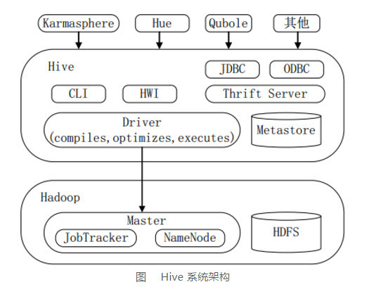

Hadoop生态系统中的Hive
=================================================================================
当用户真正使用Hadoop的API来实现WordCount算法（见原书中的示例）时，甚至有更多底层细节需要用户自己
来控制。这是一个只适用于有经验的Java开发人员的工作，因此也就将Hadoop潜在地放在了一个非程序员用户无
法触及的位置，即使这些用户了解他们想使用的算法。

这也就是引用Hive的原因。**Hive不仅提供了一个熟悉SQL的用户所能熟悉的编程模型，还消除了大量的通用代码**，
甚至是那些有时是不得不使用Java编写的令人棘手的代码。

**这就是为什么Hive对于Hadoop是如此重要的原因**，无论用户是DBA还是Java开发工程师。Hive可以让你花
费相当少的精力就可以完成大量的工作。

下图显示了Hive的主要“模块”以及Hive是如何与Hadoop交互工作的。

有好几种方式可以与Hive进行交互。本书中，我们将主要关注于 **CLI，也就是命令行界面**。
