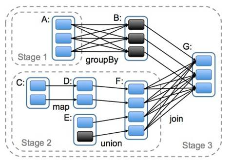

Spark编程模型
================================================================================
## 1.RDD简介
Spark编程模型是 **弹性分布式数据集（Resilient Distributed Dataset, RDD）**，它是MapReduce
模型的扩展和延伸，但它 **解决了MapReduce的缺陷：在并行计算阶段高效地进行数据共享**。

相比以前集群容错处理模型，如：MapReduce、Dryad，它们 **将计算转换为一个有向无环图（DAG）的任
务集合**。这使在这些模型中能够 **有效地恢复DAG中故障和慢节点执行的任务**，但是这些模型中除了文
件系统外没有提供其他的存储方式，这就导致了在 **网络上进行频繁的数据复制而造成I/O压力**。由于RDD
提供一种基于粗粒度变换（如：map、filter和join等）的接口，该接口会将相同的操作应用到多个数据集上，
**这就使得它们可以记录创建数据集的“血缘”（Lineage），而不需要存储真正的数据**，从而达到高效的容
错性。**当某个RDD分区丢失的时候，RDD记录有足够的信息来重新计算，而且只需要计算该分区，这样丢失的
数据可以很快地恢复，不需要昂贵的复制代价**。

**基于RDD机制实现了多类模型计算**，包括多个现有的集群编程模型。这些模型包括以下几方面的内容：
1. **迭代计算**： 目前最常见的工作方式。比如应用于图处理、数据优化以及机器学习中的算法。
2. **交互式SQL查询**： Spark的RDD不仅拥有很多常见数据库引擎的特性，达到可观的性能，而且Spark
SQL中提供完善的容错机制，能够在短查询和长查询中很好地处理故障和慢节点。
3. **MapReduceRDD**：通过提供MapReduce的 **超集**，能够高效地执行MapReduce程序。
4. **流式数据处理**：当前的模型没有解决在大规模集群中频繁出现 **慢节点的问题**，同时对故障解决
办法有限，需要大量的复制或浪费很长的恢复时间。**Spark提出了离散数据流（D-Stream）** 来解决这样
的问题。**`D-Streams`把流式计算的执行当作一系列短而确定的批量计算的序列，并将状态保存在RDD中**。
D-Streams根据相关RDD的依赖关系图进行并行化恢复，可以达到快速故障恢复，避免了数据复制。

## 2.RDD的类型
Spark编程中开发者需要 **编写一个驱动程序来连接到工作进程（Worker）。驱动程序定义一个或多个RDD
以及相关行动操作，驱动程序同时记录RDD的继承关系，即“血缘”**。而工作进程（Worker）是一直运行的进
程，它将经过一系列操作后的RDD分区数据保存在内存中。

Spark中的操作大致可以分为四类操作：
+ **创建操作**：用于RDD创建工作。RDD创建只有两种方法，一种是来 **自于内存集合和外部存储系统**，
另一种是 **通过转换操作生成的RDD**。
+ **转换操作**：将RDD通过一定的操作变换成新的RDD，比如：HadoopRDD可以使用map操作变换为MappedRDD，
**RDD的转换操作是惰性操作，它只是定义了一个新的RDDs，并没有立即执行**。
+ **控制操作：进行RDD持久化，可以让RDD按不同的存储策略保存在磁盘或者内存中**，比如cache接口默
认将RDD缓存在内存中。
+ **行动操作**：能够触发Spark运行的操作，例如，对RDD进行collect就是行动操作。Spark中行动操作 
分为两类，**一类的操作结果变成Scala集合或者变量，另一类将RDD保存到外部文件系统或者数据库中**。

## 2.RDD的实现

### 2.1.作业调度
当对RDD执行转换操作时，**调度器会根据RDD的”血缘“来构建由若干调度阶段组成的有向无环图（DAG），
每个调度阶段包含尽可能多的连续窄依赖转换**。调度器按照有向无环图顺序进行计算，并最终得到目标RDD。

调度器向各节点分配任务采用 **延时调度机制** 并根据数据存储位置来确定。**若一个任务需要处理的某个
分区刚好存储在某个节点的内存中，则该任务会分配给该节点；如果在内存中不包含该分区，调度器会找到包
含该RDD的较佳位置，并把任务分配给所在节点**。

**对应宽依赖的操作**，在Spark **将中间结果物化到父分区的节点上**，这和MapReduce物化map的输出
类似，**可以简化数据的故障恢复过程**。如下图：

