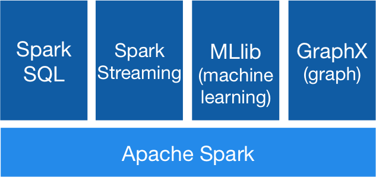
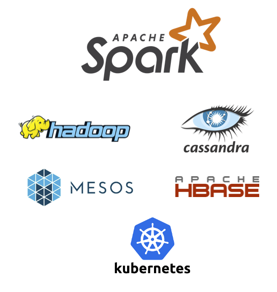

Spark介绍
===================================================================================
Apache Spark™是用于大规模数据处理的统一分析引擎。

## 1. 速度
**运行工作负载的速度提高了100倍**。Apache Spark使用最先进的DAG调度程序，查询优化器和物理执行引擎，
为批处理数据和流数据提供了高性能。

Hadoop和Spark中的逻辑回归：


## 2. 便于使用
**使用Java，Scala，Python，R和SQL快速编写应用程序**。Spark提供了80多个高阶算子，可轻松构建并行
应用程序。 您可以从Scala，Python，R和SQL Shell交互使用它。
```python
# Spark的Python DataFrame API通过自动模式推断读取JSON文件
df = spark.read.json("logs.json") 
df.where("age > 21").select("name.first").show()
```

## 3. 概论
**结合使用SQL，流和复杂的分析**。Spark为包括SQL和DataFrames，用于机器学习的MLlib，GraphX和
Spark Streaming的库提供了强大的支持。您可以在同一应用程序中无缝组合这些库。



## 4. 无处不在
**Spark可在Hadoop，Apache Mesos，Kubernetes，standalone或云中运行。它可以访问各种数据源**。
您可以在EC2，Hadoop YARN，Mesos或Kubernetes上使用Standalone集群模式运行Spark。访问HDFS，
Alluxio，Apache Cassandra，Apache HBase，Apache Hive和数百种其他数据源中的数据。



