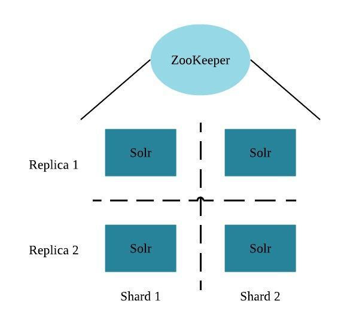
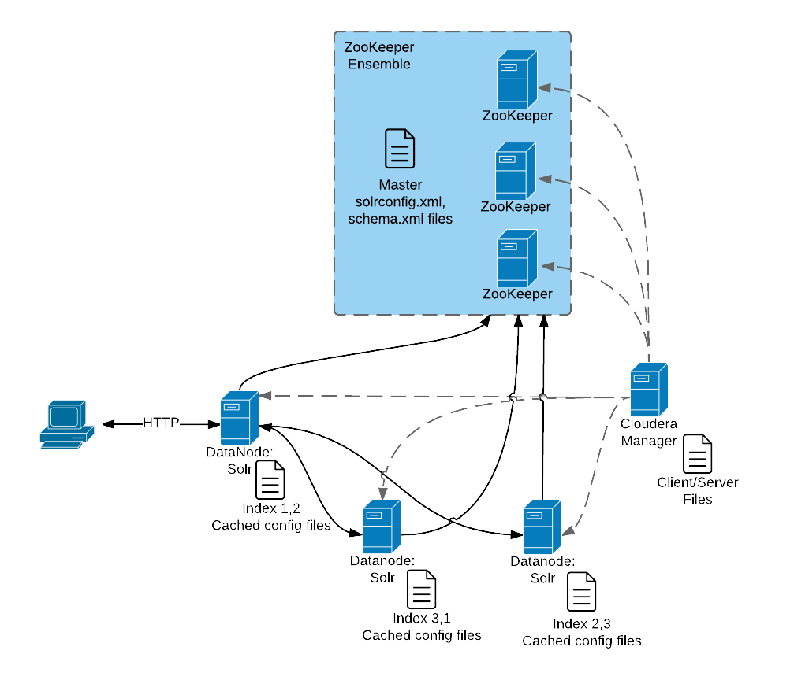

Cloudera Search概述
================================================================================
Cloudera Search为存储在 **Hadoop、HBase** 中的数据提供了简单、自然的语言访问。终端用户和其他
web服务可以使用全文检索和分面挖掘来研究文本、半结构化和结构化数据，以及快速地过滤和聚合它以获得业务
洞察力，**而不需要SQL或编程技能**。

Cloudera Search是 **Apache Solr完全集成在Cloudera平台中的产品**，充分利用了CDH中包含的灵活、
可扩展且强大的存储系统和数据处理框架。这 **消除了跨基础架构移动大型数据集以执行业务任务的需要**。
它进一步实现了简化的数据管道，其中搜索和文本匹配是较大工作流程的一部分。

Cloudera Search合并了Apache Solr，其中包括Apache Lucene，SolrCloud，Apache Tika和Solr
Cell，**Cloudera Search包含在CDH 5及更高版本中**。

下表介绍了Cloudera搜索功能：

| 功能 | 描述 |
| :------------- | :------------- |
| 使用Cloudera Manager进行统一管理和监控 | Cloudera Manager为CDH和Cloudera Search提供统一和集中的管理和监控。 Cloudera Manager简化了搜索服务的部署，配置和监控。 许多现有的搜索解决方案缺乏管理和监控能力，并且无法深入了解利用率，系统健康状况，趋势和其他可支持性方面。 |
| 索引存储在HDFS中 | Cloudera Search与HDFS集成在一起，实现了健壮，可扩展且自我修复的索引存储。 由Solr / Lucene创建的索引直接使用数据写入HDFS，而不是本地磁盘，从而提供容错和冗余。Cloudera Search经过优化，可在HDFS中快速读取和写入索引，同时通过标准Solr机制提供索引并进行查询。 由于数据和索引位于同一位置，因此数据处理不需要传输或单独管理的存储。 |
| 通过MapReduce创建批索引 | 为了便于大数据集的索引创建，Cloudera Search内置了MapReduce作业，用于索引存储在HDFS或HBase中的数据。因此，MapReduce的线性可伸缩性应用于索引管道，从而减轻Solr索引服务资源的负担。 |
| 数据摄取的实时和可伸缩索引 | Cloudera Search提供与Flume的集成以支持接近实时的索引。 当新事件通过Flume层次结构并写入HDFS时，可以将这些事件直接写入Cloudera Search索引器。此外，Flume支持路由事件，过滤和传递给CDH的数据注释。 这些功能可与Cloudera Search一起使用，以改进索引分片，索引分隔和文档级访问控制。 |
| 通过Hue轻松进行互动和数据探索 | Cloudera搜索GUI作为Hue插件提供，使用户能够交互式查询数据，查看结果文件并进行分面探索。 Hue还可以安排常规查询和探索索引文件。 此GUI使用基于标准Solr API的Cloudera Search API。 拖放仪表板界面使任何人都可以轻松创建搜索仪表板。 |
| 简化了搜索工作负载的数据处理 | Cloudera搜索可以使用Apache Tika进行解析和编写许多标准文件格式的索引。此外，Cloudera搜索支持Avro、Hadoop Sequence和Snappy文件格式映射，以及日志文件格式、JSON、XML和HTML。Cloudera Search还提供Morphlines，这是一个易于使用的预建库，包含常用数据预处理功能。 Morphlines简化了多种文件格式索引的数据准备工作。 用户可以轻松实现Flume，Kafka和HBase的Morphlines，或者将其他应用程序（如MapReduce或Spark作业）重复使用相同的Morphlines。 |
| HBase搜索 | Cloudera Search与HBase集成，支持全文搜索HBase数据，而不会影响HBase性能或复制数据存储。 监听器监控来自HBase RegionServers的复制事件流，并捕获每个写入或更新复制的事件，从而启用抽取和映射（例如，使用Morphlines）。 然后将事件直接发送到Solr以便在HDFS中进行索引和存储，使用与Cloudera Search的其他索引工作负载相同的过程。 这些索引可以立即提供，从而实现HBase数据的自由文本搜索。|

### 1.Cloudera搜索的工作原理
在接近实时的索引用例中，例如日志或事件流分析，Cloudera Search索引通过Apache Flume，Apache
Kafka，Spark Streaming或HBase流式传输的事件。字段和事件映射到标准Solr可索引架构。 Lucene索
引传入事件，并将索引写入并存储在HDFS中的标准Lucene索引文件中。在HDFS分区中的常规流量事件路由和
数据存储也可以应用。事件可以通过多个Flume代理进行路由和流式传输，并写入单独的Lucene索引器中，这
些索引器可以写入单独的索引碎片，以便在索引时实现更好的扩展并在搜索时实现更快的响应。

索引从HDFS加载到Solr核心，就像Solr从本地磁盘读取一样。Cloudera Search设计的不同之处在于HDFS的
健壮，分布式和可扩展的存储层，它有助于消除代价高昂的停机时间，并且在不移动数据的情况下实现跨工作负载
的灵活性。然后可以通过标准的Solr API或通过简单的搜索GUI应用程序将搜索查询提交给Solr，该应用程序可
以在Hue中部署，包含在Cloudera Search中。

Cloudera Search面向批处理的索引功能可以满足在批量上传文件或大数据集中进行搜索的需求，这些数据集的
更新频率较低，而且不需要近实时索引。它还可以方便地用于重新索引（独立Solr中常见的痛点）或用于按需数据
探索的临时索引。通常，批量索引定期完成（小时，每日，每周等），作为较大工作流程的一部分。

对于这种情况，Cloudera Search包含基于MapReduce或Spark的高度可扩展的索引工作流程。针对HDFS中的
指定文件或文件夹或HBase中的表启动MapReduce或Spark工作流，并在映射阶段执行字段提取和Solr模式映射。
Reducers使用嵌入式Lucene将数据作为单个索引或索引碎片写入，具体取决于您的配置和首选项。索引存储在
HDFS中之后，可以使用标准的Solr机制来查询它们，如前面关于近实时索引用例所述。您还可以配置这些批量索
引选项，以将新索引数据直接发布到由Solr提供的实时活动索引中。这个GoLive选项可以在不中断服务的情况下
启用简化的数据管道来定期处理传入的批量更新。

**Lily HBase Indexer Service是一个灵活的，可扩展的，容错的，事务性的，接近实时的系统，用于处理
连续的HBase单元更新到实时搜索索引。Lily HBase Indexer使用Solr来索引存储在HBase中的数据**。随着
HBase向HBase表格单元应用插入，更新和删除操作，索引器使用标准HBase复制功能使Solr与HBase表格内容保
持一致。索引器支持灵活的自定义应用程序特定规则来提取，转换和加载HBase数据到Solr。 Solr搜索结果可以
包含columnFamily：限定符链接回存储在HBase中的数据。这样应用程序可以使用搜索结果集来直接访问匹配的原
始HBase单元。**索引和搜索不会影响HBase的操作稳定性或写入吞吐量**，因为索引和搜索过程与HBase是分开
的和异步的。

### 2.了解Cloudera搜索
Cloudera Search适合用于分析大型数据集中信息的更广泛的解决方案。CDH提供了存储数据和运行查询的手段
和工具。你可以通过以下方式探索数据：
+ MapReduce或Spark作业
+ Impala查询
+ Cloudera Search查询

CDH通过使用MapReduce作业为大数据集提供存储和访问，但创建这些作业需要技术知识，每个作业可能需要几分
钟或更长时间才能运行。与MapReduce作业相关的较长的运行时间可能会中断研究数据的过程。

为了提供更直接的查询和响应，并消除编写MapReduce应用程序的需要，可以使用Apache Impala。Impala以
秒为单位返回结果，而不是分钟。

虽然Impala是一个快速，功能强大的应用程序，但它使用基于SQL的查询语法。对于不熟悉SQL的用户，使用Impala
可能会遇到挑战。如果您不知道SQL，则可以使用Cloudera Search。尽管Impala，Apache Hive和Apache Pig
都需要在查询时需要应用一个结构，但搜索支持对已编制索引的任何数据或字段进行自由文本搜索。

#### 搜索如何使用现有基础架构
**已在CDH部署中的任何数据都可以编入索引，并可供Cloudera Search查询使用。 对于未存储在CDH中的数据，
Cloudera Search提供了用于将数据加载到现有基础架构中的工具，以及将数据移入HDFS或写入Apache HBase
时对其进行索引的工具**。

**通过利用现有基础架构，Cloudera Search消除了创建新的冗余结构的需求**。另外，Cloudera Search使用
CDH和Cloudera Manager提供的服务的方式不会干扰在同一环境中运行的其他任务。这样，您就可以重用现有基础
架构，而无需在同一组系统中运行多个服务相关的成本和问题。

### 3.Cloudera Search和其他Cloudera组件
Cloudera Search与其他Cloudera组件交互以解决不同的问题。下表列出了对搜索过程有贡献的Cloudera组件，
并描述了它们如何与Cloudera Search进行交互：

| 组件 | 贡献 | 适用于 |
| :------------- | :------------- | :---------------- |
| HDFS | 存储源文件。搜索索引源文档以使其可搜索。支持Cloudera Search的文件（例如Lucene索引文件和预写日志）也存储在HDFS中。使用HDFS可在更大的基础上提供更简单的配置，冗余和容错功能。借助HDFS，Cloudera Search服务器本质上是无状态的，因此主机故障的后果极小。HDFS还提供快照，群集间复制和灾难恢复。| 所有情况 |
| MapReduce | 搜索包括一个预建的基于MapReduce的作业。此作业可用于HDFS中存储的任何受支持数据集的按需索引或计划索引。此作业使用群集资源进行可伸缩批量索引。| 很多情况下 |
| Flume | Search包含一个Flume接收器，可以将事件直接写入群集中部署的索引器，从而允许在摄取期间进行数据索引。| 很多情况下 |
| Hue | Hue包含一个基于GUI的搜索应用程序，该应用程序使用标准Solr API并可与HDFS中索引的数据进行交互。该应用程序为Solr标准查询语言和分面搜索功能的可视化提供支持。| 很多情况下 |
| Morphlines | morphline是一个定义ETL转换链的丰富配置文件。 Morphlines可以使用来自任何数据源的任何类型的数据，处理数据并将结果加载到Cloudera Search。Morphlines运行在一个小型的，可嵌入的Java运行时系统中，可用于近实时应用程序，如flume代理以及批处理应用程序，如Spark作业。 | 很多情况下 |
| ZooKeeper | 协调数据和元数据的分布，也称为碎片。它提供自动故障转移以提高服务弹性。 | 很多情况下 |
| Spark | CrunchIndexerTool可以使用Spark将HDFS文件中的数据移动到Apache Solr中，并通过morphline运行数据以进行提取和转换。| 一些案例 |
| HBase | 支持索引存储的数据，提取列，列族和关键信息作为字段。尽管HBase不使用二级索引，但Cloudera Search可以促进HBase中行和表内容的全文搜索。| 一些案例 |
| Cloudera Manager | 部署，配置，管理和监控Cloudera Search进程和资源利用率，以跨群集服务。Cloudera Manager有助于简化Cloudera Search管理，但这不是必需的。| 一些案例 |
| Cloudera Navigator | Cloudera Navigator为Hadoop系统提供治理，包括支持审计搜索操作。| 一些案例 |
| Sentry | Sentry支持基于角色的Cloudera Search的精细授权。Sentry可以对各种操作应用一系列限制，例如访问数据，通过配置对象管理配置或创建集合。无论用户尝试完成操作的方式如何，都会始终应用限制。例如，限制对集合中数据的访问会限制访问权限，无论查询来自命令行，浏览器，Hue还是通过管理控制台。| 一些案例 |
| Oozie | 自动化索引作业的调度和管理。Oozie可以检查新数据并根据需要开始索引工作。| 一些案例 |
| Impala | 进一步分析搜索结果。| 一些案例 |
| Hive | 进一步分析搜索结果。| 一些案例 |
| Parquet | 提供列式存储格式，为结构化工作负载（如Impala或Hive）提供特别快速的结果返回。Morphlines为从Parquet提取数据提供了一条高效的流水线。| 一些案例 |
| Avro | 包含Cloudera Search可用于建立索引的元数据。| 一些案例 |
| Kafka | 搜索使用此消息代理来增加吞吐量并减少处理实时数据的延迟。| 一些案例 |
| Sqoop | 批量提取数据并启用批量索引的数据可用性。| 一些案例 |

### 4.Cloudera搜索架构
Cloudera Search作为一组服务器上的分布式服务运行，并且每个服务器负责一部分可搜索数据。数据被分割成
小块，副本由这些块组成，并且这些块分布在服务器中。这提供了两个主要优点：
+ 将内容分成较小的片段分配在服务器之间索引内容的任务。
+ 复制整个部分可以使查询更有效地缩放，并使系统能够提供更高级别的可用性。

每个Cloudera Search服务器都可以独立处理请求。客户端可以发送请求索引文档或对任何搜索服务器执行搜索，
并且该服务器将请求路由到正确的服务器。

每个搜索部署都需要：
+ ZooKeeper至少在一台主机上运行。您可以在同一台主机上安装ZooKeeper，Search和HDFS。
+ 至少有一台HDFS，但与所有主机一样多。HDFS通常安装在所有群集主机上。
+ Solr至少有一台，但与所有主机一样多。Solr通常安装在所有群集主机上。

更多带有Solr和HDFS的主机提供以下好处:
+ 更多的搜索服务器处理请求。
+ 更多的搜索和HDFS搭配增加了数据本地性的程度。更多的本地数据提供更快的性能并减少网络流量。

下图显示了典型部署中的一些关键元素：

该图形说明：
1. 客户端通过HTTP提交查询。
2. 该响应由NameNode接收，然后传递给DataNode。
3. DataNode使用相关的分片在其他主机之间分发请求。
4. 查询结果将被收集并返回给客户端。

另请注意：
+ Cloudera Manager将客户端和服务器配置文件提供给部署中的其他服务器。
+ ZooKeeper服务器提供有关集群状态和运行Solr的其他主机的信息。

客户必须发送信息才能完成工作：
+ 对于查询，客户端必须具有Solr服务器的主机名和要使用的端口。
+ 对于与集合相关的操作，例如添加或删除集合，集合的名称也是必需的。
+ 索引作业（如MapReduceIndexer作业）使用启动MapReduce作业的MapReduce驱动程序。这些作业也可以
处理morphlines并将结果索引到Solr。

222
