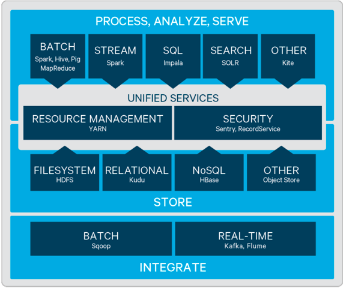

CDH概述
================================================================================
CDH是Apache Hadoop和相关项目的最完整，经过测试且颇受欢迎的发行版。CDH提供了Hadoop的核心元素、
可扩展的存储和分布式计算、以及基于Web的用户界面和重要的企业功能。 CDH是Apache许可的开源软件，
是 **唯一提供统一批处理，交互式SQL和交互式搜索以及基于角色的访问控制的Hadoop解决方案**。

CDH提供：
+ **灵活性** - 存储任何类型的数据并使用各种不同的计算框架进行处理，包括批处理，交互式SQL，自由
文本搜索，机器学习和统计计算。
+ **集成** - 在一个可与多种硬件和软件解决方案配合使用的完整Hadoop平台上快速启动并运行。
+ **安全** - 处理和控制敏感数据。
+ **可伸缩性** - 支持广泛的应用程序和可伸缩性，并扩展它们以满足您的需求。
+ **高可用性** - 可自信地执行关键业务任务。
+ **兼容性** - 利用现有的IT基础架构和投资。

