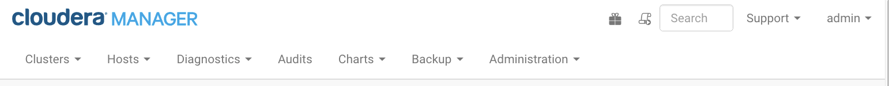
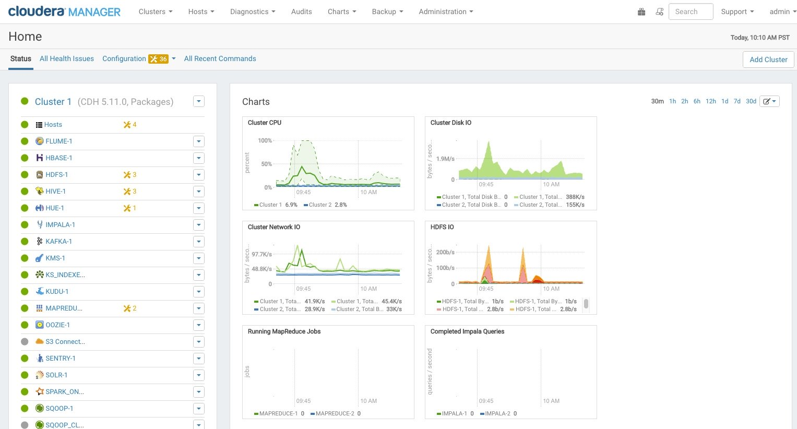

Cloudera Manager管理控制台
================================================================================
Cloudera Manager管理控制台是用于配置，管理和监控CDH的基于Web的用户界面。

如果登录到Cloudera Manager管理控制台时未配置任何服务，将显示Cloudera Manager安装向导。如果服务
已配置，Cloudera Manager顶部导航栏：



和主页显示。Cloudera Manager管理控制台顶部导航栏提供以下选项卡和菜单：
+ 集群>集群名称
  - **服务** - 显示个人服务和Cloudera管理服务。在这些页面中，您可以：
    + 查看服务实例或与该服务关联的角色实例的状态和其他详细信息
    + 对服务实例，角色或特定角色实例进行配置更改
    + 添加和删除服务或角色
    + 停止，启动或重新启动服务或角色。
    + 查看为服务或角色运行的命令
    + 查看审计事件历史记录
    + 部署和下载客户端配置
    + 停用和重新投放角色实例
    + 进入或退出维护模式
    + 执行特定类型服务的独特操作。例如：
      - 启用HDFS高可用性或NameNode联合
      - 运行HDFS负载均衡
      - 创建HBase，Hive和Sqoop目录
  - **Cloudera Manager管理服务** - 管理和监控Cloudera Manager管理服务。这包括以下角色：活动监视器，
  警报发布服务器，事件服务器，主机监视器，导航器审计服务器，导航器元数据服务器，报表管理器和服务监视器。
  - **Cloudera Navigator** - 打开Cloudera Navigator用户界面。
  - **主机** - 显示群集中的主机。
  - **报告** - 创建有关HDFS，MapReduce，YARN和Impala使用情况的报告并浏览HDFS文件，并管理HDFS目录的配额。
  - **利用率报告** - 打开“集群利用率报告”。显示YARN和Impala作业的汇总利用率信息。
  - **MapReduce_service_name作业** - 查询有关群集上运行的MapReduce作业的信息。
  - **YARN_service_name应用程序** - 查询有关群集上运行的YARN应用程序的信息。
  - **Impala_service_name查询** - 查询有关群集上运行的Impala查询的信息。
  - **动态资源池** - 通过指定命名池的相对权重来管理集群资源向YARN和Impala服务的动态分配。
  - **静态服务池** - 管理群集资源静态分配给HBase，HDFS，Impala，MapReduce和YARN服务。
+ 主机 - 显示由Cloudera Manager管理的主机。
  - **所有主机** - 显示集群中的管理主机列表。
  - **角色** - 显示在每台主机上部署的角色。
  - **主机模板** - 创建和管理主机模板，它定义了可用于轻松扩展群集的多组角色组。
  - **磁盘概览** - 显示集群中所有磁盘的状态。
  - **Parcels** - 显示集群中可用的Parcels，并允许您下载，分发和激活新Parcel。
  在这个页面你可以：
  - 查看有关各个主机的状态和各种详细度量标准
  - 进行主机监控的配置更改
  - 查看主机上运行的所有进程
  - 运行主机检查器
  - 添加和删除主机
  - 创建和管理主机模板
  - 管理Parcels
  - 退役和重新委托主机
  - 进行机架分配
  - 运行主机升级向导
+ 诊断 - 查看日志，事件和警报来诊断问题。子页面是：
  - **事件** - 搜索并显示已发生的事件和警报。
  - **日志** - 按服务，角色，主机和搜索词组以及日志级别（严重性）搜索日志。
  - **服务器日志** - 显示Cloudera Manager服务器日志。
+ 审计 - 跨集群查询和过滤审计事件，包括登录。
+ 图表 - 查询感兴趣的指标，将它们显示为图表，并显示个性化图表仪表板。
+ 备份 - 管理复制计划和快照策略。
+ 管理 - 管理Cloudera Manager。 子页面是：
  - **设置** - 配置Cloudera Manager。
  - **警报** - 显示何时生成警报，配置警报收件人并发送测试警报邮件。
  - **用户** - 管理Cloudera Manager用户和用户会话。
  - **安全性** - 生成Kerberos凭据并检查主机。
  - **许可证** - 管理Cloudera许可证。
  - **语言** - 设置用于活动事件，健康事件和警报电子邮件内容的语言。
  - **AWS Credentials** - 配置到Cloudera Manager的S3连接。
+ Parcel图标 - 链接到主机>Parcel页面。
+ 运行命令指示器 - 图标显示当前为所有服务或角色运行的命令的数量。
+ 搜索 - 支持搜索服务，角色，主机，配置属性和命令。您可以输入一个部分字符串和一个下拉列表，最多可以显示
16个匹配的实体。
+ 支持 - 显示各种支持操作。子命令是：
  - **发送诊断数据** - 将数据发送到Clouder官方支持以支持故障排除。
  - **支持门户（Cloudera Enterprise）** - 显示Cloudera支持门户。
  - **邮件列表（Cloudera Express）** - 显示Cloudera Manager用户列表。
  - **计划的诊断**：每周 - 配置自动收集诊断数据并发送到Cloudera支持的频率。
  - 以下链接打开Cloudera网站上的最新文档：
    + 帮助
    + 安装指南
    + API文档
    + 发行说明
  - **关于** - Cloudera Manager的版本号和内部版本详细信息以及Cloudera Manager服务器的当前日期和时间戳。
+ 登录的用户菜单 - 当前登录的用户。子命令是：
  - **更改密码** - 更改当前登录用户的密码。
  - **登出**

### 1.启动并登录到管理控制台
1. 在Web浏览器中，输入 **http//server_host7180**，其中服务器主机是运行Cloudera Manager服务器的主机的
FQDN或IP地址。显示Cloudera Manager Admin Console的登录屏幕。
2. 使用管理员分配的凭据登录到Cloudera Manager管理控制台。用户帐户分配的角色限制了您可以使用的功能。
```
注意：您可以将Cloudera Manager管理控制台配置为在可配置的时间段后自动注销用户。请参阅自动注销。
```

### 2.Cloudera Manager管理控制台主页
当您启动Cloudera Manager管理控制台时，会显示 **主页>状态选项卡**。



您也可以通过单击顶部导航栏中的Cloudera Manager徽标来转到主页>状态选项卡。

#### 2.1.状态
状态标签包含：
+ **集群** - 由Cloudera Manager管理的集群。每个群集都以摘要形式或完整形式显示，具体取决于
**Administration（管理）> Settings（设置）> Other（其他）> Full Property（显示为完整）** 属性中的
**Maximum Cluster Count（最大群集计数）**。当群集数量超过属性值时，仅显示群集摘要信息。
  - **摘要表单** - 群集状态页面的链接列表。单击自定义跳转到 **管理>设置>其他>最大群集数** 显示在完整属性中。
  - **完整表格** - 每个群集都有一个单独的部分，其中包含指向群集状态页面的链接以及一个表，其中包含指向主机页面
  的链接以及群集中运行的服务的状态页面。表中的每个服务行都有一个您通过单击选择的操作菜单，并且可以包含一个或多
  个以下指示符：
  
  | 指示符 | 含义 | 描述 |
  | :------------- | :------------- | :--------------- |
  |  | 健康问题 | 表示该服务至少有一个健康问题。 该指标显示最高严重级别的健康问题的数量。 如果健康测试结果不正确，指示灯将变为红色。 如果没有错误的健康测试结果，但关于测试结果存在，则该指示器为黄色。 如果没有不良或有关健康测试结果，则不显示指示。 **重要提示：如果有一个不良健康检查结果和两个有关健康结果，则会有三个健康问题，但是该数字为1**。单击指示器以显示“健康问题”弹出对话框。默认情况下，只有不良健康测试结果显示在对话框中。要显示关于运行状况测试结果，请单击另外显示n关于问题的链接。单击链接以显示状态页面，其中包含有关运行状况测试结果的详细信息。|


    333
