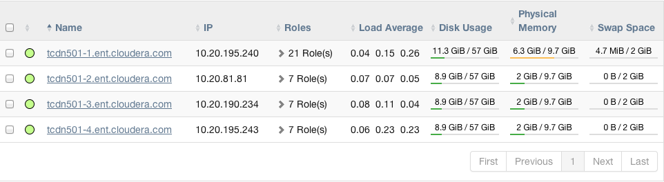

Cloudera Manager 5概述
================================================================================
**Cloudera Manager是管理CDH群集的端到端应用程序**。Cloudera Manager通过对CDH集群的每个部分提供
细粒度的可见性和控制权，为企业部署制定了标准，从而提高性能，提高服务质量，提高合规性并降低管理成本。借助
Cloudera Manager，您可以轻松部署和集中操作完整的CDH堆栈和其他托管服务。该应用程序可自动执行安装过程，
**将部署时间从几周缩短到几分钟**；为您提供集群范围的实时主机和服务运行视图；**提供了一个单一的中央控制台
来执行群集中的配置更改**；并整合了各种报告和诊断工具来帮助您优化性能和利用率。本入门介绍了Cloudera
Manager的基本概念，结构和功能。

### 1.术语
要有效地使用Cloudera Manager，您应该首先了解其术语。 术语之间的关系如下所示，其定义如下：


一些术语，如 **集群** 和 **服务**，将被使用而无需进一步解释。其他部分，如 **角色组，网关，主机模板和
parcel** 将在后面的章节中扩展。

#### 1.1.部署
Cloudera Manager的配置及其管理的所有群集。

#### 1.2.动态资源池
在Cloudera Manager中，资源的命名配置和用于在池中运行的YARN应用程序或Impala查询之间调度资源的
策略。

#### 1.3.集群
+ 一组包含HDFS文件系统并在该数据上运行MapReduce和其他进程的计算机或机架。伪分布式群集是在单台机器
上运行的CDH安装，可用于演示和个人学习。
+ 在Cloudera Manager中，这是一个逻辑实体，它包含一组主机，安装在主机上的单一版本的CDH以及在主机上
运行的服务和角色实例。主机只能属于一个群集。Cloudera Manager可以管理多个CDH群集，但每个群集只能与
单个Cloudera Manager Server或Cloudera Manager HA配对关联。

#### 1.4.主机
在Cloudera Manager中，运行角色实例的物理机器或虚拟机器。主机只能属于一个群集。

#### 1.5.机架
在Cloudera Manager中，物理实体包含一组通常由相同交换机提供服务的物理主机。

#### 1.6.服务
+ 尽可能在可预测的环境下，在 **/etc/init.d/** 中运行System V init脚本的Linux命令，删除大多数
环境变量并将当前工作目录设置为/。
+ Cloudera Manager中的一类管理功能，可以分发或不分发，在群集中运行。有时称为服务类型。例如：
MapReduce，HDFS，YARN，Spark和Accumulo。在传统环境中，多个服务在一台主机上运行; 在分布式系统中，
服务在许多主机上运行。

#### 1.7.服务实例
在Cloudera Manager中，一个在集群上运行的服务实例。例如：“HDFS-1”和“yarn”。**服务实例跨越许多角
色实例**。

#### 1.8.角色
在Cloudera Manager中，服务中的一类功能。例如，**HDFS服务** 具有以下 **角色**：NameNode，
SecondaryNameNode，DataNode和Balancer。有时称为 **角色类型** 另请参阅用户角色。

#### 1.9.角色实例
在Cloudera Manager中，在主机上运行角色的实例。它通常映射到一个Unix进程。例如：“NameNode-h1”和
“DataNode-h1”。

#### 1.10.角色组
在Cloudera Manager中，一组角色实例的配置属性。

#### 1.11.主机模板
Cloudera Manager中的 **一组角色组**。将模板应用于主机时，将创建每个角色组的角色实例并将其分配给该
主机。

#### 1.12.网关
**通常为特定集群服务提供客户端访问权限的一种角色**。例如，HDFS，Hive，Kafka，MapReduce，Solr和
Spark各自都具有网关角色，**为其客户提供访问其各自服务的权限**。网关角色的名称并不总是具有“网关”，
也不是专门用于客户端访问。例如，Hue Kerberos Ticket Renewer是一个代理Kerberos票据的网关角色。

**支持一个或多个网关角色的节点有时被称为网关节点或边缘节点**，其中“边缘”的概念在网络或云环境中是常见的。
就Cloudera群集而言，当从Cloudera Manager管理控制台的“操作”菜单中选择“部署客户端配置”时，群集中的
网关节点将接收相应的客户端配置文件。

#### 1.13.parcel
二进制分发格式，包含已编译的代码和元信息，如软件包描述，版本和依赖关系。

#### 1.14.静态服务池
在Cloudera Manager中，**总集群资源（CPU，内存和I/O权重）的静态分区** - 跨越一系列服务。

#### 1.15.群集示例
请考虑具有四台主机的群集"Cluster1"，如以下Cloudera Manager列表中所示：



主机tcdn501-1是群集的“master”主机，因此与其他主机上运行的7个角色实例相比，它拥有更多的角色实例21。
除CDH“master”角色实例外，tcdn501-1还具有Cloudera管理服务角色：


### 2.架构
如下所示，Cloudera Manager的核心是Cloudera Manager Server。服务器承载管理控制台Web服务器和应用
程序逻辑，负责安装软件，配置，启动和停止服务以及管理运行服务的群集。


Cloudera Manager Server与其他几个组件一起工作：
+ **代理** - 安装在每台主机上。代理负责启动和停止进程，解压缩配置，触发安装以及监视主机。
+ **管理服务** - 由一组执行各种监视，警报和报告功能的角色组成的服务。
+ **数据库** - 存储配置和监视信息。通常，多个逻辑数据库在一个或多个数据库服务器上运行。例如，
Cloudera Manager Server和监控角色使用不同的逻辑数据库。
+ **Cloudera存储库** - 由Cloudera Manager分发的软件存储库。
+ **客户端** - 是与服务器交互的接口：
  - **管理控制台** - 管理员用于管理集群和Cloudera Manager的基于Web的用户界面。
  - **API** - 与开发人员创建自定义Cloudera Manager应用程序的API。

#### 2.1.心跳
心跳是Cloudera Manager中的主要通信机制。默认情况下，代理 **每15秒** 向Cloudera Manager服务器发送
检测信号。但是，为了减少用户等待时间，当状态发生变化时，频率会增加。

在心跳交换过程中，代理通知Cloudera Manager Server其活动。 而Cloudera Manager Server则会响应代理
应执行的操作。代理和Cloudera Manager Server最终都会进行一些调整。例如，如果您启动服务，代理将尝试启动
相关流程; 如果某个进程无法启动，Cloudera Manager Server会将启动命令标记为失败。

### 3.状态管理
Cloudera Manager Server维护集群的状态。此状态可以分为两类：“**模型**”和“**运行时**”，两者均存储在
Cloudera Manager Server数据库中。


Cloudera Manager建模CDH和托管服务：它们的角色、配置和相互依赖关系。模型状态捕获应该在哪里运行的内
容以及使用什么配置。例如，模型状态捕获了一个集群包含17个主机的事实，每个主机应该运行一个DataNode。
您可以通过Cloudera Manager管理控制台配置屏幕以及API和操作（如“添加服务”）与模型进行交互。

运行时状态是在哪里运行的进程，以及哪些命令（例如，重新平衡HDFS或运行备份/灾难恢复计划或滚动重新启动或
停止）正在运行。运行时状态包括运行进程所需的确切配置文件。当您在Cloudera Manager管理控制台中选择“启动”时，
服务器将收集相关服务和角色的所有配置，验证它，生成配置文件并将它们存储在数据库中。

更新配置（例如，Hue Server Web端口）时，您已更新模型状态。但是，如果Hue在执行此操作时正在运行，它仍
在使用旧端口。当这种不匹配发生时，角色被标记为具有“过时配置”。要重新同步，您需要重新启动角色（这会触发
配置重新生成和进程重新启动）。

当Cloudera Manager建模所有合理的配置时，有些情况下不可避免地需要特殊处理。为了让您解决问题（例如，错误
或探索不支持的选项），Cloudera Manager支持“高级配置代码段”机制，可让您直接向配置文件添加属性。

### 4.配置管理
Cloudera Manager定义了几个级别的配置：
+ **服务级别** 可以定义适用于整个服务实例的配置，例如HDFS服务的默认复制因子（dfs.replication）。
+ **角色组级别** 可以定义适用于成员角色的配置，例如DataNode的处理程序计数（dfs.datanode.handler.count）。
对于不同的DataNode组可以设置不同的值。例如，运行在功能更强大的硬件上的DataNode可能有更多的处理程序。
+ **角色实例级别** 可以覆盖它从其角色组继承的配置。这应该谨慎使用，因为它很容易导致角色组内的配置分歧。
一个示例用法是临时启用特定角色实例中的调试日志记录以解决问题。
+ **主机** 具有与监视，软件管理和资源管理相关的配置。
+ **Cloudera Manager** 本身具有与其自身管理操作相关的配置。

#### 4.1.角色组
您可以在服务实例（例如HDFS）或角色实例（例如，host17上的DataNode）上设置配置。单个角色继承在服务级别设
置的配置。在角色级别进行的配置将覆盖从服务级别继承的配置。虽然这种方法提供了灵活性，但以同样的方式配置一组
角色实例可能会很乏味。

Cloudera Manager支持角色组，这是一种将配置分配给一组角色实例的机制。这些组的成员然后继承这些配置。例如，
在具有异构硬件的群集中，可以为每种主机类型创建一个DataNode角色组，并且可以将这些主机上运行的DataNode分配
给其相应的角色组。这使得可以通过修改一个角色组的配置来为在同一硬件上运行的所有DataNode设置配置。前面讨论的
HDFS服务具有为服务角色定义的以下角色组：


除了易于管理角色子集的配置外，角色组还可以为不同用户或工作负载维护用于实验或管理共享群集的不同配置。

#### 4.2.主机模板
在典型的环境中，主机组具有相同的硬件和相同的一组服务。主机模板在集群中定义一组角色组（最多只能有一种类型），
并提供两个主要优点：
+ 轻松地将新主机添加到集群 - 多个主机可以创建，配置和启动一个操作中的不同服务。
+ 轻松更改一组主机上不同服务的角色配置 - 这对于快速切换整个群集的配置以适应不同的工作负载或用户非常有用。

#### 4.3.服务器和客户端配置
管理员有时会惊讶于修改 **/etc/hadoop/conf** 然后重新启动HDFS不起作用。这是因为Cloudera Manager启动
的服务实例不会从默认位置读取配置。以HDFS为例，当不受Cloudera Manager管理时，每个主机通常会有一个HDFS配置，
位于/etc/hadoop/conf/hdfs-site.xml。运行在同一主机上的服务器端守护进程和客户端都将使用相同的配置。

**Cloudera Manager区分服务器和客户端配置**。对于HDFS，文件/etc/hadoop/conf/hdfs-site.xml只包含与
HDFS客户端相关的配置。也就是说，默认情况下，如果您运行需要与Hadoop通信的程序，它将从该目录获取NameNode和
JobTracker的地址以及其他重要配置。对/etc/hbase/conf和/etc/hive/conf采取了类似的方法。
相比之下，HDFS角色实例（例如NameNode和DataNode）从 **/var/run/cloudera-scm-agent/process/unique-process-name**
下的专用per-process目录获取其配置。为每个进程分配自己的专用执行和配置环境，允许Cloudera Manager独立控制
每个进程。例如，以下是一个示例879-hdfs-NAMENODE进程目录的内容：
```shell
$ tree -a /var/run/cloudera-scm-Agent/process/879-hdfs-NAMENODE/
  /var/run/cloudera-scm-Agent/process/879-hdfs-NAMENODE/
  ├── cloudera_manager_Agent_fencer.py
  ├── cloudera_manager_Agent_fencer_secret_key.txt
  ├── cloudera-monitor.properties
  ├── core-site.xml
  ├── dfs_hosts_allow.txt
  ├── dfs_hosts_exclude.txt
  ├── event-filter-rules.json
  ├── hadoop-metrics2.properties
  ├── hdfs.keytab
  ├── hdfs-site.xml
  ├── log4j.properties
  ├── logs
  │   ├── stderr.log
  │   └── stdout.log
  ├── topology.map
  └── topology.py
```
区分服务器和客户端配置提供了几个优点：
+ 服务器端配置中的敏感信息（例如Hive Metastore RDBMS的密码）不会暴露给客户端。
+ 依赖于其他服务的服务可以使用自定义配置进行部署。例如，要获得良好的HDFS读取性能，Impala需要HDFS客户端
配置的专用版本，这可能会对通用客户端造成危害。这是通过将Impala守护进程（存储在上述每个进程目录中）的HDFS
配置与通用客户端（/etc/hadoop/conf）的HDFS配置分开来实现的。
+ 客户端配置文件更小，可读性更好。这也避免了使用不相关的服务器端属性来迷惑非管理员的Hadoop用户。

#### 4.4.部署客户端配置和网关
客户端配置是一个zip文件，其中包含具有服务设置的相关配置文件。每个zip文件都包含该服务所需的一组配置文件。
例如，MapReduce客户端配置zip文件包含core-site.xml，hadoop-env.sh，hdfs-site.xml，log4j.properties
和mapred-site.xml的副本。Cloudera Manager支持“下载客户端配置”操作，以便将客户端配置文件分发给群集外部
的用户。

Cloudera Manager可以在集群内部署客户端配置; 每个适用的服务都具有“部署客户端配置”操作。此操作不一定会将客
户端配置部署到整个群集; 它仅将客户端配置部署到此服务分配给的所有主机。例如，假设一个集群有10个主机，并且主机
1-9上正在运行MapReduce服务。当您使用Cloudera Manager部署MapReduce客户端配置时，主机10将不会获得客户端
配置，因为MapReduce服务没有为其分配任何角色。此设计旨在避免从多个服务部署冲突的客户端配置。

要将客户端配置部署到未分配角色的主机，请使用网关。网关是传达服务应该可以从特定主机访问的标志。与所有其他角色
不同，它没有关联的进程。在前面的示例中，要将MapReduce客户端配置部署到主机10，请将MapReduce网关角色分配给
该主机。

网关也可以用来为某些主机定制客户端配置。网关可以放置在角色组中，并且可以对这些组进行不同的配置。但是，与角色实
例不同，无法覆盖网关实例的配置。

在我们前面讨论的集群中，没有Hive角色实例的三个主机（tcdn501-[2-5]）具有Hive网关：


dd
