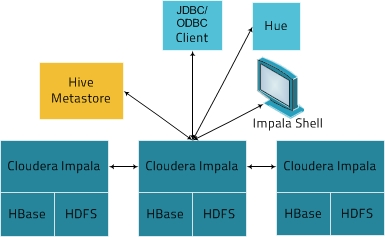

Apache Impala概述
================================================================================
**Impala直接在存储在HDFS、HBase中的Apache Hadoop数据上提供快速的交互式SQL查询**。除了使用相
同的统一存储平台之外，**Impala还使用与Apache Hive相同的元数据，SQL语法（Hive SQL），ODBC驱动
程序和用户界面（Hue中的Impala查询UI）**。这为实时或面向批处理的查询提供了一个熟悉且统一的平台。

**Impala是对可用于查询大数据的工具的补充。Impala不会取代基于MapReduce（如Hive）的批处理框架。
基于MapReduce构建的Hive和其他框架最适合长时间运行的批处理作业，例如涉及批处理提取、转换和加载（ETL）
类型作业的批处理作业**。
```
注意：Impala于2017年11月15日毕业于Apache孵化器。在之前称为“Cloudera Impala”的文档中，现在的官方名称是“Apache Impala”
```

### 1.Impala的好处
Impala提供：
+ 数据科学家和分析师已经知道的熟悉的SQL接口。
+ 能够在Apache Hadoop中查询大量数据（“大数据”）。
+ 在集群环境中执行查询，以方便扩展和使用具有成本效益的硬件。
+ 无需复制或导出/导入步骤即可在不同组件之间共享数据文件；**例如，使用Pig编写代码，使用Hive进行转
换并使用Impala进行查询。Impala可以读取和写入Hive表格，实现使用Impala进行简单数据交换，以便对
Hive生成的数据进行分析**。
+ 用于大数据处理和分析的单一系统，因此客户可以避免昂贵的建模和ETL仅用于分析。

### 2.Impala如何与CDH配合使用
下图说明了Impala如何在更广泛的Cloudera环境中定位：



Impala解决方案由以下组件组成：
+ **客户端** - 包括 **Hue，ODBC客户端，JDBC客户端和Impala Shell** 在内的实体都可以与Impala进
行交互。这些接口通常用于发出查询或完成管理任务，例如连接到Impala。
+ **Hive Metastore** - **存储有关Impala可用数据的信息**。例如，Metastore让Impala知道哪些数
据库可用，以及这些数据库的结构如何。在创建、删除和更改模式对象，通过Impala SQL语句将数据加载到表中
时，相关的元数据更改将通过 **Impala 1.2** 中引入的 **专用目录服务** 自动广播到所有Impala节点。
+ **Impala** - **这个在DataNode上运行的进程**，协调和执行查询。Impala的每个实例都可以接收、计
划和协调来自Impala客户端的查询。查询分布在Impala节点中，然后这些节点充当工作人员，执行并行查询片段。
+ **HBase和HDFS** - 存储要查询的数据。

使用Impala执行的查询处理如下：
1. 用户应用程序通过ODBC或JDBC向Impala发送SQL查询，**这些查询提供标准化的查询接口**。用户应用程序
可能连接到群集中的任何 **impalad**，这impalad成为查询的协调员。
2. Impala解析查询并对其进行分析，以确定跨集群的impalad实例需要执行哪些任务，执行计划是为了优化效率。
3. 本地impalad实例访问HDFS和HBase等服务以提供数据。
4. 每个impalad将数据返回给 **协调impalad**，它将这些结果发送给客户端。

### 3.主要Impala功能
Impala为以下方面提供支持：
+ Hive Query Language（**HiveQL**）的大多数常见 **SQL-92功能** ，包括SELECT，连接和聚合函数。
+ HDFS、HBase，其中包括：
  - HDFS文件格式：分隔文本文件，Parquet，Avro，SequenceFile和RCFile。
  - 压缩编解码器：Snappy，GZIP，Deflate，BZIP。
+ 常见的数据访问接口包括：
  - JDBC驱动程序。
  - ODBC驱动程序。
  - Hue Beeswax和Impala查询UI。
+ impala-shell命令行界面。
+ Kerberos身份验证。
