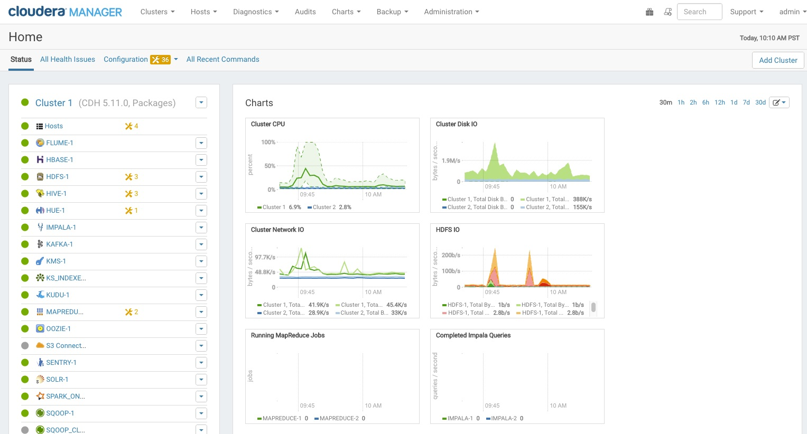

测试安装
================================================================================
要开始测试，请启动Cloudera Manager管理控制台。一旦你登录，主页应该看起来像这样：



屏幕左侧是当前使用其状态信息运行的服务列表。所有的服务应该运行健康良好 。
您可以单击每个服务查看有关每个服务的更多详细信息。您还可以通过检查每个主机的心跳，运行MapReduce作业
或使用现有的Hue应用程序与集群进行交互来测试安装。

## 检查主机心跳
检查所有代理是否在运行的一种方法是查看自上次心跳以来的时间。您可以通过单击“主机”选项卡执行此操作，
您可以在其中查看所有主机的列表以及其“最后心跳”的值。默认情况下，每个代理程序必须每15秒成功检测一次。
Last Heartbeat的最近值表示服务器和客户端正在成功通信。

## 运行MapReduce作业
1. 登录到群集中的主机。
2. 使用以下命令之一运行Hadoop PiEstimator示例：
    + **Parcel**：
        ```shell
        sudo -u hdfs hadoop jar /opt/cloudera/parcels/CDH/lib/hadoop-mapreduce/hadoop-mapreduce-examples.jar pi 10 100
        ```
3. 根据您的群集是否配置为在YARN或MapReduce服务上运行MapReduce作业，请通过从Cloudera Manager管理控制台
的顶部导航栏中选择以下某个选项来查看运行作业的结果：
    + `集群 > ClusterName > yarn应用程序`
    + `集群 > 集群名称 > mapreduce活动`
