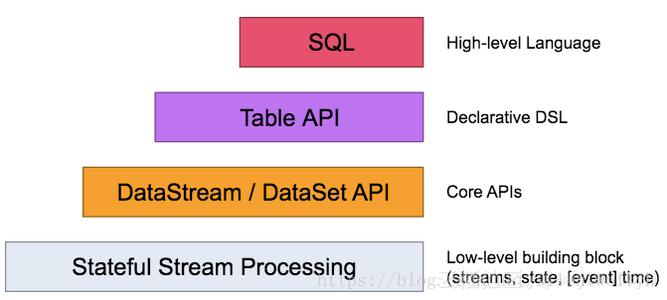

Flink编程模型
================================================================================
## 1.数据集类型
根据现实的数据产生方式和数据产生是否含有边界角度，将数据分为两种类型的数据集，**一种是有界数据集，
另外一种是无界数据集**。

### 1.1.有界数据集
有界数据集具有 **时间边界**，在处理过程中数据一定会在某个时间范围内起始和结束，有可能是一分钟，
也有可能是一天内的交易数据。**对有界数据集的数据处理方式被称为批处理**，而针对批数据处理，目前业
界比较流行的分布式批处理框架有：**Apache Hadoop和Apache Spark** 等。

### 1.2.无界数据集
对于无界数据集，数据从开始生成就一直持续不断地产生新的数据，因此数据是没有边界的，例如服务器的日
志、传感器信号数据等。**对无界数据集的数据处理方式被称为流式数据处理，简称为流计算**。可以看出，
流式数据处理过程实现复杂度会更高，因为需要考虑处理过程中 **数据的顺序错乱，以及系统容错等方面的
问题**，因此流处理需要借助专门的流数据处理技术。目前业界的`Apache Storm`、`Spark Streaming`、
`Apache Flink`等分布式计算引擎都能不同程度地支持处理流式数据。

### 1.3.统一数据处理
有界数据集和无界数据集只是一个相对概念，主要根据时间的范围而定，**可以认为一段时间内的无界数据集
其实就是有界数据集，同时有界数据也可以通过一些方法转换为无界数据**。例如系统一年报订单交易数据，
其本质上应该是有界的数据集，可是当我们把它一条一条按照产生的顺序发送到流式系统，通过流式系统对数
据进行处理，在这种情况下可以认为数据是无界的。对于无界数据也可以拆分成有界数据进行处理，例如将系
统产生的数据接入到存储系统，按照年或月进行切割，切分成不同时间长度的有界数据集，然后就可以通过批
处理方式对数据进行处理。从以上分析我们可以得出结论：**有界数据和无界数据其实是可以相互转换的。有
了这样的理论基础，对于不同的数据类型，业界也提出了不同的能够统一数据处理的计算框架**。

目前在业界比较熟知的开源大数据处理框架中，能够同时支持流计算和批处理，比较典型的代表分别为
`Apache Spark`和`Apacke Flink`两套框架。其中 **Spark通过批处理模式来统一处理不同类型的数据
集**，对于流数据是将数据按照批次切分成 **微批**（有界数据集）来进行处理。**Flink** 则从另外一
个角度出发，**通过流处理模式来统一处理不同类型的数据集**。Flink用比较符合数据产生的规律方式处理
流数据，对于有界数据可以转换成无界数据统一进行流式，最终将批处理和流处理统一在一套流式引擎中，这
样用户就可以使用一套引擎进行批处理和流计算的任务。Flink作为一套新兴的分布式计算引擎，能够在统一
平台中很好地处理流式任务和批量任务，同时使用流计算模式更符合数据产生的规律。

## 2.Flink编程接口



Flink根据数据集类型的不同将核心数据处理接口分为两大类：一类是支持批计算的接口`DataSet API`，
另外一类是支持流计算的接口`DataStream API`。同时Flink将数据处理接口抽象成四层，由上向下分别为：
`SQL API`、`Table API`、`DataStream/DataSet API`以及`Stateful Stream Processing API`，
用户可以根据需要选择任意一层抽象接口来开发Flink应用。

### 2.1.Flink SQL
Flink提供了 **统一的SQL API**完成对批处理和流计算的处理，目前SQL API也是社区重点发展的接口层。

### 2.2.Table API
**Table API将内存中的DataStream和DataSet数据集在原有的基础之上增加Schema信息，将数据类型统
一抽象成表结构，然后通过Table API提供的接口处理对应的数据集**。SQL API则可以直接查询Table API
中注册表中的数据表。Table API构建在DataStream和DataSet之上的同时，提供了大量面向领域语言的编
程接口，例如`GroupByKey`、`Join`等操作符，提供给用户一种更加友好的处理数据集的方式。除此之外，
Table API在转换为DataStream和DataSet的数据处理过程中，也应用了大量的优化规则对处理逻辑进行了
优化。同时Table API中的Table可以和DataStream及DataSet之间进行相互转换。

### 2.3.DataStream API和DataSet API
DataStream API和DataSet API主要面向具有开发经验的用户，**用户可以使用DataStream API处理
无界流数据，使用DataSet API处理批量数据**。DataStream API和DataSet API接口同时提供了各种
数据处理接口，例如：`map`、`filter`、`oins`、`aggregations`、`window`等方法，**同时每种
接口都支持了Java、Scala及Python等多种开发语言的SDK**。

### 2.4.Stateful Stream Process API
`Stateful Stream Process API`是Flink中处理`Stateful Stream`最底层的接口，**用户可以使
用`Stateful Stream Process`接口操作状态、时间等底层数据**。使用`Stream Process API`接口
开发应用的灵活性非常强，可以实现非常复杂的流式计算逻辑，但是相对用户使用成本也比较高，**一般企业
在使用Flink进行二次开发或深度封装的时候会用到这层接口**。

## 3.Flink程序结构
Flink应用程序也遵循着一定的编程模式。不管是使用DataStream API还是DataSet API基本具有相同的
程序结构，如下代码所示。**通过流式计算的方式实现对文本文件中的单词进行统计**，然后将结果输出在给
定路径中。
```scala

```


