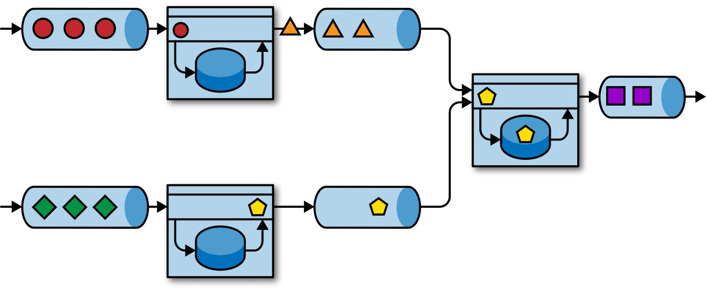

状态化流处理概述
================================================================================
## 1.传统数据处理架构
绝大多数企业所实现的传统架构都会将数据处理分为两类：**事务型处理** 和 **分析型处理**。

## 1.1.事务型处理
企业在日常业务运营过程中会用到各类应用，例如：企业资源规划（ERP）系统、客户关系管理（CRM）系统、
基于Web的应用等。

## 1.2.分析型处理
存储于不同事务型数据库系统中的数据，可以为企业提供业务运营相关的分析见解。例如：通过分析订单处理
系统中的数据来获知销售增长率，或者通过分析运输延迟原因或预测销售量以调整库存。**然而用于存储事务
性数据的多个数据库系统通常都是相互隔离的，如能将它们联合分析必然会创造更高的价值**。

**对于分析类查询，我们通常不会直接在事务型数据库上执行，而是将数据复制到一个专门用来处理分析类查
询的数据仓库**。为了填充数据仓库，需要将事务型数据库系统中的数据拷贝过去。这个向数据仓库拷贝数据
的过程被称为 **提取、转换、加载（ETL）**。ETL的基本流程是，从事务型数据库中提取数据，将其转换为
通用表示形式，最终加载到分析型数据库中。为了保持数据仓库中的数据同步，ETL过程需要周期性地执行。

一旦数据导入数据仓库，我们就能对它们做查询分析。**通常数据仓库中的查询可以分为两类：第一类是定期
报告查询**。它可用于计算业务相关的统计数据，如收入、用户增长、产出等。将这些指标整合成报告，能够
帮助管理层评估企业整体健康状况。**第二类是即席查询**。其主要目的是通过解答特定问题来辅助关键性的
商业决策，例如通过查询来整合营收数字和电台广告中的投入，以评估市场营销的有效性。

## 2.状态化流处理
**几乎所有数据都是连续事件流的形式产生**。请考虑一下，无论是网站或移动应用中的用户交互或订单下达，
还是服务器日志或传感器测量结果，这些数据本质上都是事件流。**作为一类面向无限事件流的应用设计模式，
状态化流处理适用于企业IT基础设施中的很多应用场景**。

**任何一个处理事件流的应用，如果要支持跨多条记录的转换操作，都必须是有状态的，即能够存储和访问中
间结果。应用收到事件后可以执行包括读写状态在内的任意计算**。

**Apache Flink会将应用状态存储在本地内存或嵌入式数据库中**。由于采用的是分布式架构，Flink需要
对本地状态予以保护，以避免因应用或机器故障导致数据丢失。为了实现该特性，**Flink会定期将应用状态
的一致性检查点（checkpoint）写入远程持久化存储**。

有状态的流处理应用通常会从事件日志中读取事件记录。**事件日志负责存储事件流并将其分布式化**。由于
事件只能以追加的形式写入持久化日志中，所以其顺序无法在后期改变。**有不少事件日志系统都是开源软件，
其中最流行的当属Apache Kafka**。

**将运行在Flink之上的有状态的流处理应用和事件日志系统相连会很有意义。在该架构下，事件日志系统可
以持久化输入事件并以确定的顺序将其重放。一旦出现故障，Flink会利用之前的检查点恢复状态并重置事件
日志的读取位置，以此来使有状态的流处理应用恢复正常**。

三类常见的有状态的流处理应用：
+ 事件驱动型应用
+ 数据管道型应用
+ 数据分析型应用

### 2.1.事件驱动型应用
事件驱动型应用是一类 **通过接收事件流触发** 特定应用业务逻辑的有状态的流式应用。事件驱动型应用的
典型应用场景有：
+ **实时推荐**（例如在客户浏览商家页面的同时进行产品推荐）。
+ **模式识别或复杂事件处理**（例如根据信用卡交易记录进行欺诈识别）。
+ **异常检测**（例如计算机网络入侵检测）。

事件驱动型应用利用事件日志进行通信，其数据则会以本地状态形式存储。如下图：

图中不同应用之间通过 **事件日志** 进行连接，上游应用将结果写入事件日志供下游应用消费使用。**事件
日志将发送端和接收端解耦，并提供异步非阻塞的事件传输机制。每个应用都可以是有状态的，只需要管理好自
身状态而无须访问外部数据存储**。同时，所有应用都支持独立操作和扩缩容。 

### 2.2.数据管道 

### 2.3.流式分析 

