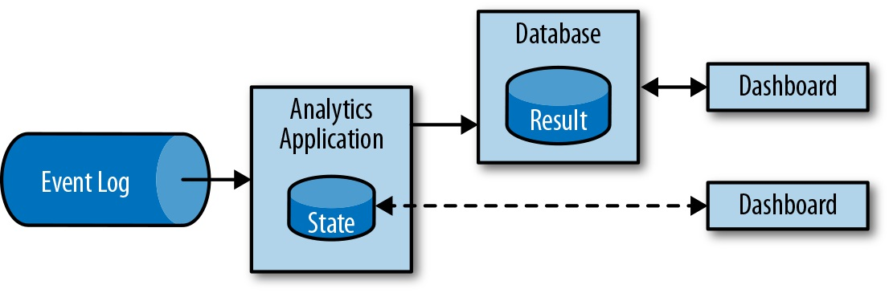

状态化流处理概述
================================================================================
## 1.传统数据处理架构
绝大多数企业所实现的传统架构都会将数据处理分为两类：**事务型处理** 和 **分析型处理**。

## 1.1.事务型处理
企业在日常业务运营过程中会用到各类应用，例如：企业资源规划（ERP）系统、客户关系管理（CRM）系统、
基于Web的应用等。

## 1.2.分析型处理
存储于不同事务型数据库系统中的数据，可以为企业提供业务运营相关的分析见解。例如：通过分析订单处理
系统中的数据来获知销售增长率，或者通过分析运输延迟原因或预测销售量以调整库存。**然而用于存储事务
性数据的多个数据库系统通常都是相互隔离的，如能将它们联合分析必然会创造更高的价值**。

**对于分析类查询，我们通常不会直接在事务型数据库上执行，而是将数据复制到一个专门用来处理分析类查
询的数据仓库**。为了填充数据仓库，需要将事务型数据库系统中的数据拷贝过去。这个向数据仓库拷贝数据
的过程被称为 **提取、转换、加载（ETL）**。ETL的基本流程是，从事务型数据库中提取数据，将其转换为
通用表示形式，最终加载到分析型数据库中。为了保持数据仓库中的数据同步，ETL过程需要周期性地执行。

一旦数据导入数据仓库，我们就能对它们做查询分析。**通常数据仓库中的查询可以分为两类：第一类是定期
报告查询**。它可用于计算业务相关的统计数据，如收入、用户增长、产出等。将这些指标整合成报告，能够
帮助管理层评估企业整体健康状况。**第二类是即席查询**。其主要目的是通过解答特定问题来辅助关键性的
商业决策，例如通过查询来整合营收数字和电台广告中的投入，以评估市场营销的有效性。

## 2.状态化流处理
**几乎所有数据都是连续事件流的形式产生**。请考虑一下，无论是网站或移动应用中的用户交互或订单下达，
还是服务器日志或传感器测量结果，这些数据本质上都是事件流。**作为一类面向无限事件流的应用设计模式，
状态化流处理适用于企业IT基础设施中的很多应用场景**。

**任何一个处理事件流的应用，如果要支持跨多条记录的转换操作，都必须是有状态的，即能够存储和访问中
间结果。应用收到事件后可以执行包括读写状态在内的任意计算**。

**Apache Flink会将应用状态存储在本地内存或嵌入式数据库中**。由于采用的是分布式架构，Flink需要
对本地状态予以保护，以避免因应用或机器故障导致数据丢失。为了实现该特性，**Flink会定期将应用状态
的一致性检查点（checkpoint）写入远程持久化存储**。

有状态的流处理应用通常会从事件日志中读取事件记录。**事件日志负责存储事件流并将其分布式化**。由于
事件只能以追加的形式写入持久化日志中，所以其顺序无法在后期改变。**有不少事件日志系统都是开源软件，
其中最流行的当属Apache Kafka**。

**将运行在Flink之上的有状态的流处理应用和事件日志系统相连会很有意义。在该架构下，事件日志系统可
以持久化输入事件并以确定的顺序将其重放。一旦出现故障，Flink会利用之前的检查点恢复状态并重置事件
日志的读取位置，以此来使有状态的流处理应用恢复正常**。

三类常见的有状态的流处理应用：
+ 事件驱动型应用
+ 数据管道型应用
+ 数据分析型应用

### 2.1.事件驱动型应用
事件驱动型应用是一类 **通过接收事件流触发** 特定应用业务逻辑的有状态的流式应用。事件驱动型应用的
典型应用场景有：
+ **实时推荐**（例如在客户浏览商家页面的同时进行产品推荐）。
+ **模式识别或复杂事件处理**（例如根据信用卡交易记录进行欺诈识别）。
+ **异常检测**（例如计算机网络入侵检测）。

事件驱动型应用利用事件日志进行通信，其数据则会以本地状态形式存储。如下图：

图中不同应用之间通过 **事件日志** 进行连接，上游应用将结果写入事件日志供下游应用消费使用。**事件
日志将发送端和接收端解耦，并提供异步非阻塞的事件传输机制。每个应用都可以是有状态的，只需要管理好自
身状态而无须访问外部数据存储**。同时，所有应用都支持独立操作和扩缩容。 

与事务型应用和微服务架构相比，事件驱动型应用有很多优势：**访问本地状态的性能要比读写远程数据存储
系统更好；伸缩和容错交由流处理引擎完成；以事件日志作为应用的输入，不但完整可靠，而且还支持精准的数
据重放。此外，Flink可以将应用状态重置到之前的某个检查点，从而允许应用在不丢失状态的前提下更新或
扩容**。

**事件驱动型应用对作为载体的底层流处理引擎具有极高的要求**。不同的流处理引擎对于此类应用支持程度
存在一定差异。API的表达能力，以及对状态处理和事件时间的支持水平等诸多因素决定了我们可以实现和执行
的业务逻辑。**这方面具体取决于流处理引擎的API、提供的状态原语，以及对事件时间的处理能力。此外，
作为基本需求，系统要提供精确一次（`exactly-once`）的状态一致性保障和针对应用的可伸缩能力。Apache 
Flink能够同时涵盖上述全部特性，是运行该类应用的一个非常好的选择**。

### 2.2.数据管道 
**如今的IT架构通常会包含多种不同的数据存储**，例如：关系型或专用数据库系统、事件日志系统、分布式
文件系统、内存缓存及搜索引擎等。**为了在各自访问模式下都能达到最佳性能，上述系统会将数据以不同格
式或数据结构存储**。公司为了提高数据访问性能把相同数据存储到多个系统中已非常普遍。由于数据存在多
个副本，这些数据存储系统之间需要保持同步。

在不同存储系统间同步数据的传统方式是定期执行ETL作业，但这对于现如今 很多应用场景而言根本 **无法
满足 延迟方面的需求**。另一个替代方案是 **使用事件日志系统来分发更新**。具体来说就是将更新写入事
件日志系统，并由它进行分发。日志的消费方会将这些更新整合到相关数据存储系统中。根据用例的不同，转
存的数据可能需要归一化，利用外部输入丰富数据或在写入目标存储之前进行数据聚合。

**有状态的流处理应用的另一个日常用例是以低延迟的方式获取、转换并插入数据，我们将此类应用称为数据
管道**。它需要短时间内处理大批量数据。执行数据管道应用的流处理引擎为了支持不同外部系统的数据读写，
还需要提供 **多样化的数据源、数据汇连接器**。Flink同样可以做到上述一切。

### 2.3.流式分析 
ETL作业会周期性地把数据导入数据存储系统，并通过 **即席或计划查询** 处理数据。无论它们的架构是基
于数据仓库还是Hadoop生态系统组件，这都属于 **批处理**。虽然周期性地将数据导入分析系统在多年来一
直是最先进的方法，**但它会给分析流程带来相当大的延迟**。

**流式分析应用不再需要等待周期性地触发。相反，它会持续获取事件流，以极低的延迟整合最新事件，从而
可以不断更新结果**。这有点类似于数据库系统为了更新物化视图而用到的维护技术。通常情况下，流式应用
会把它们的结果保存在某种支持高效更新的外部数据存储中，例如数据库或键值存储。

## 3.开源流处理的演变 
**第一代开源分布式流处理引擎（2011年）专注于以毫秒级延迟处理数据并保证系统故障时事件不会丢失**。
它们的API非常底层，而且并 **未针对流式应用结果的准确性和一致性提供内置保障。其结果完全取决于事件
到达的时间和顺序**。此外，虽然数据在出错时不会丢失，但可能会被处理多次。和批处理引擎相比，**第一
代开源流处理引擎通过牺牲结果的准确度来换取低延迟**。以当前的眼光看待流处理系统，计算快速和结果准
确二者不可兼得，因此才有了所谓的 **Lambda架构**。

