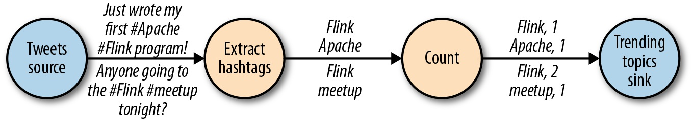

流处理基础
================================================================================
## 1.Dataflow编程概述

### 1.1.Dataflow图
**Dataflow** 程序通常表示为 **有向图**。图中 **顶点称为算子，表示计算；而边表示数据依赖关系**。
算子是Dataflow程序的基本功能单元，它们从输入获取数据，对其进行计算，然后产生数据并发往输出以供后
续处理。**没有输入端的算子称为数据源，没有输出端的算子称为数据汇。一个Dataflow图至少要有一个数
据源和一个数据汇**。如下图展示了一个从推文输入流中提取并统计主题标签的Dataflow程序。

类似上图的Dataflow图被称作 **逻辑图**，因为它们表达了高层视角下的计算逻辑。为了执行Dataflow程
序，需要将逻辑图转化为 **物理Dataflow图**，后都会指定程序的执行细节。下图展示了上图中逻辑图所对
应的物理Dataflow图。**在逻辑Dataflow图中，顶点代表算子；在物理Dataflow图中，顶点代表任务**，
”抽取主题标签“和”计数“算子都包含两个并行算子任务，每个任务负责计算一部分输入数据。

## 1.2.数据并行与任务并行
Dataflow图的并行性可以通过多种方式加以利用。首先，**你可以将输入数据分组，让同一操作的多个任务
并行执行在不同数据子集上，这种并行称为数据并行**。数据并行非常有用，因为它能够将计算负载分配到多
个节点上从而允许处理大规模的数据。再者，你可以让不同算子分配

## 2.并行流处理

## 3.时间语义

## 4.状态和一致性模型
