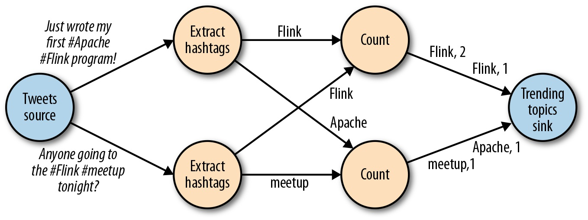
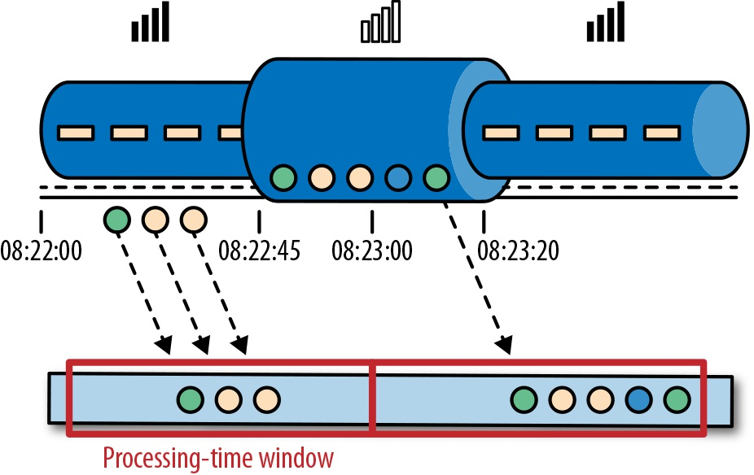

流处理基础
================================================================================
## 1.Dataflow编程概述

### 1.1.Dataflow图
**Dataflow** 程序通常表示为 **有向图**。图中 **顶点称为算子，表示计算；而边表示数据依赖关系**。
算子是Dataflow程序的基本功能单元，它们从输入获取数据，对其进行计算，然后产生数据并发往输出以供后
续处理。**没有输入端的算子称为数据源，没有输出端的算子称为数据汇。一个Dataflow图至少要有一个数
据源和一个数据汇**。如下图展示了一个从推文输入流中提取并统计主题标签的Dataflow程序。

类似上图的Dataflow图被称作 **逻辑图**，因为它们表达了高层视角下的计算逻辑。为了执行Dataflow程
序，需要将逻辑图转化为 **物理Dataflow图**，后都会指定程序的执行细节。下图展示了上图中逻辑图所对
应的物理Dataflow图。**在逻辑Dataflow图中，顶点代表算子；在物理Dataflow图中，顶点代表任务**，
”抽取主题标签“和”计数“算子都包含两个并行算子任务，每个任务负责计算一部分输入数据。

## 1.2.数据并行与任务并行
Dataflow图的并行性可以通过多种方式加以利用。首先，**你可以将输入数据分组，让同一操作的多个任务
并行执行在不同数据子集上，这种并行称为数据并行**。数据并行非常有用，因为它能够将计算负载分配到多
个节点上从而允许处理大规模的数据。再者，**你可以让不同算子的任务（基于相同或不同的数据）并行计算，
这种并行称为任务并行**。通过任务并行，可以更好地利用集群的计算资源。

## 1.3.数据交换策略
**数据交换策略定义了如何将数据项分配给物理Dataflow图中的不同任务。这些策略可以由执行引擎根据算
子的语义自动选择，也可以由Dataflow编程人员显式指定**。如下图：

+ **转发策略（`forward strategy`）在发送端任务和接收端任务之间一对一地进行数据传输。如果两端
任务运行在同一物理机器上（通常由任务调度器决定），该交换策略可以避免网络通信**。
+ **广播策略（`broadcast strategy`）会把每个数据项发往下游算子的全部并行任务。该策略会把数据
复制多份且涉及网络通信，因此代价十分昂贵**。
+ **基于键值的策略（`key-based strategy`）根据某一键值属性对数据分区，并保证键值相同的数据项
会交由同一任务处理。**
+ **随机策略（`random strategy`）会将数据均匀分配至算子的所有任务，以实现计算任务的负载均衡**。

## 2.并行流处理
数据流中的事件可以表示监控数据、传感器测量值、信用卡交易、气象站观测数据、在线用户交互、以及网络
搜索等。本节你将学到 **如何利用Dataflow编程范式并行处理无限数据流**。

### 2.1.延迟和吞吐
对 **批处理应用** 而言，我们通常会关心 **作业的总执行时间**，或者说处理引擎读取输入、执行计算、
写回结果总共需要多长时间。但由于流式应用会持续执行且输入可能是无限的，所以在数据流处理中没有总执
行时间的概念。取而代之的是，**流式应用** 需要针对到来数据尽可能快地计算结果，同时还要应对很高的
事件接入速率，**我们用延迟和吞吐来表示这两方面的性能需求**。

#### 2.1.1.延迟
**延迟表示处理一个事件所需的时间。本质上，它是从接收事件到在输出中观察到事件处理效果的时间间隔**。
在流处理中，延迟是以时间片（例如毫秒）为单位测量的。根据应用的不同，你可能会关注平均延迟、最大延
迟或延迟的百分位数值。例如，平均延迟为10毫秒表示平均每条数据会在10毫秒内处理；而第95百分位延迟在
10毫秒意味着95%的事件会在10毫秒内处理。

保证低延迟对很多流式应用（例如：诈骗识别、系统告警、网络监测等）而言至关重要。**低延迟是流处理的
一个关键特性，它滋生出了所谓的实时应用。像Apache Flink这样的现代化流处理引擎可以提供低至几毫秒
的延迟**。真正的流模型中，事件一到达系统就可以进行处理，延迟会更加真实地反映出每个事件都要经历的
实际处理工作。

#### 2.1.2.吞吐 
**吞吐是用来衡量系统处理能力（处理速率）的指标**。它告诉我们系统每单位时间可以处理多少事件。**通
常情况下延迟是越低越好，而显然吞吐则是越高越好**。吞吐的衡量方式是计算每个单位时间的事件或操作数。
位要注意，处理速率取决于数据到来速率，因此吞吐低不一定意味着性能差。在流处理系统中，你通常希望系
统有能力应对以最大期望速率到来的事件。换言之，**首要的关注点是确定峰值吞吐，即系统满负载时的性能
上限。如果系统持续以力不能及的高速率接收数据，那么缓冲区可能会用尽，继而可能导致数据丢失。这种情形
通常被称为背压（`backpressure`）**，我们有多种可选策略来处理它。

#### 2.1.3.延迟与吞吐
**延迟与吞吐并非相互独立的指标**。如果事件在数据处理管道中传输时间太久，我们将难以确保高吞吐；同
样，如果系统性能不足，事件很容易堆积缓冲，必须等待一段时间才能处理。

### 2.2.数据流上的操作 
**流处理引擎通常会提供一系列内置操作** 来实现数据流的获取、转换、以及输出。这些算子可以组合生成
Dataflow处理图，从而实现流式应用所需的逻辑。

**这些操作既可以是无状态（`stateless`）的，也可以是有状态（`stateful`）的**。无状态的操作不
会维持内部状态，即处理事件时无需依赖已处理过的事件，也不保存历史数据。由于事件处理互不影响且与事
件到来的时间无关，**无状态的操作很容易并行化。此外，如果发生故障，无状态的算子可以很容易地重启，
并从中断处继续工作**。相反，有状态算子可能需要维护之前接收的事件信息。它们的状态会根据传入的事件
更新，并用于未来事件的处理逻辑中。**有状态的流处理应用在并行化和容错方面会更具挑战性，因为它们需
要对状态进行高效划分，并且在出错时需进行可靠的故障恢复**。

#### 2.2.1.数据接入和数据输出
**数据接入和数据输出操作允许流处理引擎和外部系统进行通信**。数据接入操作是从外部数据源获取原始数
据并将其转换成适合后续处理的格式。实现数据接入操作逻辑的算子称为数据源。数据源可以从TCP套接字、
文件、Kafka主题或传感器数据接口中获取数据。数据输出操作是将数据以适合外部系统使用的格式输出。负
责数据输出的算子称为数据汇，其写入的目标可以是文件、数据库、消息队列或监控接口等。

#### 2.2.2.转换操作 
**转换操作是一类“只过一次”的操作，它们会分别处理每个事件**。这些操作逐个读取事件，对其应用某些转
换并产生一条新的输出流。如下图所示（**带有函数的流式算子会将每个到来事件的颜色变深**），**转换逻
辑可以是算子内置的，也可以由用户自定义函数提供**。函数由应用开发人员编写，可用来实现某些自定义的
计算逻辑。

**算子既可以同时接收多个输入流或产生多条输出流，也可以通过单流分割或合并多条流来改变Dataflow图
的结构**。

#### 2.2.3.滚动聚合
**滚动聚合（如求和、求最小值和求最大值）会根据每个到来的事件持续更新结果。聚合操作都是有状态的，
它们通过将新到来的事件合并到已有状态来生成更新后的聚合值**。注意，**为了更有效地合并事件和当前状
态并生成单个结果，聚合函数必须满足可结合及可交换的条件**，否则算子就需要存储整个流的历史记录。如
下图（**求最小值的滚动聚合操作**）：

#### 2.2.4.窗口操作 
**转换操作和滚动聚合每次处理一个事件来产生输出并（可能）更新状态。然而，有些操作必须收集并缓冲记
录才能计算结果**，例如流式join或像是求中位数的整体聚合。**为了在无限数据流上高效地执行这些操作，
必须对操作所维持的数据量加以限制**。本节讨论支持该项功能的 **窗口操作**。

**除了产生单个有用的结果，窗口操作还支持在数据流上完成一些具有切实语义价值的查询**。你已经了解滚
动聚合是如何将整条历史流压缩成一个聚合值，以及如何针对每个事件在极低延迟内产生结果。该操作对某些
应用而言是可行的，**但如果你只对最新的部分数据感兴趣该怎么办**？假设有一个应用能向司机提供实时路
况信息以帮助他们躲避拥堵。在该场景下，你只想知道在最近几分钟内某个特定位置有没有发生交通事故，而
可能对该位置发生过的所有事故并不感兴趣。此外，将整条历史流合并为单个聚合值会丢失数据随时间变化的
信息。例如，**你可能想了解某路口每5分钟的车流量**。

**窗口操作会持续创建一些称为“桶”的有限事件集合，并允许我们基于这些有限集进行计算。事件通常会根据
其时间或其他数据属性分配到不同桶中**。为了准确定义窗口算子语义，我们需要决定事件如何分配到桶中以
及窗口用怎样的频率产生结果。**窗口的行为是由一系列策略定义的，这些窗口策略决定了什么时间创建桶，
事件如何分配到桶中以及桶内数据什么时间参与计算**。

其中参与计算的决策会根据触发条件判定，当触发条件满足时，桶内数据会发送给一个计算函数，由它来对桶
中的元素应用计算逻辑。这些计算函数可以是某些聚合（例如求和，求最小值），也可以是一些直接作用于桶
内收集元素的自定义操作。**策略的指定可以基于时间（例如最近5秒钟接收的事件）、数量（例如最新100个
事件）或其他数据属性**。
+ **滚动窗口将事件分配到长度固定且互不重叠的桶中**。在窗口边界通过后，所有事件会发送给计算函数进
行处理。**基于数量的（`count-based`）滚动窗口定义了在触发计算前需要集齐多少条事件**。如下图一，
基于数量的滚动窗口将输入流按每4个元素一组分配到不同的桶中。**基于时间的（`time-based`）流动窗
口定义了在桶中缓冲数据的时间间隔**。如下图二，基于时间的流动窗口将事件汇集到桶中，每10分钟触发一
次计算。

    图一：
    

    图二：
    

+ **滑动窗口将事件分配到大小固定且允许相互重叠的桶中，这意味着每个事件可能会同时属于多个桶。我们
通过指定长度和滑动间隔来定义滑动窗口。滑动间隔决定每隔多久生成一个新的桶**。如下图，基于数量的滑
动窗口的长度为4个事件，滑动间隔为3个事件。

    

+ **会话窗口** 在一些常见的真实场景中非常有用，这些场景既不适合用滚动窗口也不适合用滑动窗口。假
设有一个应用要在线分析用户行为，在该应用中我们要把事件按照用户的同一活动或会话来源进行分组。会话
由发生在相邻时间内的一系列事件外加一段非活动时间组成。例如，**用户浏览一连串新闻文章的交互过程可
以看作一个会话。由于会话长度并非预先定义好，而是和实际数据有关，所以无论是滚动还是滑动窗口都无法
用于该场景。而我们需要一个窗口操作，能将属于同一会话的事件分配到相同桶中。会话窗口根据会话间隔将
事件分为不同的会话，该间隔值定义了会话在关闭前的非活动时间长度**。如下图展示一个会话窗口。

    

迄今为止你所见到的所有窗口都是基于全局流数据的窗口。**但在实际应用中，你可能会想将数据流划分为多
条逻辑流并定义一些并行窗口**。例如，如果你在收集来自不同传感器的测量值，那么可能会想在应用窗口计
算前按照传感器ID对数据流进行划分。**并行窗口中，每个数据分区所应用的窗口策略都相互独立**。如下图
展示了一个 **按事件顔色划分、基于数量2的并行滚动窗口**。

窗口操作与流处理中两个核心概念密切相关：**时间语义和状态管理**。时间可能是流处理中最重要的一个方
面。尽管低延迟是流处理中一个很吸引人的特性，但流处理的真正价值远不止提供快速分析。**现实世界的系
统，网络及通信信道往往充斥着缺陷，因此流处理通常都会有所延迟或者以乱序到达**。了解如何在这种情况
下提供精准、确定的结果就变得至关重要。此外，**处理实时事件的流处理应用还应以相同的方式处理历史事
件。这样才能支持离线分析，甚至时间旅行式分析**。当然，如果你的系统无法在故障时保护状态，那一切都
是空谈。至今为止你见到的所有窗口类型都要在生成结果前缓冲数据。实际上，如果你想在流式应用中计算任
何有意义的结果（即便是简单的计数），都需要维护状态。**考虑到流式应用可能需要整日、甚至长年累月地
运行，因此必须保证出错时其状态能进行可靠的恢复，并且即使系统发生故障系统也能提供准确的结果**。

## 3.时间语义
本节将讨论流处理引擎 **如何基于乱序事件产生精确结果，以及如何使用数据流进行历史事件处理并实现“时
间旅行”**。

### 3.1.流处理场景下一分钟的含义
**当处理一个持续到达且可能无穷的事件流时，时间便成了应用中最为核心的要素**。假如你想持续计算结果，
比如每分钟计算结果，比如每分钟计算一次，那么一分钟在流式应用环境中的含义到底是什么？

假设有某个应用程序会分析 **用户玩在线手游时产生的事件**。该应用将用户组织成不同团队，并会收集每
个团队的活动信息，这样就能基于团队成员完成游戏目标的速度，提供诸如额外生命或等级提升的游戏奖励。
爱丽丝是个铁杆玩家，每天早晨上班路上都会玩这个游戏。但是有个问题：爱丽丝住在柏林，每天乘地铁上班，
而众所周知，柏林地铁上手机上网信号很差。因此考虑如下情况：**爱丽丝开始消泡泡的时候手机还能联网向
分析应用发送事件。突然，地铁开进隧道，手机断网了。爱丽丝继续玩她的，此时游戏产生的事件会缓存在手
机里。在地铁离开隧道，爱丽丝重新上线后，之前缓存的事件才会发送给应用，此时应用该怎么办**？

**在线游戏这个简单场景展示了算子语义应该依赖事件实际发生时间而非应用收到事件的时间**。在爱丽丝游
戏的例子中，流式应用可以使用两个不同概念的时间，**即处理时间（`processing time`）和事件时间
（`event time`）**。

### 3.2.处理时间 
**处理时间是当前流处理算子所在机器上的本地时钟时间**。基于处理时间的窗口会包含那些恰好在一段时间
内到达窗口算子的事件，这里的时间段是按照机器时间测量的。如下图所示，在爱丽丝的例子中，处理时间窗
口在她手机离线后会继续计时，因此不会把她离线那段时间的活动考虑在内。

### 3.3.事件时间
**事件时间是数据流中事件实际发生的时间，它以附加在数据流中事件的时间戳为依据。这些时间戳通常在事
件数据进入流处理管道之前就存在**。如下图所示，即使事件有延迟，事件时间窗口也能准确地将事件分配到
窗口中。

事件时间将处理速度和结果内容彻底解耦。基于事件时间的操作是可预测的，其结果具有确定性。**无论数据
流的处理速度如何。事件到达算子的顺序怎样，基于事件时间的窗口都会生成同样的结果**。

**使用事件时间要克服的挑战之一是如何处理延迟事件。普遍存在的无序问题也可以借此解决**。假设有另一
位名叫鲍勃的玩家也在玩那个在线手游，他恰好和爱丽丝在同一趟地铁上。虽然玩的游戏相同，但鲍勃和爱丽
丝的移动网络供应商不同。当爱丽丝的手机在隧道里没有信号的时候，鲍勃的手机依然能联网向后端游戏应用
发送事件。

**依靠事件时间，我们可以保证在数据乱序的情况下结果依然正确，而且结合可重放的数据流，时间戳所带来
的确定性允许你对历史数据“快进”。这意味着你可以通过重放数据流来分析历史数据，就如同它们是实时产生
的一样**。此外，你可以把计算“快进”到现在，这样一旦你的程序赶上了当前事件产生的进度，它能够以完全
相同的程序逻辑作为实时应用继续运行。

### 3.4.水位线
在到目前为止有关事件时间窗口的讨论中，我们一直忽略了一个非常重要的方面：**怎样决定事件时间窗口的
触发时机？换言之，我们需要等多久才能确定已经收到了所有发生在某个特定时间点之前的事件**？此外，我
们如何得知数据会产生延迟？**鉴于分布式系统现实的不确定性以及外部组件可能引发任意延迟，这两个问题
都没有完美的答案。在本节中，我们将了解如何利用水位线来设定事件时间窗口的行为**。

**水位线是一个全局进度指标，表示我们确信不会再有延迟事件到来的某个时间点。本质上，水位线提供了一
个逻辑时钟，用来通知系统当前的事件时间。当一个算子接收到时间为T的水位线，就可以认为不会再收到任何
时间戳小于或等于T的事件了。水位线无论对于事件时间窗口还是处理乱序事件的算子都很关键**。算子一旦收
到某个水位线，就相当于接到信号：某个特定时间区间的时间戳已经到齐，可以触发窗口计算或对接收的数据
进行排序了。

**水位线允许我们在结果的准确性和延迟之间做出取舍**。激进的水位线策略保证了低延迟，但随之而来的是
低可信度。该情况下，**延迟事件可能会在水位线之后到来，我们必须额外加一些代码来处理它们**。反之，
如果水位线过于保守，虽然可信度得以保证，但可能会无谓地增加处理延迟。

在很多现实应用中，系统无法获取足够多的信息来完美地确定水位线。无论水位线是由用户定义还是自动生成，
只要存在“拖后腿“的任务，追踪分布式系统中的全局进度就可能出现问题，因此 **简单地依赖水位线并不总
是可以高枕无忧。而流处理系统很关键的一点是能提供某些机制来处理那些可能晚于水位线的迟到事件**。根
据应用需求的不同，你可能想直接忽略这些事件，将它们写入日志或利用它们去修正之前的结果。

### 3.5.处理时间与事件时间 
此刻你可能心存疑惑：既然事件时间能够解决所有问题，为何还要去关心处理时间？事实上，**处理时间的确
有其特定的适用场景。处理时间窗口能够将延迟降至最低。由于无需考虑迟到或乱序的事件，窗口只需简单地
缓冲事件，然后在达到特定时间后立即触发窗口计算即可。因此对于那些更重视处理速度而非准确度的应用，
处理时间就会派上用场**。另一种情况是，你需要周期性地实时报告结果而无论其准确性如何。一个常见示例
应用是实时监控仪表盘，它会接收并展示事件聚合结果。最后，处理时间窗口能够表示数据流自身的真实情况，
这可能会在某些用例中派上用场。总而言之，**虽然处理时间提供了很低的延迟，但它的结果依赖处理速度，
具有不确定性。事件时间则与之相反，能够保证结果的准确性，并允许你处理延迟甚至无序的事件**。

## 4.状态和一致性模型
我们现在要转向流处理中另一个十分重要的方面——状态，状态在数据处理中无处不在，任何一个稍复杂的计算
都要用它。为了生成结果，函数会在一段时间或基于一定个数的事件来累积状态。**有状态算子同时使用传入
的事件和内部状态来计算输出。以某个滚动聚合算子为例，假设它会输出至今为止所见到的全部事件之和。该
算子以内部状态形式存储当前的累加值，并会在每次收到新事件时对其进行更新**。

在使用批处理系统分析无限数据集的情况下，状态的重要性会越发凸现。**在现代化流处理引擎兴起之前，处
理无限数据的通用办法是将到来事件分成小批次，然后不停地在批处理系统上调度并运行作业。每当一个作业
结束，其结果都会写入持久化存储中，同时所有算子的状态将不复存在。一旦某个作业被调度到下个批次上执
行，它将无法访问之前的状态。该问题通常的解决方案是将状态管理交由某个外部系统（如数据库）完成**。
反之，在持续运行的流式作业中，每次处理事件所用到的状态都是持久化的，我们完全可以将其作为编程模型
中的最高级别。按理说，**我们也可以使用外部系统来管理流处理过程中的状态，只是这样可能会引入额外延
迟**。

**由于流式算子处理的都是潜在无穷无尽的数据，所以必须小心避免内部状态无限增长。为了限制状态大小，
算子通常都会只保留到目前为止所见事件的摘要或概览。这种摘要可能是一个数量值，一个累加值，一个对至
今 为止全部事件的抽样，一个窗口缓冲或是一个保留了应用运行过程中某些有价值信息的自定义数据结构**。

不难想象，支持有状态算子将面临很多实现上的挑战：
+ **状态管理：** 系统需要高效地管理状态并保证它们 **不受并发更新的影响**。
+ **状态划分：** 由于结果需要同时依赖状态和到来的事件，所以状态并行化会变得异常复杂。幸运的是，
**在很多情况下可以把状态按照键值划分，并独立管理每一部分**。举例而言，如果你要处理从一组传感器得
到的测量值数据流，**则可以用分区算子状态（`partitioned operator state`）来单独维护每个传感
器的状态**。
+ **状态恢复：** 最后一个也是最大的挑战在于，**有状态算子需要保证状态可以恢复，并且即使出现故障
也要确保结果正确**。

### 4.1.任务故障
**流式作业通常会运行较长时间，因此状态可能是经过数天甚至数月才收集得到。通过重新处理所有输入来重
建故障期间丢失的状态，不仅代价高，而且还很耗时**。对于长期运行的流式作业而言，每个任务都随时有可
能出现故障。**如何确保能够透明地处理这些故障，让流式作业得以继续运行？事实上，你不仅需要流处理引
擎在出现任务故障时可以继续运行，还需要它能保证结果和算子状态的正确性**。

