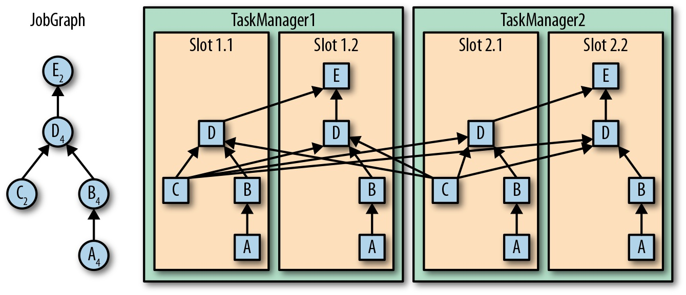
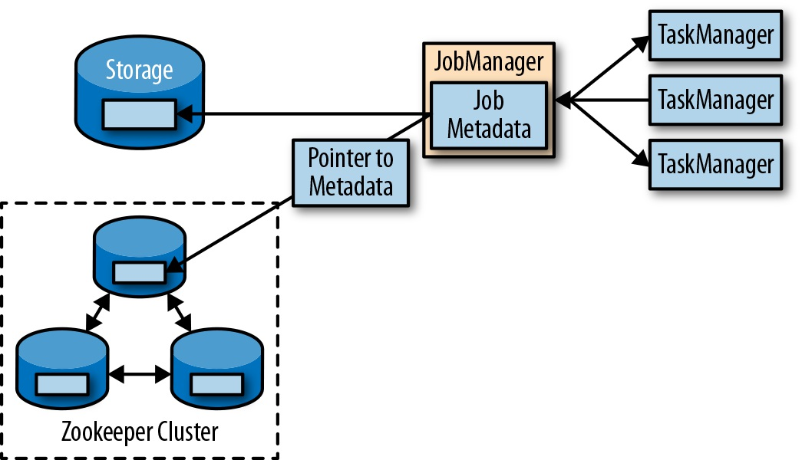

Apache Flink架构
================================================================================
## 1.系统架构 
Flink并没有依靠自身实现所有功能，而是在已有集群基础设施和服务之上专注于它的核心功能——**分布式数
据流处理。Flink和很多集群管理器（如：`Apache Mesos`、`YARN`及`Kubernetes`）都能很好地集成**；
同时它也可以通过配置，作为独立集群来运行。**Flink没有提供分布式持久化存储，而是利用了现有的分布
式文件系统（如`HDFS`）** 或对象存储 （如`S3`）。**它依赖`Apache ZooKeeper`来完成高可用性设
置中的领导选举工作**。

### 1.1.搭建Flink所需组件
Flink的搭建需要 **四个不同组件**，它们相互协作，共同执行流式应用。这些组件是，**JobManager、
ResourceManager、TaskManager和Dispatcher**。
+ **作为主进程（`master process`），JobManager控制着单个应用程序的执行。换句话说，每个应用
都由一个不同的JobManager掌控。JobManager可以接收需要执行的应用，该应用会包含一个所谓的JobGraph，
即逻辑Dataflow图，以及一个打包了全部所需类、库以及其他资源的JAR文件**。JobManager将JobGraph
转化成名为ExecutionGraph的物理Dataflow图。该图包含了那些可以并行执行的任务。JobManager从
ResourceManager申请执行任务的必要资源（**TaskManager处理槽**）。一旦它收到了足够数量的
TaskManager处理槽（`slot`），就会将ExecutionGraph中的任务分发给TaskManager来执行。在执行
过程中，JobManager还要负责所有需要集中协调的操作，如创建检查点。
+ **针对不同的环境和资源提供者（`resource provider`）（如YARN、Mesos、Kubernetes或独立部
署），Flink提供了不同的ResourceManager。ResourceManager负责管理Flink的计算资源单元——
TaskManager处理槽**。当JobManager申请TaskManager处理槽时，ResourceManager会指示一个拥有
空闲处理槽的TaskManager将其处理槽提供给JobManager。如果ResourceManager的处理槽数无法满足
JobManager的请求，则ResourceManager可以和资源提供者通信，让它们提供额外容器来启动更多
TaskManager进程。同时，ResourceManager还负责终止空闲的TaskManager以释放计算资源。
+ **TaskManager是Flink的工作进程（`worker process`）。通常在Flink搭建过程中要启动多个
TaskManager。每个TaskManager提供一定数量的处理槽。处理槽的数目限制了一个TaskManager可执行的
任务数。TaskManager在启动后，会向ResourceManager注册它的处理槽**。当接收到ResourceManager
的指示时，TaskManager会向JobManager提供一个或多个处理槽。之后，JobManager就可以向处理槽中分
配任务来执行。在执行期间，运行同一应用不同任务的TaskManager之间会产生数据交换。
+ **Dispatcher会跨多个作业运行，它提供了一个REST接口来让我们提交需要执行的应用。一旦某个应用提
交执行，Dispatcher会启动一个JobManager并将应用转交给它**。REST接口意味着Dispatcher这一集群
的HTTP入口可以受到防火墙的保护。Dispatcher同时还会启动一个Web UI，用来提供有关作业执行的信息。

下图展示了应用提交执行过程中Flink各组件之间的交互过程：

### 1.2.应用部署
Flink应用可以通过 **两种模式** 进行部署。

#### 框架模式
在该模式下，**Flink应用会打包成一个JAR文件，通过客户端提交到运行的服务上**。这里的服务可以是
Flink Dispatcher，Flink JobManager或是YARN的ResourceManager。无论哪种情况，运行的服务都
会接收Flink应用并确保其执行。如果应用提交到JobManager，会立即开始执行；如果应用提交到Dispatcher
或YARN ResourceManager，它们会启动一个JobManager并将应用转交给它，随后由JobManager负责执
行该应用。

#### 库模式 
在该模式下，**Flink应用会绑定到一个特定应用的容器镜像（如Docker镜像）中。镜像中还包含着运行
JobManager以及ResourceManager的代码。当容器从镜像启动后会自动加载ResourceManager和
JobManager，并将绑定的作业提交执行。另一个和作业无关的镜像负责部署TaskManager容器**。容器通过
镜像启动后会自动运行的TaskManager，后者可以连接ResourceManager并注册处理槽。通常情况下，外部
资源管理框架（如 **Kubernates**）负责启动镜像，并确保在发生故障时容器能够重启。

**基于框架的模式采用的是传统方式，即通过客户端提交应用（或查询）到正在运行的服务上；而在库模式中，
Flink不是作为服务，而是以库的形式绑定到应用所在的容器镜像中**。后者常用于微服务架构。

### 1.3.任务执行
**一个TaskManager允许同时执行多个任务。这些任务可以属于同一个算子（数据并行），也可以是不同算
子（任务并行），甚至还可以来自不同的应用（作业并行）**。下图展示了TaskManager、处理槽 、任务以
及算子之间的关系：

左侧的JobGraph（应用的非并行化表示）包含了5个算子，其中算子A和C是数据源，算子E是数据汇。算子C
和E的并行度为2，其余算子的并行度为4。由于算子最大并行度是4，因此应用若要执行则至少需要4个处理槽。
如果每个TaskManager内有两个处理槽，则运行两个TaskManager即可满足该需求。JobManager将
JobGraph“展开成”ExecutionGraph并把任务分配到4个空闲处理槽。对于并行度为4的算子，其任务会每个
处理槽分配一个。其余两个算子C和E的任务会分别放到处理槽1.1、2.1和处理槽1.2、2.2中。将任务以切片
的形式调度至处理槽中有一个好处：TaskManager中的多个任务可以在同一进程内高效地执行数据交换而无须 
访问网络。

**TaskManager会在同一个JVM进程内以多线程的方式执行任务**。和独立进程相比，线程更加轻量并且通
信开销更低，**但无法严格地将任务彼此隔离**。因此只要有一个任务运行异常，就有可能“杀死”整个
TaskManager进程，导致它上面运行的所有任务都停止。**如果将每个TaskManager配置成只有一个处理槽，
则可以限制应用在TaskManager级别进行隔离，即每个TaskManager只运行单个应用的任务**。通过在
TaskManager内部采用线程并行以及在每个主机上部署多个TaskManager进程，**Flink为部署应用时性能
和资源隔离的取舍提供了极大的自由度**。

### 1.4.高可用性设置
流式应用通常都会设计成7*24小时运行，因此对于它很重要的一点是：**即便内部进程发生故障时也不能终止
运行。为了从故障中恢复，系统首先要重启故障进程，随后需要重启应用并恢复其状态**。

#### TaskManager故障
如前所述，为了执行应用的全部任务，Flink需要足够数量的处理槽。**假设一个Flink设置包含4个
TaskManager，每个TaskManager有2个处理槽，那么一个流式应用最多支持以并行度8来运行。如果有一个
TaskManger出现故障，则可用处理槽的数量就降到了6个，这时候JobManager就会向ResourceManager申
请更多的处理槽。若无法完成（例如应用运行在一个独立集群上），JobManager将无法重启应用，直至有足
够数量的可用处理槽**。应用的重启策略决定了JobManager以何种频率重启应用以及重启尝试之间的等待间
隔。

#### JobManager故障
和TaskManager相比，JobManager发生故障会更为棘手。它用于控制流式应用执行以及保存该过程中的元
数据（如已完成检查点的存储路径）。**如果负责管理的JobManager进程消失，流式应用将无法继续处理数
据。这就导致JobManager成为Flink应用中的一个单点失效组件**。为了解决该问题，**Flink提供了高可
用模式，支持在原JobManager消失的情况下将作业的管理职责及元数据迁移到另一个JobManager**。

**Flink中的高可用模式是基于能够提供分布式协调和共识服务的Apache ZooKeeper来完成的，它在Flink
中要用于”领导“选举以及持久且高可用的数据存储。JobManager在高可用模式下工作时，会将JobGraph以
及全部所需的元数据（例如应用的JAR文件）写入一个远程持久化存储系统中。此外，JobManager还会将存储 
位置的路径写入ZooKeeper的数据存储。在应用执行过程中，JobManager会接收每个任务检查点的状态句柄、
（存储位置）。在检查点即将完成的时候，如果所有任务已经将各自状态成功写入远程存储 ，JobManager就
会将状态句柄写入远程存储，并将远程存储的路径地址写入ZooKeeper。因此所有用于JobManager故障恢复
的数据都在远程存储上面，而ZooKeeper持有这些存储位置的路径**。如下图：

**当JobManager发生故障时，其下应用的所有任务都会自动取消**。新接手工作的JobManager会执行以下
步骤：
1. 向ZooKeeper请求存储位置，以获取JobGraph、JAR文件以及应用最新检查点在远程存储的状态句柄。
2. 向ResourceManager申请处理槽来继续执行应用。
3. 重启尖用并利用最近一次检查点重置任务状态。

如果是在容器环境（如：Kubernates）中以库模式部署运行应用，容器编排服务通常会自动重启故障的
JobManager或TaskManager容器。当运行在YARN或Mesos上面时，Flink的其余进程会触发JobManager
或TaskManager进程重启。Flink没有针对独立集群模式提供重启故障进程的工具，因此有必要运行一些后备
JobManager及TaskManager来接管故障进程的工作。

## 2.Flink中的数据传输
在运行过程中，应用的任务会持续进行数据交换。**TaskManager负责将数据从发送任务传输至接收任务。
它的网络模块在记录传输前会先将它们收集到缓冲区中。换言之，记录并非逐个发送的，而是在缓冲区中以批次
形式发送。该技术是有效利用网络资源、实现高吞吐的基础**。

每个TaskManager都有一个用于收发数据的网络缓冲池（每个缓冲默认32KB大小）。如果发送端和接收端的
任务运行在不同的TaskManager进程中，它们就要用到操作系统的网络栈进行通信。流式应用需要以流水线方
式交换数据，因此每对TaskManager之间都要维护一个或多个永久的TCP连接来执行数据交换。在Shuffle连
接模式下，每个发送端任务都需要向任意一个接收任务传输数据。对于每一个接收任务，TaskManager都要提
供一个专用的网络缓冲区，用于接收其他任务发来的数据。如下图：

如上图所示，由于接收端的并行度为4,所以每个发送端任务至少需要4个网络缓冲区来向任一接收端任务发送
数据。同理，每个接收端任务也需要至少4个缓冲区来接收数据。缓冲区内的数据在向对方TaskManager传输
时会共享网络连接。为了使流水线式的数据交换平滑进行，TaskManager必须提供足够多的缓冲区来同时服务
所有进出连接。**在Shuffle或广播连接的情况下，每个发送任务都需要为每个接收任务提供一个缓冲区，因
此所需的缓冲区数量可达到相关算子任务数的平方级别。Flink默认的网络缓冲区配置足以应对中小型使用场
景**。而对于大型使用场景，需要根据第9章“内存和网络缓冲”中所介绍的内容调整配置。

**当发送任务和接收任务处于同一个TaskManager进程时，发送任务会将要发送的记录序列化到一个字节缓
冲区，一旦该缓冲区占满就会被放到一个队列里。接收任务会从这个队列里获取缓冲区并将其中的记录反序列
化。这意味着同一个TaskManager内不同任务之间的数据传输不会涉及网络通信**。

Flink采用多种技术来降低任务之间的通信开销。

### 2.1.基于信用值的流量控制
通过网络连接逐条发送记录不但低效，还会导致很多额外开销。若想充分利用网络连接带宽，就需要对数据进
行缓冲。**在流处理环境下，缓冲的一个明显缺点是会增加延迟，因为记录首先要收集到缓冲区中而不会立即
发送**。

**Flink实现了一个基于信用值的流量控制机制，它的工作原理如下：接收任务会给发送任务授予一定的信用
值，其实就是保留一些用来接收它数据的网络缓冲。一旦发送端收到信用通知，就会在信用值所限定的范围内
尽可能多地传输缓冲数据，并会附带上积压量（已经填满准备传输的网络缓冲数目）大小。接收端使用保留的
缓冲来处理收到的数据，同时依据各发送端的积压量信息来计算所有相连的发送端在下一轮的信用优先级**。

**由于发送端可以在接收端有足够资源时立即传输数据，所以基于信用值的流量控制可以有效降低延迟。此外，
信用值的授予是根据各发送端的数据积压量来完成的，因此该机制还能在出现数据倾斜（`data skew`）时有
效地分配网络资源。不难看出，基于信用值的流量控制是Flink实现高吞吐低延迟的重要一环**。

### 2.2.任务链接
**Flink采用一种名为任务链接的优化技术来降低某些情况下的本地通信开销。任务链接的前提条件是，多个
算子必须有相同的并行度且通过本地转发通道（`local forward channel`）相连**。如下图中算子所组
成的流水线就满足上述条件。它包含了3个算子，每个算子的任务并行度都为2且通过本地转发方式连接。

下图展示了流水线如何在任务链接模式下执行。**多个算子的函数被“融合”到同一个任务中，在同一个线程内
执行。函数生成的记录只需通过简单的方法调用就可以分别发往各自的下游函数。因此函数之间的记录传输基
本上不存在序列化及通信开销**。

虽然任务链接可以有效地降低本地任务之间的通信开销，但有的流水线应用反而不希望用到它。举例而言，
**有时候我们需要对过长任务链接进行切分或者将两个计算量大的函数分配到不同的处理槽中**。如下图展示
了相同的流水线在 **非任务链接模式** 下执行。其中每个函数都交由单独的任务、在特定线程内处理。

**Flink在默认情况下会开启任务链接**。

## 3.事件时间处理
**虽然处理时间是基于处理机器的本地时间**，相对容易理解，**但它会产生一些较为随意、不一致且无法重
现的结果**。相反，**事件时间语义会生成可重现且一致性的结果，这也是很多流处理用例的刚性需求**。但
和基于处理时间语义的应用相比，基于事件时间的应用需要一些额外的配置。此外，相比纯粹使用处理时间的
引擎，支持事件时间的流处理引擎内部要更加复杂。

**Flink不仅针对常见的事件时间操作提供了直观易用的原语，还支持一些表达能力很强API，允许使用者以
自定义算子的方式实现更高级的事件时间处理应用。在面对这些高级应用时，充分理解Flink内部事件处理机
制通常会有所帮助，有时候更是必要的**。上一章我们介绍了Flink在提供处理时间语义时所采用的两个概念：
**记录时间戳和水位线**。接下来我们会介绍Flink内部如何实现和处理时间戳及水位线以支持事件时间语义
的流式应用。

### 3.1.时间戳
**在事件时间模式下，Flink流式应用处理的所有记录都必须包含时间戳。时间戳将记录和特定时间点进行关
联，这些时间点通常是记录所对应事件的发生时间**。正如“时间语义”中所述，**基本上所有现实应用场景都
会出现一定程度的时间戳乱序**。

**Flink内部采用8字节的Long值对时间戳进行编码，并将它们以元数据（`metadata`）的形式附加在记录
上。内置算子会将这个Long值解析为毫秒精度的Unix时间戳（自`1970-01-01-00:00:00:0000`以来的毫
秒数）。但自定义算子可以有自己的时间戳解析机制，如将精度调整为微秒**。

### 3.2.水位线
**除了记录的时间戳，Flink基于事件时间的应用还必须提供水位线（`watermark`）。水位线用于在事件
时间应用中推断每个任务当前的事件时间。基于时间的算子会使用这个时间来触发计算并推动进度前进**。例
如：基于时间窗口的任务会在其事件时间超过窗口结束边界时进行最终的窗口计算并发出结果。

**在Flink中，水位线是利用一些包含Long值时间戳的特殊记录来实现的**。如下图：

水位线拥有两个基本属性：
1. **必须单调递增。这是为了确保任务中的事件时间时钟正确前进，不会倒退**。
2. **和记录的时间戳存在联系。一个时间戳为T的水位线表示，接下来所有记录的时间戳一定都大于T**。

**第二个属性可用来处理数据流中时间戳乱序的记录**，例如上图中的时间戳为3和5的记录。对基于时间的算
子任务而言，其收集和处理的记录可能会包含乱序的时间戳。**这些算子只有当自己的事件时间时钟（由接收
的水位线驱动）指示不必再等那些包含相关时间戳的记录时，才会最终触发计算。当任务收到一个违反水位线
属性，即时间戳小于或等于前一个水位线的记录时，该记录本应参与的计算可能已经完成。我们称此类记录为
迟到记录（`late record`）。为了处理迟到记录，Flink提供了不同的机制，我们将在第6章“处理迟到数
据”中讨论它们**。

**水位线的意义之一在于它允许应用控制结果的完整性和延迟。如果水位线和记录的时间戳非常接近，那结果
的处理延迟就会很低，因为任务无须等待过多记录就可以触发最终计算。但同时结果的完整性可能会受影响，
因为可能有部分相关记录被视为迟到记录，没能参与运算。相反，非常“保守”的水位线会增加处理延迟，但同
时结果的完整性也会有所提升**。

### 3.3.水位线传播和事件时间 
**Flink内部将水位线实现为特殊的记录，它们可以通过算子任务进行接收和发送。任务内部的时间服务（
`time service`）会维护一些计时器，它们依靠接收到水位线来激活。这些计时器是由任务在时间服务内注
册，并在将来的某个时间点执行计算**。例如：窗口算子会为每个活动窗口注册一个计时器，它们会在事件时
间超过窗口的结束时间清理窗口状态。

当任务接收到一个水位线时会执行以下操作：
1. **基于水位线记录的时间戳更新内部事件时间时钟**。
2. **任务的时间服务会找出所有触发时间小于更新后事件时间的计时器。对于每个到期的计时器，调用回调
函数、利用它来执行计算或发出记录**。
3. **任务根据更新后的事件时间将水位线发出**。

> Flink对通过DataStream API访问时间戳和水位线有一定限制。普通函数无法读写记录的时间戳或水位线，
> 但一系列处理函数除外。它们可以读取当前正在处理记录的时间戳，获得当前算子的事件时间，还能注册计
> 时器。所有函数的API都无法支持设置发出记录的时间戳、调整任务的事件时间时钟或发出水位线。为发出
> 记录配置时间戳的工作需要由基于时间的DataStream算子任务来完成，这样才能确保时间戳和发出的水位
> 线对齐。举例而言，时间窗口算子任务会在发送触发窗口计算的水位线时间戳之前，将所有经过窗口计算所
> 得结果的时间戳设为窗口的结束时间。

接下来我们详细解释一下任务在收到一个新的水位线之后，将如何发送水位线和更新其内部事件时间时钟。正
如第2章的“数据并行和任务并行”中所述，**Flink会将数据流划分为不同的分区，并将它们交由不同的算子
任务来并行执行。每个分区作为一个数据流，都会包含带有时间戳的记录以及水位线**。根据上下游连接情况，
其任务可能需要同时接收来自多个输入分区的记录和水位线，也可能需要将它们发送到多个输出分区。

**一个任务会为它的每个输入分区都维护一个分区水位线。当收到某个分区传来的水位线后，任务会以接收值
和当前值中较大的那个去更新对应分区水位线的值。随后，任务会把事件时间时钟调整为所有分区水位线中最
小的那个值。如果事件时间时钟向前推动，任务会先处理因此而触发的所有计时器，之后才会把对应的水位线
发往所有连接的输出分区，以实现事件时间 到全部下游任务的广播**。

下图展示了一个有4个输入分区和3个输出分区的任务在接收到水位线后，是如何更新它的分区水位线和事件时
间时钟，并将水位线发出的。

对于那些有着两条或多条输入数据流的算子，如`Jnion`或`CoFlatMap`（详见第5章的“多流转换”），它们
的任务同样是利用全部分区水位线中的最小值来计算事件时间时钟，并没有考虑分区是否来自不同的输入流，
这就导致所有输入的记录都必须基于同一个事件时间时钟来处理。如果不同输入流的事件时间没有对齐，那么
该行为就会导致一些问题。

**Flink的水位线处理和传播算法保证了算子任务所发出的记录时间戳和水位线一定会对齐。然而，这依赖于
一个事实，所有分区都会持续提供自增的水位线。只要有一个分区的水位线没有前进，或分区完全空闲下来不
再发送任何记录或水位线，任务的事件时间时钟就不会前进，继而导致计时器无法触发。这种情形会给那些靠
时钟前进来执行计算或清除状态的时间相关算子带来麻烦。因此，如果一个任务没有从全部输入任务以常规间
隔接收新的水位线，就会导致时间相关算子的处理延迟或状态大小激增**。

**当算子两个输入流差距很大时，也会产生类似影响。对于一个有两个输入流的任务而言，其事件时间时钟会
受制于那个相对较慢的流。而较快流的记录或中间结果会在状态中缓冲，直到事件时间时钟到达允许处理它们
的那个点**。

### 3.4.时间戳分配和水位线生成
**时间戳和水位线通常都是在数据流刚刚进入流处理应用的时候分配和生成的。由于不同的应用会选择不同的
时间戳，而水位线依赖于时间戳和数据流本身的特征，所以应用必须显式地分配时间戳和生成水位线**。
Flink DataStream应用可以通过三种方式完成该工作。

#### 在数据源完成 
我们可以 **利用`SourceFunction`在应用读入数据流的时候分配时间戳和生成水位线。`SourceFunction`
会发出一条记录流。每个发出的记录都可以附加一个时间戳，水位线可以作为特殊记录在任何时间点发出。如
果`SourceFunction`（临时性地）不再发出水位线，可以把自己声明成空闲。Flink会在后续算子计算水位
线的时候把那些来自于空闲`SourceFunction`的流分区排除在外。数据源空闲声明机制可以用来解决上面提
到的水位线不向前推进的问题**。我们会在第8章的“实现自定义数据源函数”中详细讨论数据源函数。

#### 周期分配器
**DataStream API提供了一个名为`AssignerWithPeriodicWatermarks`的用户自定义函数，它可以
用来从每条记录提取时间戳，并周期性地响应获取当前水位线的查询请求。提取出来的时间戳会附加到各自的
记录上，查询得到的水位线会注入到数据流中**。这个函数会在第6章的“分配时间戳和生成水位线”中介绍。

#### 定点分配器
**另一个支持从记录中提取时间戳的用户自定义函数叫作`AssignerWithPunctuatedWatermarks`。它可
以用于需要根据特殊输入记录生成水位线的情况。和`AssignerWithPeriodicWatermarks`函数不同，这
个函数不会强制你从每条记录中都提取一个时间戳（虽然这样也行）**。我们同样会在第6章的“分配时间戳和
生成水位线”中详细讨论它。

## 4.状态管理 
本节我们会对Flink支持的 **不同类别的状态** 进行介绍。我们将解释如何利用 **状态后端
（`state backend`）对状态进行存储和维护，以及有状态的应用如何通过状态再分配实现扩缩容**。通常 
意义上，函数里所有需要任务去维护并用来计算结果的数据都属于任务的状态。你可以把状态想象成任务的业
务逻辑所需要访问的 **本地或实例变量**。如下图展示了某个任务和它状态之间的典型交互过程：

任务首先会接收一些输入数据。在处理这些数据的过程中，任务对其状态进行读取或更新，并根据状态和输入
数据计算结果。我们以一个持续计算接收到多少条记录的简单任务为例。当任务收到一个新的记录后，首先会
访问状态获取当前统计的记录数目 ，然后把数目增加并更新状态，最后将更新后的数目发送出去。

应用读写状态的逻辑通常都很简单，而难点在于如何高效、可靠地管理状态。**这其中包括如何处理数量巨大、
可能超出内存的状态，如何保证发生故障时状态不会丢失。所有和状态一致性、故障处理以及高效存取相关的
问题都由Flink负责搞定**，这样开发人员就可以专注于自己的应用逻辑。

在Flink中，状态都是和特定算子相关联。**为了让Flink的运行层知道算子有哪些状态，算子需要自己对其
进行注册**。根据作用域的不同，状态可以分为两类：**算子状态（`operator state`）和键值分区状态
（`keyed state`）**。

### 4.1.算子状态 
算子状态的作用域是某个算子任务，这意味着所有在同一个并行任务之内的记录都能访问到相同的状态。算子

### 4.2.键值分区状态 

### 4.3.状态后端

### 4.4.有状态算子的扩缩容

## 5.检查点、保存点及状态恢复 

### 5.1.一致性检查点

### 5.2.从一致性检查点中恢复 

### 5.3.Flink检查点算法 

### 5.4.检查点对性能的影响 

### 5.5.保存点 

