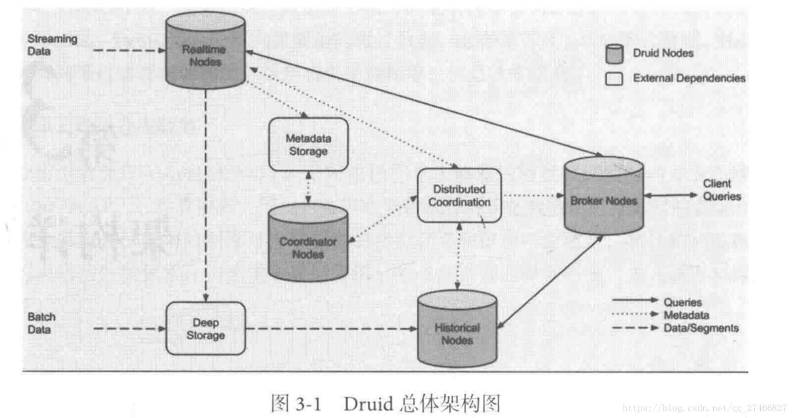

架构详解
================================================================================
Druid的目标是提供一个能够在大数据集上做实时数据消费与探索的平台。然而，**对普遍的数据平台来说，
数据的高效摄入与快速查询往往是一对难以两全的指标，因此常常需要在其中做一些取舍与权衡**。相比之下，
**Druid却能够同时提供性能卓越的数据实时摄入与复杂的查询性能**。它是怎么做到的呢？答案是 **通过
其独到的架构设计、基于DataSource与Segment的数据结构**，以及在许多系统细节上的优秀设计与实现。

## 1.Druid架构概览

Druid总体架构图显示出Druid自身包含以下4类节点：
+ **实时节点（`Realtime Node`）：即时摄入实时数据，以及生成Segment数据文件**。 
+ **历史节点（`Historical Node`）：加载已生成好的数据文件，以供数据查询**。
+ **查询节点（`Broker Node`）：对外提供数据查询服务，并同时从实时节点与历史节点查询数据，合并
后返回给调用方**。
+ **协调节点（`Coordinator Node`）：负责历史节点的数据负载均衡，以及通过规则（Rule）管理数据
的生命周期**。

