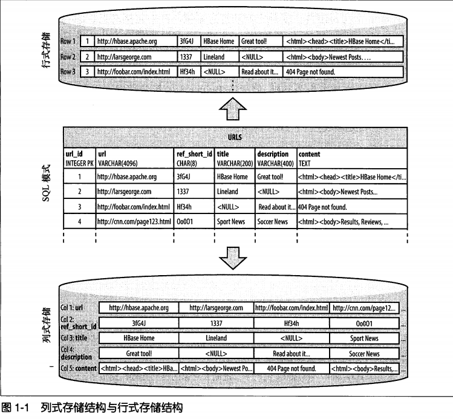
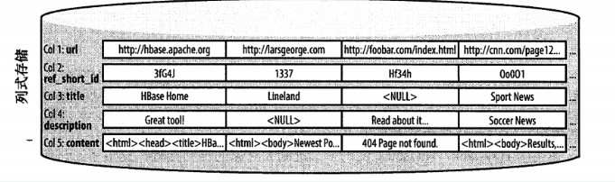

海量数据的黎明
================================================================================
对于海量数据的重要性，`Ralph Kimball`博士指出：
```
数据资产会取代20世纪传统有形资产的地位，成为资产负债表的重要组成部分。
```
还指出：
```
数据的价值已经超越了传统企业广泛认同的价值边界。
```
Google和Amazon是认识到数据价值的典范，它们已经开始开发满足自己业务需求的解决方案。例如，Google
在一系列的技术出版物中描述了基于商业硬件的可扩展的存储和处理系统。**开源社区利用Google的这些思
想实现了开源Hadoop项目的两个模块：HDFS和MapReduce**。

**Hadoop擅长存储任意的、半结构化的数据，甚至是非结构化的数据，可以帮助用户在分析数据的时候决定
如何解释这些数据，同样允许用户随时更改数据分类的方式：一旦用户更新了算法，只需要重新分析数据**。

**目前Hadoop几乎是所有现有数据库系统的一种补充，它给用户提供了数据存储的无限空间，支持用户在恰当
的时候存储和获取数据，并且针对大文件的存储、批量访问和流式访问做了优化**。这使得用户对数据的分析
变得简单快捷，**但是用户同样需要访问分析后的最终数据，这种需求需要的不是批量模式而是随机模式**，
这种模式相对于在数据库系统来说，相当于一种全表扫描和使用索引。

**通常用户在随机访问结构化数据的时候都会查询数据库**。RDBMS在这方面最为突出。大多数RDBMS一直遵
守 **科德十二定律**（`Codd's 12 roles`），**这个定律对于RDBMS来说是刚性标准，并且由于RDBMS
的底层架构是经过仔细研究的，所以在相当长的一段时间里这种架构都不会有明显的改变**。近年来出现的各
种处理方法，如 **列式存储** 的（`column-oriented`）数据库和 **大规模并行处理**
（`Massively Parallel Processing`，**MPP**）数据库，**表明业界重新思考技术方案以满足新的
工作负载，但是大多数解决方案仍旧是基于科德十二定律来实现的，并没有打破传统的法则**。

## 列式存储数据库
**列式存储数据库以列为单位聚合数据，然后将列值顺序地存入磁盘**，这种存储方法不同于行式存储的传统
数据库，行式存储数据库连续地存储整行。

**列式存储的出现主要基于这样一种假设，对于特定的查询，不是所有的值都是必需的**。尤其是在分析型数
据库里，这种情形很常见，因此需要选择一种更为合适的存储模式。

在这种新型的设计中，**减少I/O只是众多主要因素之一**，它还有其他的优点：**因为列的数据类型天生是
相似的，即便逻辑上每一行之间有轻微的不同，但仍旧比按行存储的结构聚集在一起的数据更利于压缩**，因
为大多数的压缩算法只关注有限的压缩窗口。

**像增量压缩或前缀压缩这类的专业算法，是基于列存储的类型定制的，因而大幅度提高了压缩比。更好的压
缩比有利于在返回结果时降低带宽的消耗**。





值得注意的是，**从典型RDBMS的角度来看，HBase并不是一个列式存储的数据库，但是它利用了磁盘上的列
存储格式**，这也是RDBMS与HBase最大的相似之处，因为HBase以列式存储的格式在磁盘上存储数据。但它
**与传统的列式数据库有很大的不同，传统的列式数据库比较适合实时存取数据的场景，HBase比较适合键值
对的数据存取，或者有序的数据存取**。

如今数据的产生速度比几年以前已经有了迅猛的增长，随着全球化步伐加快，这个增长速度只会越来越迅猛，
由此所产生的数据处理问题也会越来越严峻，有效存储PB级的数据并能高效地检索和更新并不是一件容易的事
情，在这种背景下，企业使用HBase更合适。
