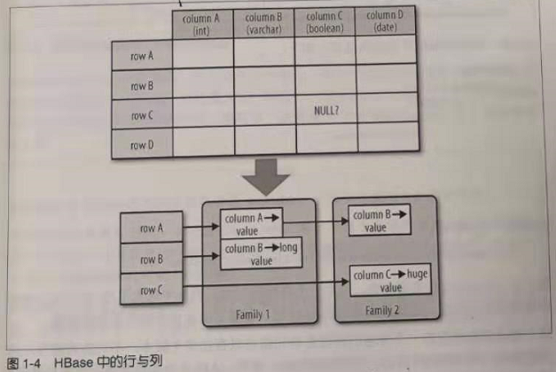

结构
================================================================================
本节首先介绍HBase的架构，然后介绍一些关于HBase起源的背景资料，之后将介绍其数据模型的一般概念和
可用的存储API，最后在一个更高的层次上对其实现细节进行分析。

## 1.背景
2003年，Google发表了一篇论文，叫“The Google File System”。**这个分布式文件系统简称GFS**，
它使用商用硬件集群存储海量数据。文件系统将数据在节点之间 **冗余复制**，这样的话，即使一台存储服
务器发生故障，也不会影响数据的可用性。**它对数据的流式读取也做了优化，可以边处理边读取**。

不久，Google又发表了另外一篇论文，叫“MapReduce: Simplified Data Processing on Large Clusters”。
**MapReduce是GFS架构的一个补充，因为它能够充分利用GFS集群中的每个商用服务器提供的大量CPU**。
MapReduce加上GFS形成了处理海量数据的核心力量，包括构建Google的搜索索引。

**不过以上描述的两个系统都缺乏实时随机存取数据的能力。GFS的另一个缺陷就是，它适合存储少许非常非
常大的文件，而不适合存储成千上万的小文件，因为文件的元数据信息最终要存储在主节点的内存中，文件越
多主节点的压力越大**。

因此，**Google尝试去找到一个能够驱动交互应用的解决方案**。意识到RDBMS在大规模处理中的缺点，工
程师们开始考虑问题的其他切入点：**摒弃关系型的特点，采用简单的API来进行CRUD操作，再加上一个扫描
函数，在较大的键范围或全表范围上迭代扫描**，这些努力的成果最终在2006年的论文“BigTable：A Distributed
Storage System for Structured Data”中发表了。
```
“BigTable是一个管理结构化数据的分布式存储系统，它可以扩展到非常大：如在成千上万的商用服务器上存储PB级的数据。......
一个稀疏的、分布式的、持久的多维排序映射。”
```
强烈建议对HBase感兴趣的人云阅读这篇论文，它介绍了很多BigTable的设计原理，用户最终都能在HBase中
找到BigTable的影子。**HBase实现了BigTable存储架构**，因此我们也可以用HBase来解释每样东西。

## 2.表、行、列和单元格
首先，做一个简要总结：最基本的单位是列，一列或多列形成一行，并由唯一的 **行键（`row key`）**
来确定存储。反过来，一个表中有若干行，**其中每列可能有多个版本，在每一个单元格中存储了不同的值**。
除了每个单元格可以保留若干个版本的数据这一点，整个结构看起来像典型的数据库的描述，但很明显有比这更
重要的因素。

所有的行 **按照行键（row key）字典序** 进行排序存储。下面示例展现了如何通过不同的行键增加多行数
据。例如：
```shell
hbase(main):001:0> scan 'table1'
```
```
ROW               COLUMN+CELL
row-1             column=cf1:,timestamp=1297073325971 ...
row-10            column=cf1:,timestamp=1297073325972 ...
row-11            column=cf1:,timestamp=1297073325973 ...
row-2             column=cf1:,timestamp=1297073325974 ...
row-22            column=cf1:,timestamp=1297073325975 ...
row-3             column=cf1:,timestamp=1297073325976 ...
row-abc           column=cf1:,timestamp=1297073325977 ...
7 row(s) in 0.1100 seconds
```
**注意，排列的顺序可能和你预期的不一样，可能需要通过补键来获得正确排序**。在字典序中，是按照二进
制逐字节从左到右依次对比每一个行键，例如，`row-1`...小于`row-2`...，因此，无论后面是什么，将
始终按照这个顺序排列。

**按照行键排序可以获得像RDBMS的主键索引一样的特性**，也就是说，**行键总是唯一的**，并且只出现一
次，否则你就是在更新同一行。**虽然BigTable的论文里只考虑了行键单一索引，但是HBase增加了对辅助
索引的支持。行键可以是任意的字节数组，但它并不一定是人直接可读的**。

**一行由若干列组成，若干列又构成一个列族**（`column family`），这不仅有助于构建数据的语义边界
或者局部边界，还有助于给它们设置某些特性（如压缩），或者指示它们存储在内存中。**一个列族的所有列
存储在同一个底层的存储文件里**，这个存储文件叫做 **HFile**。

**列族需要在表创建时就定义好，并且不能修改得太频繁，数量也不能太多。在当前的实现中有少量已知的缺
陷，这些缺陷使得列族数量只限于几十，实际情况可能还小得多。列族名必须由可打印字符组成**，这与其他
名字或值的命名规范有显著不同。

**常见的引用列的格式为：`family:qualifier`，`qualifier`是任意的字节数组（还可以不设置qualifier）**。
与列族的数量有限制相反，**列的数量没有限制：一个列族里可以有数百万个列。列值也没有类型和长度的限
定**。

下图展现了 **普通数据库** 与 **列式HBase** 在 **行设计** 上的不同，行和列没有像经典的电子表格
模型那样排列，**而是采用了标签描述**（`tag metaphor`），也就是说，信息保存在一个特定的标签下。



```
上图中，NULL值表明了固定模式的数据库在没有值的地方必须存储NULL值，但是在HBase的存储架构中，可以干脆省略整个列。换句话说，
空值是没有任何消耗的：它们不占用任何存储空间。
```


dd
