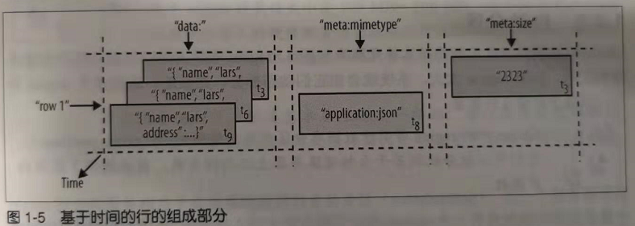
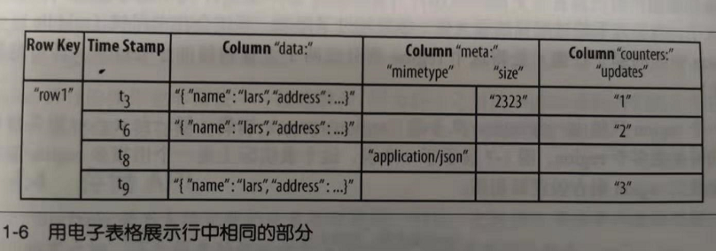
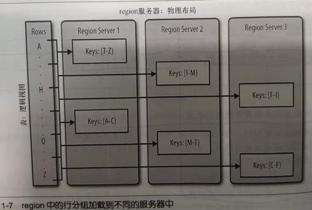

结构
================================================================================
本节首先介绍HBase的架构，然后介绍一些关于HBase起源的背景资料，之后将介绍其数据模型的一般概念和
可用的存储API，最后在一个更高的层次上对其实现细节进行分析。

## 1.背景
2003年，Google发表了一篇论文，叫“The Google File System”。**这个分布式文件系统简称GFS**，
它使用商用硬件集群存储海量数据。文件系统将数据在节点之间 **冗余复制**，这样的话，即使一台存储服
务器发生故障，也不会影响数据的可用性。**它对数据的流式读取也做了优化，可以边处理边读取**。

不久，Google又发表了另外一篇论文，叫“MapReduce: Simplified Data Processing on Large Clusters”。
**MapReduce是GFS架构的一个补充，因为它能够充分利用GFS集群中的每个商用服务器提供的大量CPU**。
MapReduce加上GFS形成了处理海量数据的核心力量，包括构建Google的搜索索引。

**不过以上描述的两个系统都缺乏实时随机存取数据的能力。GFS的另一个缺陷就是，它适合存储少许非常非
常大的文件，而不适合存储成千上万的小文件，因为文件的元数据信息最终要存储在主节点的内存中，文件越
多主节点的压力越大**。

因此，**Google尝试去找到一个能够驱动交互应用的解决方案**。意识到RDBMS在大规模处理中的缺点，工
程师们开始考虑问题的其他切入点：**摒弃关系型的特点，采用简单的API来进行CRUD操作，再加上一个扫描
函数，在较大的键范围或全表范围上迭代扫描**，这些努力的成果最终在2006年的论文“BigTable：A Distributed
Storage System for Structured Data”中发表了。
```
“BigTable是一个管理结构化数据的分布式存储系统，它可以扩展到非常大：如在成千上万的商用服务器上存储PB级的数据。......
一个稀疏的、分布式的、持久的多维排序映射。”
```
强烈建议对HBase感兴趣的人云阅读这篇论文，它介绍了很多BigTable的设计原理，用户最终都能在HBase中
找到BigTable的影子。**HBase实现了BigTable存储架构**，因此我们也可以用HBase来解释每样东西。

## 2.表、行、列和单元格
首先，做一个简要总结：最基本的单位是列，一列或多列形成一行，并由唯一的 **行键（`row key`）**
来确定存储。反过来，一个表中有若干行，**其中每列可能有多个版本，在每一个单元格中存储了不同的值**。
除了每个单元格可以保留若干个版本的数据这一点，整个结构看起来像典型的数据库的描述，但很明显有比这更
重要的因素。

所有的行 **按照行键（row key）字典序** 进行排序存储。下面示例展现了如何通过不同的行键增加多行数
据。例如：
```shell
hbase(main):001:0> scan 'table1'
```
```
ROW               COLUMN+CELL
row-1             column=cf1:,timestamp=1297073325971 ...
row-10            column=cf1:,timestamp=1297073325972 ...
row-11            column=cf1:,timestamp=1297073325973 ...
row-2             column=cf1:,timestamp=1297073325974 ...
row-22            column=cf1:,timestamp=1297073325975 ...
row-3             column=cf1:,timestamp=1297073325976 ...
row-abc           column=cf1:,timestamp=1297073325977 ...
7 row(s) in 0.1100 seconds
```
**注意，排列的顺序可能和你预期的不一样，可能需要通过补键来获得正确排序**。在字典序中，是按照二进
制逐字节从左到右依次对比每一个行键，例如，`row-1`...小于`row-2`...，因此，无论后面是什么，将
始终按照这个顺序排列。

**按照行键排序可以获得像RDBMS的主键索引一样的特性**，也就是说，**行键总是唯一的**，并且只出现一
次，否则你就是在更新同一行。**虽然BigTable的论文里只考虑了行键单一索引，但是HBase增加了对辅助
索引的支持。行键可以是任意的字节数组，但它并不一定是人直接可读的**。

**一行由若干列组成，若干列又构成一个列族**（`column family`），这不仅有助于构建数据的语义边界
或者局部边界，还有助于给它们设置某些特性（如压缩），或者指示它们存储在内存中。**一个列族的所有列
存储在同一个底层的存储文件里**，这个存储文件叫做 **HFile**。

**列族需要在表创建时就定义好，并且不能修改得太频繁，数量也不能太多。在当前的实现中有少量已知的缺
陷，这些缺陷使得列族数量只限于几十，实际情况可能还小得多。列族名必须由可打印字符组成**，这与其他
名字或值的命名规范有显著不同。

**常见的引用列的格式为：`family:qualifier`，`qualifier`是任意的字节数组（还可以不设置qualifier）**。
与列族的数量有限制相反，**列的数量没有限制：一个列族里可以有数百万个列。列值也没有类型和长度的限
定**。

下图展现了 **普通数据库** 与 **列式HBase** 在 **行设计** 上的不同，行和列没有像经典的电子表格
模型那样排列，**而是采用了标签描述**（`tag metaphor`），也就是说，信息保存在一个特定的标签下。


```
上图中，NULL值表明了固定模式的数据库在没有值的地方必须存储NULL值，但是在HBase的存储架构中，可以干脆省略整个列。换句话说，
空值是没有任何消耗的：它们不占用任何存储空间。
```
**所有列和行的信息都会通过列族在表中定义**，关于这一点我们在下文进行讨论。

每一列的值或 **单元格的值都具有时间戳，默认由系统指定，也可以由用户显式设置**。时间戳可以被使用，
例如 **通过不同的时间戳来区分不同版本的值。一个单元格的不同版本的值按照降序排列在一起，访问的时候
优先读取最新的值**。这种优化的目的在于让新值比老值更容易被读取。

**用户可以指定每个值所能保存的最大版本数**。此外，还支持 **谓词删除**（`predicate deletion`，
参考后面关于 **LSM树** 的内容），例如，允许用户只保存过去一周内写入的值。这些值（或单元格）也只
是 **未解释的字节数组**，客户端需要知道怎样去处理这些值。

前面提到过，**HBase是按照BigTable模型实现的**，是一个稀疏的、分布式的、持久化的、多维的映射，
**由行键、列键和时间戳索引**。将以上特点联系在一起，我们就有了如下的数据存取模式：
```java
(Table, RowKey, Family, Column, Timestamp) -> Value
```
可用一种更像编程语言的风格表示如下：
```java
SortedMap<RowKey, List<SortedMap<Column, List<Value, Timestamp>>>>
```
第一个`SortedMap`代表那个表，包含一个列族的List。列族中包含了另一个`SortedMap`存储列和相应的
值。这些值在最后的`List`中，存储了值和该值被设置的时间戳。

**这个数据存取模型的一个有趣的特性是单元格可以存在多个版本，不同的列被写入的次数不同**。API默认提
供了一个所有列的统一视图，**API会自动选择单元格的当前值**。下图展示了示例表中的某一行：



另一种查看数据的方式，在这种更类似电子表格的形式中，将时间戳添加了它自己的那一列中。



**尽管这些值插入的次数不同，并且存在多个版本，但是仍然能将行看作是所有列以及这些列的最新版本的组
合**。这里提供了查询一个特定时间戳或者是特定时间戳之前的值的方式，也可以一次查询多个版本的值，关
于这一点请参见第3章。
```
webtable

BigTable和HBase的典型使用场景是webtable，存储从互联网抓取的网页。

行键是反转的网页URL，如org.hbase.www。有一个用于存储网页HTML代码的列族contents，还有其他的列族，如anchor，用于存储外向
链接和入站链接，还有一个用于存储元数据的列族language。

contents列族使用多版本，允许用户存储一些旧的HTML副本，使用多版本是有益的，例如帮助分析一个页面的变化频率，使用的时间戳是抓
取该页面的实际次数？？（时间吧？？）。
```
**行数据** 的存取操作是 **原子的**，可以读写任意数目的列。**目前还不支持跨行事务和跨表事务**。
**原子存取也是促成系统架构具有强一致性的一个因素**，因为并发的读写者可以对行的状态作出安全的假设
（**Hbase是一个强一致性数据库，不是“最终一致性”数据库**）。使用 **多版本** 和 **时间戳** 同样
能够帮助应用层解决一致性问题。

## 3.自动分区
**HBase中扩展和负载均衡的基本单元称为region，region本质上是以行键排序的连续存储的区间。如果
region太大，系统就会把它们的动态拆分，相反地，就把多个region合并，以减少存储文件数量**。
```
HBase中的region等同于数据库分区中用的范围划分（range partition）。它们可以被分配到若干台物理服务器上以均摊负载，因此提
供了较强的扩展性。
```
**一张表初始的时候只有一个region，用户开始向表中插入数据时，系统会检查这个region的大小，确保其
不超过配置的最大值。如果超过了限制，系统会在中间键**（`middle key`，**region中间的那个行键**）
**处将这个region拆分成两个大致相等的子region**（详情见第8章）。

**每一个region只能由一台region服务器（`region server`）加载，每一台region服务器可以同时加
载多个region**。下图展示了一个表，这个表实际上是一个由很多region服务器加载的region集合的逻辑
视图。



```
BigTable的论文中指出，每台服务器中region的最佳加载数量是10~1000，每个region的最佳大小是100MB~200MB。这个标准是以
2006年（以及更早以前）的硬件配置为基准参数建议的。按照HBase和现在的硬件能力，每台服务器的最佳加载数据差不多还是10~1000，
但每个region的最佳大小是1GB~2GB了。

虽然数量增加了，但是基本原理还是一样的：每台服务器能加载的region数量和每个region的最佳存储大小取决于单台服务器的有效处理
能力。
```
**region拆分和服务** 相当于其他系统提供的 **自动分区**。**当一个服务器出现故障后，该服务器上的
region可以快速恢复，并获得细粒度的负载均衡，因为当服务于某个region的服务器当前负载过大、发生错
误或者被停止使用导致不可用时，系统会将该region移到其他服务器上**。

**region拆分的操作也非常快**————接近瞬间，**因为拆分之后的region读取的仍然是原存储文件，直到
合并把存储文件异步地写成独立的文件**，详情见第8章。

## 4.存储API
```
"BigTable"并不支持完整的关系数据模型；相反，它提供了具有简单数据模型的客户端，这个简单的数据模型支持动态控制数据的布局
格式......
```
**API提供了建表、删表、增加列族和删除列族操作，同时还提供了修改表和列族元数据的功能**，如压缩和
设置块大小。此外，**它还提供了客户端对给定的行键值进行增加、删除和查找操作的功能**。

**`scan API`提供了高效遍历某个范围的行的功能，同时可以限定返回哪些列或者返回的版本数。通过设置
过滤器可以匹配返回的列，通过设置起始和终止的时间范围可以选择查询的版本**。

在这些基本功能的基础上，还有一些更高级的特性。**系统支持单行事务**，基于这个特性，**系统实现了对
单个行键下存储的数据的原子读－修改－写（`read-modify-write`）序列**。虽然还 **不支持跨行和跨
表的事务**，但客户端已经能够支持批量操作以获得更好的性能。

**单元格的值可以当作计数器使用，并且能够支持原子更新。这个计数器能够在一个操作中完成读和修改，因
此尽管是分布式的系统构架，客户端依然可以利用此特性实现全局的、强一致的、连接的计数器**。

**还可以在服务器的地址空间** 中执行来自 **客户端的代码**，支持这种功能的服务端框架叫做 **协处理
器**（`coprocessor`）。这个代码能直接访问服务器本地的数据，可以用于实现轻量级批处理作业，或者使
用表达式并基于各种操作来分析或汇总数据。

最后，**系统通过提供包装器集成了MapReduce框架**，该包装器能够将表转换成MapReduce作业的输入源
和输出日志。

与RDBMS不同，**HBase系统没有提供查询数据的特定域语言**，例如SQL。**数据存取不是以声明的方式完
成的，而是通过客户端API以纯粹的命令完成的。HBase的API主要是Java代码**，但是也可以用其他编程语
言来存取数据。

## 5.实现
数据存储在存储文件（`store file`）中，称为HFile，**HFile中存储的是经过排序的键值映射结构。文
件内部由连接的块组成，块的索引信息存储在文件的尾部，当把HFile打开并加载到内存中时，索引信息会优
先加载到内存中，每个块的默认大小是64KB，可以根据需要配置不同的块大小**。存储文件提供了一个设定起
始和终止行键范围的API用于扫描特定的值。

**每一个HFile都有一个块索引，通过一个磁盘查找就可以实现查询。首先，在内存的块索引中进行二分查找，
确定可能包含给定键的块，然后读取磁盘块找到实际要找的键**。

**存储文件通常保存在Hadoop分布式文件系统（HDFS）中，HDFS提供了一个可扩展的、持久的、冗余的HBase
存储层**。存储文件通过将更改写入到可配置数目的物理服务器中，以保证不丢失数据。

**每次更新数据时，都会先将数据记录在提交日志（`commit log`）中，在HBase中这叫做预写日志
（`write-ahead log`，WAL），然后才会将这些数据写入内存中的memstore中。一旦内存保存的写入数
据的累计大小超过了一个给定的最大值，系统就会将这些数据移出内存作为HFile文件刷写到磁盘中。数据移
出内存之后，系统会丢弃对应的提交日志，只保留未持久化到磁盘中的提交日志。在系统将数据移出memstore
写入磁盘的过程中，可以不必阻塞系统的读写，通过滚动内存中的memstore就能达到这个目的，即用空的新
memstore获取更新数据，将满的旧memstore转换成一个文件。请注意，memstore中的数据已经按照行键排序，
持久化到磁盘中的HFile也是按照这个顺序排列的，所以不必执行排序或其他特殊处理**。

**因为存储文件是不可被改变的，所以无法通过移除某个键/值对来简单地删除值。可行的解决办法是，做个删
除标记（`delete marker`，又称墓碑标记），表明给定行已被删除的事实。在检索过程中，这些删除标记掩
盖了实际值，客户端读不到实际值**。

**读回的数据是两部分数据合并的结果，一部分是memstore中还没有写入磁盘的数据，另一部分是磁盘上的存
储文件**。值得注意的是，**数据检索时用不着WAL，只有服务器内存中的数据在服务器崩溃前没有写入到磁盘，
而后进行恢复数据时才会用到WAL**。

**随着memstore中的数据不断刷写到磁盘中，会产生越来越多的HFile文件，HBase内部有一个解决这个问题
的管家机制，即用合并将多个文件合并成一个较大的文件。合并有两种类型：minor合并（`minor compaction`）
和major压缩合并（`majar compaction`）。minor合并将多个小文件重写为数量较少的大文件，减少存储
文件的数量，这个过程实际上是个多路归并的过程。因为HFile的每个文件都是经过归类的，所以合并速度很快，
只受到磁盘I/O性能的影响**。

**major合并将一个region中一个列族的若干个HFile重写为一个新HFile，与minor合并相比，还有更独特
的功能：major合并能扫描所有的键/值对，顺序重写全部的数据，重写数据的过程中会略过做了删除标记的数
据。断言删除此时生效，例如，对于那些超过版本号限制的数据以及生存时间到期的数据，在重写数据时就不
再写入磁盘了**。


33
