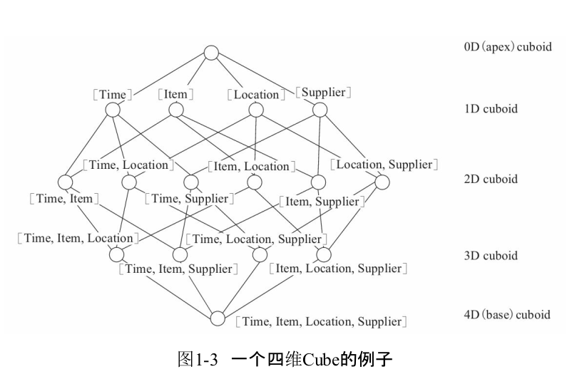

Apache Kylin的工作原理
================================================================================
**Apache Kylin的工作原理本质上是MOLAP（Multidimensional OnlineAnalytical Processing）
Cube，也就是多维立方体分析。这是数据分析中相当经典的理论**，在关系数据库年代就已经有了广泛的应用。

## 1.维度和度量简介
在说明 **MOLAP Cube** 之前需要先介绍一下 **维度** (Dimension)和 **度量** (Measure)这两
个概念。

简单来讲，**维度就是观察数据的角度**。比如电商的销售数据，可以从时间的维度来观察，也可以进一步细
化，从时间和地区的维度来观察。**维度一般是一组离散的值**，比如时间维度上的每一个独立的日期，或者
商品维度上的每一件独立的商品。**因此统计时可以把维度值相同的记录聚合在一起**，然后应用聚合函数做
累加、平均、去重复计数等聚合计算。

**度量就是被聚合的统计值，也是聚合运算的结果，它一般是连续的值**。通过比较和测算度量，分析师可以
对数据进行评估，比如今年的销售额相比去年有多大的增长，增长的速度是否达到预期，不同商品类别的增长
比例是否合理等。

## 2.Cube和Cuboid
**有了维度和度量，一个数据表或数据模型上的所有字段就可以分类了，它们要么是维度，要么是度量(可以被
聚合)。于是就有了根据维度和度量做预计算的Cube理论**。给定一个数据模型，我们可以对其上的所有维度
进行组合。**对于N个维度来说，组合的所有可能性共有2的N次方种。对于每一种维度的组合，将度量做聚合运
算，然后将运算的结果保存为一个物化视图，称为Cuboid。所有维度组合的Cuboid作为一个整体，被称为Cube**。
所以简单来说，**一个Cube就是许多按维度聚合的物化视图的集合**。

下面来列举一个具体的例子。假定有一个电商的销售数据集，其中维度包括时间(Time)、商品(Item)、地点
(Location)和供应商(Supplier)，度量为销售额(GMV)。那么所有维度的组合就有 **2的4次方 = 16种**，
比如一维度(1D)的组合有[Time]、[Item]、[Location]、[Supplier]4种；二维度(2D)的组合有[Time,
Item]、[Time,Location]、[Time、Supplier]、[Item,Location]、[Item,Supplier]、[Location,
Supplier]6种；三维度(3D)的组合也有4种；最后零维度(0D)和四维度(4D)的组合各有1种；总共就有16
种组合。



计算Cuboid，即按维度来聚合销售额。如果用SQL语句来表达计算Cuboid[Time,Loca-tion]，那么SQL语
句如下:
```sql
select time, location, sum(gmv) as gmv from sales group by time,location
```
**将计算的结果保存为物化视图，所有Cuboid物化视图的总称就是Cube**。

## 3.工作原理
**Apache Kylin的工作原理就是对数据模型做Cube预计算，并利用计算的结果加速查询**，具体工作过程
如下。
1. 指定数据模型，定义维度和度量。
2. 预计算Cube，计算所有Cuboid并保存为物化视图。
3. 执行查询时，读取Cuboid，运算,产生查询结果。

由于Kylin的查询过程不会扫描原始记录，而是通过预计算预先完成表的关联、聚合等复杂运算，**并利用预
计算的结果来执行查询，因此相比非预计算的查询技术，其速度一般要快一到两个数量级，并且这点在超大的
数据集上优势更明显。当数据集达到千亿乃至万亿级别时，Kylin的速度甚至可以超越其他非预计算技术1000
倍以上**。
