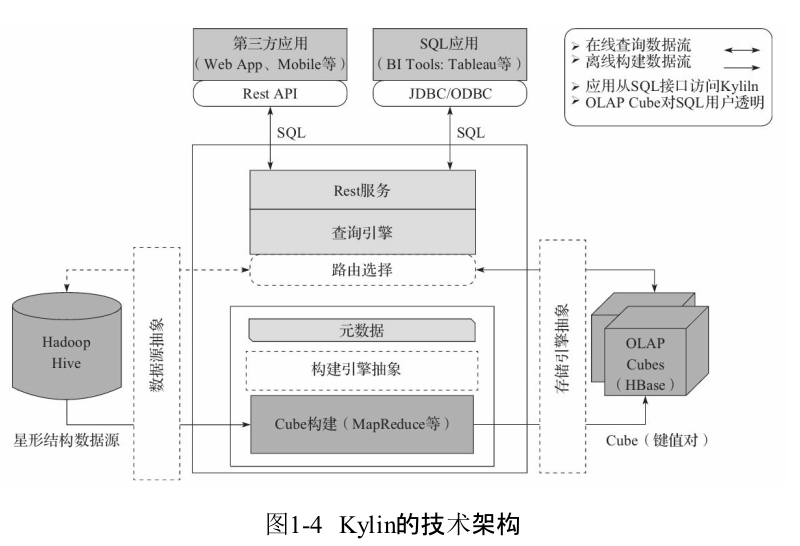

Apache Kylin的技术架构
================================================================================
Apache Kylin系统可以分为 **在线查询** 和 **离线构建** 两部分，在线查询的模块主要处于上半区，
而离线构建则处于下半区。



我们首先来看看离线构建的部分。数据源在左侧，目前主要是Hadoop Hive，保存着待分析的用户数据。根据
元数据的定义，下方构建引擎从数据源抽取数据，并构建Cube。**数据以关系表的形式输入，且必须符合星形
模型（Star Schema）**（更复杂的 **雪花模型** 在成文时还不被支持，可以用视图将雪花模型转化为星
形模型，再使用Kylin）。**MapReduce是当前主要的构建技术**。构建后的Cube保存在右侧的存储引擎中，
一般选用 **HBase** 作为存储。

完成了离线构建之后，用户可以从上方查询系统发送SQL进行查询分析。Kylin提供了各种 **Rest API、
JDBC/ODBC接口**。无论从哪个接口进入，SQL最终都会来到Rest服务层，再转交给查询引擎进行处理。这里
需要注意的是，**SQL语句是基于数据源的关系模型书写的，而不是Cube。Kylin在设计时刻意对查询用户屏
蔽了Cube的概念**，分析师只需要理解简单的关系模型就可以使用Kylin，没有额外的学习门槛，传统的SQL
应用也很容易迁移。**查询引擎解析SQL，生成基于关系表的逻辑执行计划，然后将其转译为基于Cube的物理
执行计划，最后查询预计算生成的Cube并产生结果**。整个过程不会访问原始数据源。
```
注意，对于查询引擎下方的路由选择，在最初设计时曾考虑过将Kylin不能执行的查询引导去Hive中继续执行，但在实践后发现Hive与Kylin
的速度差异过大，导致用户无法对查询的速度有一致的期望，很可能大多数查询几秒内就返回结果了，而有些查询则要等几分钟到几十分钟，因
此体验非常糟糕。最后这个路由功能在发行版中默认关闭，因此在上图中是用虚线表示的。
```
**Apache Kylin1.5** 版本引入了“**可扩展架构**”的概念。在上图中显示为三个粗虚线框表示的抽象层。
**可扩展指Kylin可以对其主要依赖的三个模块做任意的扩展和替换。Kylin的三大依赖模块分别是数据源、
构建引擎和存储引擎**。在设计之初，作为Hadoop家族的一员，这三者分别是Hive、MapReduce和HBase。
但随着推广和使用的深入，渐渐有用户发现它们均存在不足之处。比如，**实时分析可能会希望从Kafka导入
数据而不是从Hive；而Spark的迅速崛起，又使我们不得不考虑将MapReduce替换为Spark，以期大幅提高
Cube的构建速度；至于HBase，它的读性能可能还不如Cassandra或Kudu等**。可见,是否可以将一种技术
替换为另一种技术已成为一个常见的问题。于是我们对 **Kylin1.5版本的系统架构进行了重构，将数据源、
构建引擎、存储引擎三大依赖抽象为接口，而Hive、MapReduce、HBase只是默认实现**。深度用户可以根据
自己的需要做二次开发，将其中的一个或多个替换为更适合的技术。


dd
