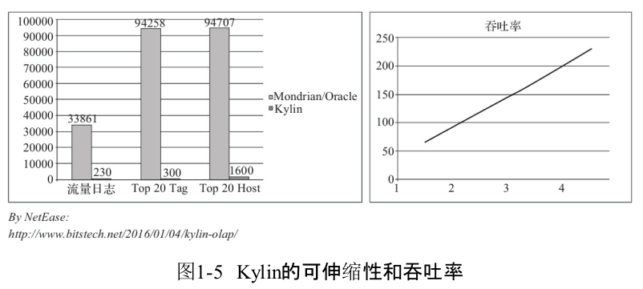

Apache Kylin的主要特点
================================================================================
Apache Kylin的主要特点包括支持 **SQL接口、支持超大数据集、秒级响应、可伸缩性、高吞吐率、BI工
具集成** 等。

## 1.标准SQL接口
Apache Kylin以 **标准SQL** 作为对外服务的主要接口。尽管Kylin内部以Cube技术为核心,对外却没有
选用 **MDX**(`MultiDimensional eXpressions`，**多维表达式**)作为接口。**虽然MDX作为OLAP
查询语言**，从学术上来说，它是更加适合Kylin的选择，然而实践表明，SQL简单易用，代表了绝大多数用
户的第一需求。

SQL需要以关系模型作为支撑。**Kylin使用的查询模型是数据源中的关系模型表，一般而言，也就是指Hive
表**。终端用户只需要像原来查询Hive表一样编写SQL，就可以无缝地切换到Kylin，几乎不需要额外的学习，
甚至原本的Hive查询也因为与SQL同源，大多都无须修改就能直接在Kylin上运行。

## 2.支持超大数据集
**Apache Kylin对大数据的支撑能力可能是目前所有技术中最为领先的**。早在2015年eBay的生产环境中
Kylin就能支持 **百亿** 记录的秒级查询，之后在移动的应用场景下又有了 **千亿** 记录秒级查询的案
例。这些都是实际场景的应用，而非实验室中的理论数据。

因为使用了 **Cube预计算技术**，**在理论上，Kylin可以支撑的数据集大小没有上限，仅受限于存储系统
和分布式计算系统的承载能力，并且查询速度不会随数据集的增大而减慢。Kylin在数据集规模上的局限性主
要在于维度的个数和基数。它们一般由数据模型来决定，不会随着数据规模的增长而线性增长**，这也意味着
Kylin对未来数据的增长有着更强的适应能力。

## 3.亚秒级响应
根据可查询到的公开资料可以得知，Apache Kylin在某生产环境中90%的查询可以在3s内返回结果。这并不
是说一小部分SQL相当快，而是在数万种不同SQL的真实生产系统中，绝大部分的查询都非常迅速；在另外一个
真实的案例中，对1000多亿条数据构建了立方体，90%的查询性能都在1.18s以内，可见Kylin在超大规模数
据集上表现优异。这与一些只在实验室中，只在特定查询情况下采集的性能数据不可同日而语。当然并不是使
用Kylin就一定能获得最好的性能。针对特定的数据及查询模式，往往需要做进一步的性能调优、配置优化等，
性能调优对于充分利用好Apache Kylin至关重要。

## 4.可伸缩性和高吞吐率
在保持高速响应的同时，Kylin有着良好的可伸缩性和很高的吞吐率。下图来自网易的性能分享，左侧是Kylin
查询速度与Mondrian/Oracle的对比，可以看到在3个测试查询中，Kylin分别比Mondrian/Oracle快147
倍、314倍和59倍。

这主要还是归功于预计算降低了查询时所需的计算总量，令Kylin可以在相同的硬件配置下承载更多的并发查询。

## 5.BI及可视化工具集成
Apache Kylin提供了丰富的API，以与现有的BI工具集成，具体包括如下内容。
+ **ODBC接口，与Tableau、Excel、Power BI等工具集成**。
+ **JDBC接口，与Saiku、BIRT等Java工具集成**。
+ **Rest API，与JavaScript、Web网页集成**。
分析师可以沿用他们最熟悉的BI工具与Kylin一同工作，或者在开放的API上做二次开发和深度定制。另外，
**Kylin核心开发团队也贡献了Apache Zeppelin的插件**，现在已经可以用Zeppelin来访问Kylin服务。

## 6.与其他开源产品比较
与Apache Kylin一样致力于解决大数据查询问题的其他开源产品也有不少，比如 **Apache Drill、
Apache Impala、Druid、Hive、Presto(Facebook)、SparkSQL** 等。本节试图将Kylin与它们做一
个简单的比较。

从底层技术的角度来看，这些开源产品有很大的共性，一些底层技术几乎被所有的产品一致采用，Kylin也不
例外。
+ **大规模并行处理**：可以通过增加机器的方式来扩容处理速度，在相同的时间里处理更多的数据。
+ **列式存储**：通过按列存储提高单位时间里数据的I/O吞吐率，还能跳过不需要访问的列。
+ **索引**：利用索引配合查询条件，可以迅速跳过不符合条件的数据块，仅扫描需要扫描的数据内容。
+ **压缩**：压缩数据然后存储，使得存储的密度更高，在有限的I/O速率下，在单位时间里读取更多的记录。

综上所述，我们可以注意到，**所有这些方法都只是提高了单位时间内处理数据的能力**，当大家都一致采用
这些技术时，它们之间的区别将只停留在实现层面的代码细节上。最重要的是，**这些技术都不会改变一个事
实，那就是处理时间与数据量之间的正比例关系**。当数据量翻倍时，**MPP**（在不扩容的前提下）需要翻
倍的 **时间** 来完成计算；**列式存储** 需要翻倍的 **存储空间**；**索引** 下符合条件的 **记录
数** 也会翻倍；**压缩** 后的 **数据大小** 也还是之前的两倍。因此查询速度也会随之变成之前的两倍。
当数据量成十倍、百倍地增长时，这些技术的查询速度就会成十倍百倍地下降，最终变得不能接受。

**Apache Kylin的特色在于，在上述的底层技术之外，另辟蹊径地使用了独特的Cube预计算技术。预计算事
先将数据按维度组合进行了聚合，将结果保存为物化视图。经过聚合，物化视图的规模就只由维度的基数来决定，
而不再随着数据量的增长呈线性增长**。以电商为例，如果业务扩张，交易量增长了10倍，只要交易数据的维
度不变（供应商/商品数量不变），聚合后的物化视图将依旧是原先的大小，查询的速度也将保持不变。

dd
