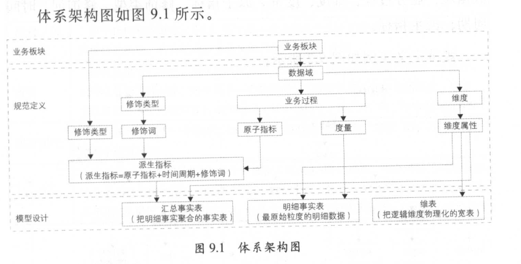

概述
================================================================================
面对爆炸式增长的数据，**如何建设高效的数据模型和体系，对这些数据进行有序和有结构地分类组织和存储，
避免重复建设和数据不一致性，保证数据的规范性，一直是大数据系统建设不断追求的方向**。

**OneData** 即是 **阿里巴巴内部进行数据整合及管理的方法体系和工具**。阿里巴巴的大数据工程师在
这一体系下，**构建统一、规范、可共享的全域数据体系，避免数据的冗余和重复建设，规避数据烟囱和不一
致性**，充分发挥阿里巴巴在大数据海量、多样性方面的独特优势。借助这一统一化数据整合及管理的方法体
系，我们构建了阿里巴巴的 **数据公共层**，并可以帮助相似的大数据项目快速落地实现。下面重点介绍
**OneData体系和实施方法论**。

**阿里巴巴集团大数据建设方法论** 的核心是：**从业务架构设计到模型设计，从数据研发到数据服务，做
到数据可管理、可追溯、可规避重复建设**。目前，阿里巴巴集团数据公共层团队已把这套方法论沉淀为产品，
以帮助数据PD、数据模型师和ETL工程师建设阿里的大数据。这一体系包含方法论以及相关产品。

## 1.定位及价值
建设统一的、规范化的 **数据接人层（ODS）** 和 **数据中间层（DWD、DWS）**，通过 **数据服务和数
据产品**，完成服务于阿里巴巴的大数据系统建设，即 **数据公共层建设**。提供标准化的（Standard）、
共享的（Shared）、数据服务（Service）能力，降低数据互通成本，释放计算、存储、人力等资源，以消除
业务和技术之痛。

## 2.体系架构

**业务板块**：由于阿里巴巴集团业务生态庞大，所以根据业务的属性划分出几个相对独立的业务板块，**业
务板块之间的指标或业务重叠性较小**。如电商业务板块涵盖淘系、B2B系和Ali Express系等。

**规范定义**：阿里数据业务庞大，结合行业的数据仓库建设经验和阿里数据自身特点，设计出的一套 **数
据规范命名体系**，规范定义将会被用在模型设计中。后面章节将会详细说明。

**模型设计：以维度建模理论为基础，基于维度建模总线架构，构建一致性的维度和事实（进行规范定义）**。
同时，**在落地表模型时**，基于阿里自身业务特点，设计出一套 **表规范命名体系**。后面章节将会详细
说明。

