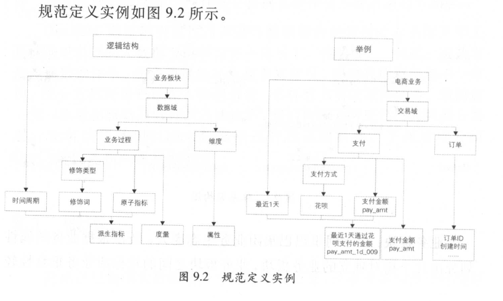

规范定义
================================================================================
**规范定义指以维度建模作为理论基础，构建总线矩阵，划分和定义数据域、业务过程、维度、度量/原子指标、
修饰类型、修饰词、时间周期、派生指标**。

## 1.名词术语

| 名词术语 | 解释 |
|:------------ |:-------------- |
| 数据域 | 指面向业务分析，将业务过程或者维度进行抽象的集合。其中，业务过程可以概括为一个个不可拆分的行为事件，在业务过程之下，可以定义指标；维度是指度量的环境，如买家下单事件，买家是维度。为保障整个体系的生命力，数据域是需要抽象提炼，并且长期维护和更新的，但不轻易变动。在划分数据域时，既能涵盖当前所有的业务需求，又能在新业务进入时无影响地被包含进已有的数据域中和扩展新的数据域。|
| 业务过程 | 指企业的业务活动事件，如下单、支付、退款都是业务过程。请注意，业务过程是一个不可拆分的行为事件，通俗地讲，业务过程就是企业活动中的事件。|
| 时间周期 | 用来明确数据统计的时间范围或者时间点，如最近30天、自然周、截止当日等。|
| 修饰类型 | **是对修饰词的一种抽象划分。修饰类型从属于某个业务域**，如日志域的访问终端类型涵盖无线端、PC端等修饰词。|
| 修饰词 | **指除了统计维度以外，指标的业务场景限定抽象。修饰词隶属于一种修饰类型**，如在日志域的访问终端类型下，有修饰词PC端、无线端等。|
| 度量／原子指标 | **原子指标和度量含义相同**，基于某一业务事件行为下的度量，**是业务定义中不可再拆分的指标**，具有明确业务含义的名词，如支付金额。|
| 维度 | **维度是度量的环境，用来反映业务的一类属性，这类属性的集合构成一个维度**，也可以称为实体对象。维度属于一个数据域，如地理维度（其中包括国家、地区、省以及城市等级别的内容)、时间维度（其中包括年、季、月、周、日等级别的内容。|
| 维度属性 | **维度属性隶属于一个维度**，如地理维度里面的国家名称、国家ID、省份名称等都属于维度属性 |
| 派生指标 | **派生指标 `=` 一个原子指标 `+` 多个修饰词（可选） `+` 时间周期。可以理解为对原子指标业务统计范围的圈定**。如原子指标：支付金额，最近1天海外买家支付金额则为派生指标（最近1天为时间周期，海外为修饰词，买家作为维度，而不作为修饰词）|

