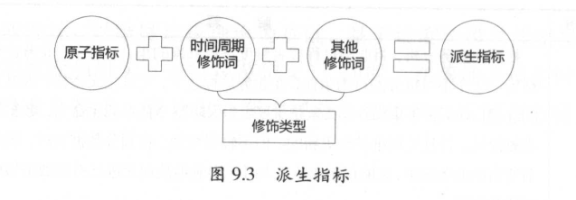
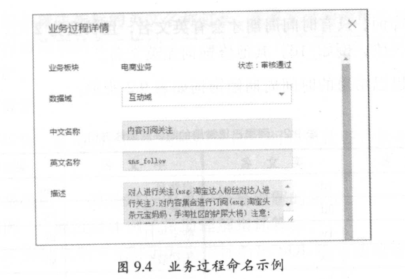

规范定义
================================================================================
**规范定义指以维度建模作为理论基础，构建总线矩阵，划分和定义数据域、业务过程、维度、度量/原子指标、
修饰类型、修饰词、时间周期、派生指标**。

## 1.名词术语

| 名词术语 | 解释 |
|:------------ |:-------------- |
| 数据域 | 指面向业务分析，将业务过程或者维度进行抽象的集合。其中，业务过程可以概括为一个个不可拆分的行为事件，在业务过程之下，可以定义指标；维度是指度量的环境，如买家下单事件，买家是维度。为保障整个体系的生命力，数据域是需要抽象提炼，并且长期维护和更新的，但不轻易变动。在划分数据域时，既能涵盖当前所有的业务需求，又能在新业务进入时无影响地被包含进已有的数据域中和扩展新的数据域。|
| 业务过程 | 指企业的业务活动事件，如下单、支付、退款都是业务过程。请注意，业务过程是一个不可拆分的行为事件，通俗地讲，业务过程就是企业活动中的事件。|
| 时间周期 | 用来明确数据统计的时间范围或者时间点，如最近30天、自然周、截止当日等。|
| 修饰类型 | **是对修饰词的一种抽象划分。修饰类型从属于某个业务域**，如日志域的访问终端类型涵盖无线端、PC端等修饰词。|
| 修饰词 | **指除了统计维度以外，指标的业务场景限定抽象。修饰词隶属于一种修饰类型**，如在日志域的访问终端类型下，有修饰词PC端、无线端等。|
| 度量/原子指标 | **原子指标和度量含义相同**，基于某一业务事件行为下的度量，**是业务定义中不可再拆分的指标**，具有明确业务含义的名词，如支付金额。|
| 维度 | **维度是度量的环境，用来反映业务的一类属性，这类属性的集合构成一个维度**，也可以称为实体对象。维度属于一个数据域，如地理维度（其中包括国家、地区、省以及城市等级别的内容)、时间维度（其中包括年、季、月、周、日等级别的内容。|
| 维度属性 | **维度属性隶属于一个维度**，如地理维度里面的国家名称、国家ID、省份名称等都属于维度属性 |
| 派生指标 | **派生指标 `=` 一个原子指标 `+` 多个修饰词（可选） `+` 时间周期。可以理解为对原子指标业务统计范围的圈定**。如原子指标：支付金额，最近1天海外买家支付金额则为派生指标（最近1天为时间周期，海外为修饰词，买家作为维度，而不作为修饰词）|

## 2.指标体系
本文在讲述指标时，会涵盖其组成体系（原子指标、派生指标、修饰类型、修饰词、时间周期），将它们作为
一个整体来解读。

### 2.1.基本原则

#### 2.1.1.组成体系之间的关系
+ **派生指标由原子指标、时间周期修饰词、若干其他修饰词组合得到**。

    

+ **原子指标、修饰类型及修饰词，直接归属在业务过程下，其中修饰词继承修饰类型的数据域**。
+ **派生指标可以选择多个修饰词，修饰词之间的关系为“或”或者“且”，由具体的派生指标语义决定**。
+ **派生指标唯一归属一个原子指标，继承原子指标的数据域，与修饰词的数据域无关**。

一般而言，**事务型指标** 和 **存量型指标**（见下文定义）**只会唯一定位到一个业务过程**，如果遇
到 **同时有两个行为发生**，需要多个修饰词生成一个派生指标的情况，则选择 **时间靠后的行为创建原子
指标**，选择 **时间靠前的行为创建修饰词**。

+ **原子指标有确定的英文字段名、数据类型和算法说明；派生指标要继承原子指标的英文名、数据类型和算
法要求**。

#### 2.1.2.命名约定
+ **命名所用术语**。指标命名，尽量使用英文简写，其次是英文，当指标英文名太长时，可考虑用汉语拼音
首字母命名。如中国制造，用`zgzc`。在OneData工具中维护着常用的名词术语，以用来进行命名。
+ **业务过程**。英文名：用英文或英文的缩写或者中文拼音简写；中文名：具体的业务过程中文即可。

    

关于 **存量型指标**（见下文定义）对应的业务过程的约定：**实体对象英文名 `+` _stock**。如在线
会员数、一星会员数等，其对应的业务过程为 **mbr_stock**；在线商品数、商品SKU种类小于5的商品数，
其对应的业务过程为 **itm_stock**。

+ **原子指标**。英文名：动作 `+` 度量；中文名：动作 `+` 度量。原子指标必须挂靠在某个业务过程下。

    

+ **修饰词**。只有时间周期才会有英文名，且长度为2位，加上“_”为3位，例如`_1d`。其他修饰词无英文
名。

    阿里巴巴常用的时间周期修饰词如表：

    | 中文名 | 英文名 | 中文名 | 英文名 |
    |:------- |:------- |:------- |:------- |
    | 最近1天 | 1d | 自然月 | cm |
    | 最近3天 | 3d | 自然季度 | cq |
    | 最近7天 | 1w | 截至当日 | td |
    | 最近14天 | 2w | 年初截至当日 | sd |
    | 最近30天 | 1m | 零点截至当前 | tt |
    | 最近60天 | 2m | 财年 | fy |
    | 最近90天 | 3m | 最近1小时 | 1h |
    | 最近180天 | 6m | 准实时 | ts |
    | 180天以前 | bh | 未来7天 | flw |
    | 自然周 | cw | 未来4周 | f4w |

+ **派生指标**。英文名：原子指标英文名 `+` 时间周期修饰词（3位，例如`_1d`） `+` 序号（4位，
例如`_001`）；中文名：时间周期修饰词 `+` `[其他修饰词]` `+` 原子指标。为了控制派生指标的英文
名称过长，在英文名的理解和规范上做了取舍，所有修饰词的含义都纳入了序号中。序号是根据原子指标`+`派
生指标自增的。

#### 2.1.3.算法
原子指标、修饰词、派生指标的算法说明必须让各种使用人员看得明白，包括：
+ **算法概述**：算法对应的用户容易理解的阐述。
+ **举例**：通过具体例子帮助理解指标算法。
+ **SQL算法说明**：对于派生指标给出SQL的写法或者伪代码。

### 2.2.操作细则
....................

