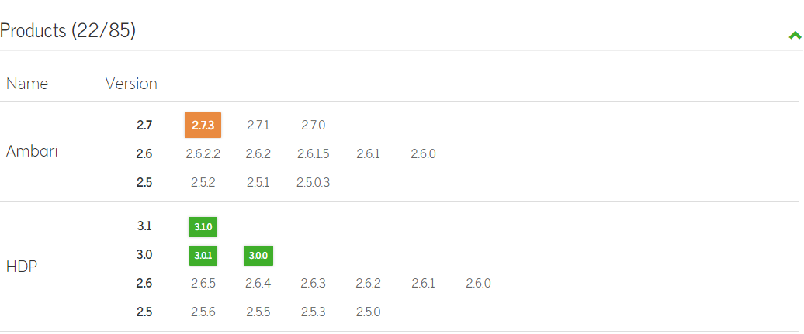
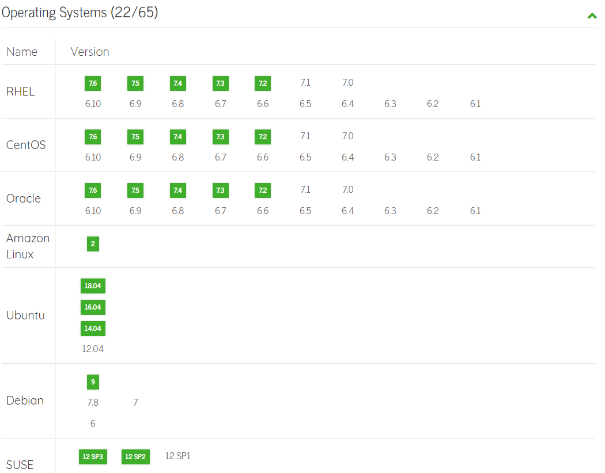
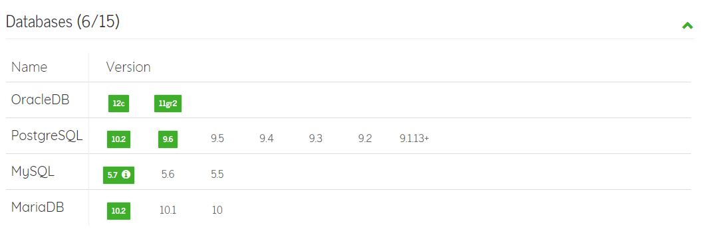
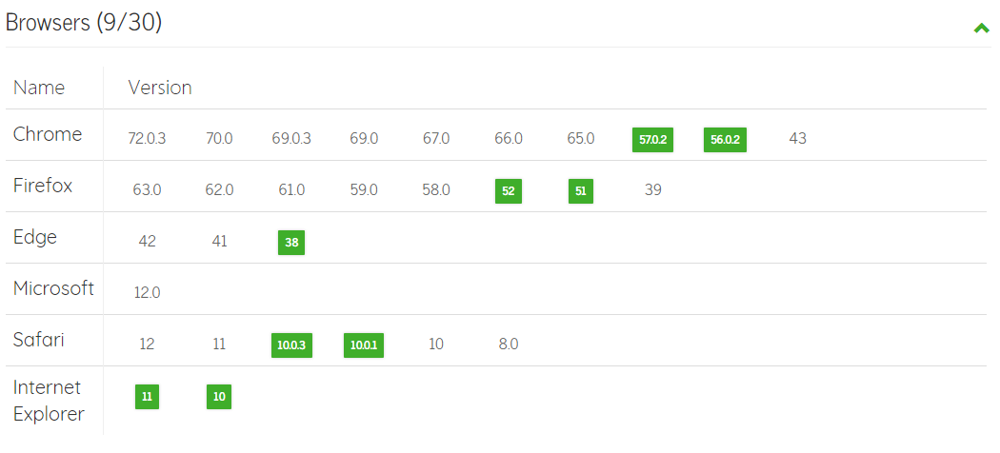
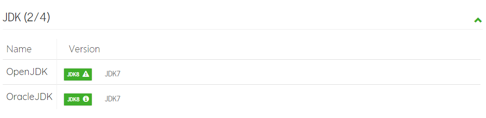
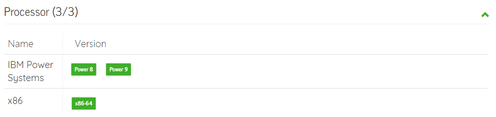

产品互操作性
================================================================================
本节介绍使用Ambari安装集群时应准备好的信息和材料。Ambari为您的集群提供端到端管理和监控解决方案。
使用`Ambari Web UI`和`REST API`，您可以从中心点部署、操作、管理配置更改，并监控群集中所有节
点的服务。

## 产品互操作性
`Ambari 2.7.3`支持矩阵工具提供以下信息。

### 1.支持的产品

### 2.支持的操作系统

### 3.支持的数据库

**注：仅使用默认的innodb引擎支持使用现有的mysql5.7数据库**。

### 4.支持的浏览器

### 5.支持的JDK

**注：`open jdk`不能在`SLES 11`上运行**。

**注：`oracle jdk`最低`JDK 1.8.0_77`**。

### 6.支持的处理器

使用以下URL确定对每个产品版本的支持。https://supportmatrix.hortonworks.com 。
