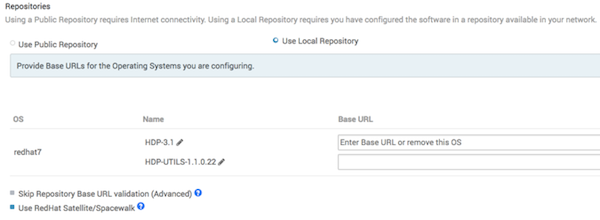
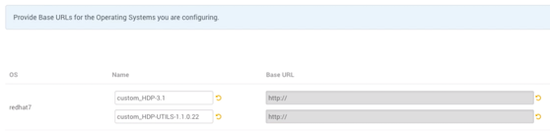
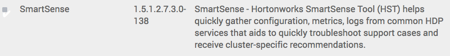
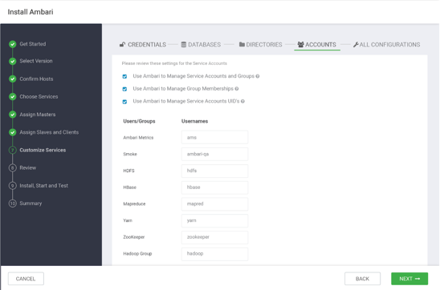

安装、配置和部署集群
================================================================================
## 1.启动Ambari服务器
+ 在Ambari Server主机上运行以下命令：
  ```shell
  ambari-server start
  ```
+ 要检查Ambari Server进程：
  ```shell
  ambari-server status
  ```
+ 要停止Ambari服务器：
  ```shell
  ambari-server stop
  ```
```
提示

如果您计划为Hive或Oozie使用现有数据库实例，则必须准备在安装Hadoop集群之前使用现有数据库。
```
在Ambari Server启动时，Ambari会运行数据库一致性检查以查找问题。如果发现任何问题，Ambari Server
启动将中止并显示以下消息：数据库配置一致性检查失败。Ambari将有关数据库一致性检查结果的更多详细信
息写入`/var/log/ambari-server/ambari-server-checkdatabase.log`文件。

您可以通过使用以下选项跳过此检查来强制Ambari Server启动：
```shell
ambari-server start --skip-database-check
```
如果您遇到数据库问题，请选择跳过此检查，**在更正数据库一致性问题之前，请不要对群集拓扑进行任何更
改或执行群集升级**。请联系Hortonworks支持并提供ambari-server-check-database.log输出以获
取帮助。

## 2.登录Apache Ambari

### 先决条件
Ambari Server必须正在运行。

使用Web浏览器登录Ambari Web：
### 第一步
1. 将您的Web浏览器指向
    ```
    http://<your.ambari.server>:8080
    ```
    其中`<your.ambari.server>`是ambari服务器主机的名称。
2. 使用默认用户名/密码登录Ambari服务器：**admin/admin**。您可以稍后更改这些凭据。对于新群集，
“群集安装”向导将显示“欢迎”页面。

## 3.启动Ambari群集安装向导
在Ambari Welcome页面中，选择Launch Install Wizard。


## 4.命名您的群集
1. 在“命名群集”中，键入要创建的群集的名称。名称中不能使用空格或特殊字符。
  ```
  提示

  如果您计划对群集进行Kerberize，请考虑限制群集名称（不超过12个字符），以适应Kerberos主体将附加到群集名称字符串并且某些身份
  提供者对总主体名称长度施加限制的事实。
  ```
2. 选择下一步。

## 5.选择版本
在此步骤中，您将选择群集的软件版本和交付方法。使用公共存储库需要Internet连接。使用本地存储库要求
您已在网络中可用的存储库中配置软件。

*1.选择堆栈*

可用版本显示在TAB中。当您选择TAB时，Ambari会尝试发现该堆栈的特定版本可用。该列表显示在DROPDOWN
中。对于该特定版本，将显示可用的服务，其中的版本显示在表中。


*2.选择版本*

如果Ambari可以访问Internet，则特定版本将在DROPDOWN中列为选项。如果您有未列出的版本的版本定义
文件，则可以单击 *添加版本*...并上载VDF文件。此外，如果您无法访问Internet或不确定要安装哪个特
定版本，则列表中还会包含 *默认版本定义*。
```
提示

如果您的Ambari服务器可以访问Internet但必须通过Internet代理服务器，请确保为Internet代理设置Ambari服务器。
```


*3.选择存储库*

Ambari为您提供了从公共存储库（如果您可以访问Internet）或本地存储库安装软件的选择。无论您选择哪
种方式，都可以编辑存储库的基本URL。将显示可用的操作系统，您可以从列表中添加/删除操作系统以适合您
的环境。

UI显示基于操作系统系列（OS系列）的存储库基本URL。请务必根据您运行的操作系统设置正确的OS系列。

| OS | 适用操作系统 |
| :------------- | :------------- |
| redhat7 | Red Hat7、CentOS 7、Oracle Linux 7、Amazon Linux 2 |
| sles12 | SUSE Linux Enterprise Server 12 |
| ubuntu14 | Ubuntu 14 |
| ubuntu16 | Ubuntu 16 |
| ubuntu18 | Ubuntu 18 |
| debian9 | Debian 9 |

*4.高级选项*

有高级存储库选项可用：
+ **跳过存储库基本URL验证（高级）**：单击“下一步”时，Ambari将尝试连接到存储库基本URL并验证您
是否已输入验证存储库。如果没有，将显示一个错误，您必须在继续之前纠正。
+ **使用RedHat Satellite/Spacewalk**：只有在计划使用本地存储库时才会启用此选项。为软件存储
库选择此选项时，您负责在Satellite/Spacewalk中配置存储库通道，并确认所选堆栈版本的存储库在群集
中的主机上可用。

### 1.使用本地RedHat Satellite或Spacewalk存储库
许多Ambari用户使用RedHat Satellite或Spacewalk来管理其群集中的操作系统存储库。配置Ambari以
使用Satellite或Spacewalk基础架构的一般过程是：
1. 确保已为与要使用的产品对应的公共存储库创建了通道。
2. 确保创建的通道在群集中的所有计算机上都可用。
3. 安装Ambari服务器并启动它。
4. 在开始集群安装之前，请更新Ambari，以便它知道不将存储库管理委派给Satellite或Spacewalk，并
在安装或升级软件包时使用适当的通道名称。
```
提示

在继续之前，请准备好您的通道名称。
```

#### 1.1.配置Ambari以使用RedHat Satellite或Spacewalk
`Ambari Server`使用版本定义文件（`VDF`）来了解版本中包含的产品和组件版本。为了使Ambari能够与
Satellite或Spacewalk良好协作，您必须为群集中的特定操作系统版本创建自定义VDF文件，以告知Ambari
在安装或升级群集时要使用哪些RedHat Satellite或Spacewalk通道名称。

要创建自定义VDF文件，我们建议将现有VDF从`HDP 3.1`存储库表下载到本地桌面。下载后，在首选编辑器
中打开VDF文件，并更改每个存储库的`<repoid/>`标记，以匹配先前配置的Satellite或Spacewalk通道
名称。在本例中，我在Satellite或Spacewalk中创建了以下频道：

Hortonworks存储库的示例通道名称:

| Hortonworks存储库 | RedHat Satellite或Spacewalk通道名称 |
| :------------- | :------------- |
| HDP-3.1.0.0 | hdp_3.1.0.0 |
| HDP-3.1-GPL* | hdp_3.1_gpl |
| HDP-UTILS-1.1.0.22 | hdp_utils_1.1.0.22 |

如果要在群集中使用LZO压缩，请参阅 [配置LZO压缩](https://docs.hortonworks.com/HDPDocuments/Ambari-2.7.3.0/administering-ambari/content/amb_configuring_lzo_compression.html) 以获取更多信息。
```xml
<repository-info>
    <os family="redhat7">
        <package-version>3_0_0_0_*</package-version>
        <repo>
            <baseurl>http://public-repo-1.hortonworks.com/HDP/centos7/3.x/updates/3.1.0.0</baseurl>
            <repoid>hdp_3.1.0.0</repoid>
            <reponame>HDP</reponame>
            <unique>true</unique>
        </repo>
        <repo>
            <baseurl>http://public-repo-1.hortonworks.com/HDP-GPL/centos7/3.x/updates/3.1.0.0</baseurl>
            <repoid>hdp_3.1_gpl</repoid>
            <reponame>HDP-GPL</reponame>
            <unique>true</unique>
            <tags>
                <tag>GPL</tag>
            </tags>
        </repo>
        <repo>
            <baseurl>http://public-repo-1.hortonworks.com/HDP-UTILS-1.1.0.22/repos/centos7</baseurl>
            <repoid>hdp_utils_1.1.0.22</repoid>
            <reponame>HDP-UTILS</reponame>
            <unique>false</unique>
        </repo>
    </os>
</repository-info>
```

#### 1.2.将自定义VDF导入Ambari
要将自定义VDF导入Ambari，请按照下列步骤操作：
1. 在群集安装向导的“*选择版本*”步骤中，单击列出HDP版本的下拉列表，然后选择“*添加版本*”。

    

2. 在添加版本中，选择 *上传版本定义文件*，然后单击 *选择文件*。浏览到本地桌面上已存储VDF文件的
目录，单击“*选择文件*”，然后单击“*读取版本信息*”。

    

3. 在“*选择版本*”中的“*存储库*”下，单击“*使用本地存储库*”。向Ambari发出信号，不应该从互联网上
下载存储库。

    

4. 在“基本URL”中，键入基本URL前缀的协议。例如：`http：//`。
5. 验证操作系统是否与基本URL值中特定的操作系统匹配。
6. 编辑存储库的名称以匹配`RedHat Satellite`或`Spacewalk`安装中的通道名称。

    

7. 在“存储库”中，单击“*使用RedHat Satellite/Spacewalk*”复选框。
8. 点击 *下一步*。

## 6.安装选项
为了构建群集，“集群安装”向导会提示您提供有关如何设置集群的常规信息。您需要提供每台主机的FQDN。该
向导还需要访问您在设置无密码SSH时创建的私钥文件。使用主机名和密钥文件信息，向导可以安全地查找、访
问和与集群中的所有主机进行交互。

步骤：
1. 在 *目标主机* 中，输入主机名列表，每行一个。您可以使用括号内的范围来指示更大的主机集。例如，
对于`host01.domain`到`host10.domain`，请使用`host[01-10].domain`。
    ```
    提示

    如果要在EC2上部署，请使用内部专用DNS主机名。
    ```
2. 如果您想让Ambari使用SSH自动在所有主机上安装`Ambari Agent`，请选择提供SSH私钥，然后使用“
主机注册信息”部分中的“选择文件”按钮查找与您安装的公钥相匹配的私钥文件，在所有主机上较早或者手动
将密钥剪切并粘贴到文本框中。
3. 输入您选择的SSH密钥的用户名。如果您不想使用root，则必须提供可以在不输入密码的情况下执行sudo
的帐户的用户名。如果环境中主机上的SSH配置为22以外的端口，则也可以更改该端口。
4. 如果您不希望Ambari自动安装Ambari代理，请选择执行手动注册。
5. 选择注册并确认继续。

## 7.确认主机
*确认主机* 会提示您确认Ambari已找到群集的正确主机，并检查这些主机以确保它们具有继续安装所需的正
确目录、程序包和进程。

如果错误地选择了任何主机，则可以通过选择相应的复选框并单击灰色“*删除所选项*”按钮来删除它们。要删
除单个主机，请单击“操作”列中的小白色“*删除*”按钮。

在屏幕的底部，您可能会注意到一个黄色框，表示在检查过程中遇到了一些警告。例如，您的主机可能已经拥
有`wget`或`curl`的副本。选择单击此处查看警告，以查看已检查的内容列表以及导致警告的原因。警告页
面还提供对python脚本的访问，该脚本可以帮助您清除可能遇到的任何问题并让您运行：
```shell
Rerun Checks
```
```
提示

如果在群集安装向导的“确认主机”步骤中，Ambari代理无法向Ambari Server注册。单击“向导”页面上的“失败”链接以显示代理日志。
以下日志条目表示代理和服务器之间的SSL连接在注册期间失败：
INFO 2014-04-02 04:25:22,669 NetUtil.py:55 - Failedto connect to https://<ambari-server>:8440/cert/ca due
to [Errno 1] _ssl.c:492: error:100AE081:elliptic curve routines:EC_GROUP_new_by_curve_name:unknown group
```
如果对主机列表感到满意，请选择“*下一步*”。

## 8.选择服务
根据在“*选择堆栈*”步骤中选择的堆栈，您将看到要安装到群集中的服务选项。堆栈包含许多服务。您可以选
择立即安装任何其他可用服务，或稍后添加服务。默认情况下，“群集安装”向导会选择所有可用的服务。

SmartSense部署是强制性的。您无法使用“群集安装”向导清除安装SmartSense的选项。



要选择要部署的服务：

**步骤**
1. 选择 **none** 以清除所有选择，或选择 **all** 以选择所有列出的服务。
2. 选中或清除单个复选框以定义要立即安装的一组服务。
3. 选择要立即安装的服务后，选择 **Next**。
```
提示

添加一些服务后，您可能需要执行其他任务。有关安装和配置特定服务的更多信息，请参阅以下主题：
+ 安装Apache Spark
+ 安装配置Apacke Storm
+ 为Kerberos配置Storm
+ 安装配置Apache Kafka
+ 为Kerberos配置Kafka
+ 安装Apache Atlas
+ 使用Ambari安装Apache Ranger
+ Apache Solr搜索安装
```

## 9.分配Masters
“群集安装”向导将所选服务的master组件分配给群集中的相应主机，并在“分配Masters”中显示分配。左列
显示了服务和当前主机。右列显示主机的当前master组件分配，指示每个主机上安装的CPU核心数和RAM数量。
1. 要更改服务的主机分配，请从该服务的下拉菜单中选择主机名。
2. 要删除ZooKeeper实例，请单击要删除的主机地址旁边的绿色图标。
3. 如果对分配感到满意，请选择“下一步”。

## 10.分配Slaves和客户端
“群集安装”向导将slave组件（如DataNodes，NodeManagers和RegionServers）分配给群集中的相应主
机。它还尝试选择主机以安装适当的客户端集。

步骤：
1. 使用all或none分别选择列中的所有主机或不选择任何主机。如果主机旁边有星号，则该主机也运行一个或
多个master组件。将鼠标悬停在星号上以查看该主机上的主要组件。
2. 使用特定主机旁边的复选框微调您的选择。
3. 如果对作业感到满意，请选择“下一步”。

## 11.自定义服务
“自定义服务”步骤为您提供了一组选项卡，使您可以查看和修改群集设置。“群集安装”向导会尝试为每个选项
设置合理的默认值。强烈建议您查看这些设置，因为您的要求可能更高级。



Ambari会将常用的自定义配置元素分为四类：**密码、数据库、目录和帐户**。所有其他配置将在“*安装向
导*”的“*所有配置*”部分中提供。

### 密码
管理员和数据库帐户的密码组合在一起以便于输入。根据所选服务，系统将提示您输入每个项目所需的密码，
并可以选择更改用于管理员帐户的用户名。
```
提示

Ranger和Atlas需要强密码才能保证您的安全。将鼠标悬停在每个媒体资源上可查看其密码要求。不满足这些要求的密码将在“自定义服务”
步骤末尾的“所有配置”选项卡上突出显示。
```

### 数据库
某些服务需要后备数据库才能运行。对于已选择安装且需要数据库的每个服务，将要求您选择应使用的数据库
并配置所选数据库的连接详细信息。
```
提示

默认情况下，Ambari为Hive Metastore安装新的MySQL实例，并为Oozie安装Derby实例。如果您计划将使用现有数据库：MySQL/MariaDB，
Oracle或PostgreSQL，继续之前请修改数据库类型和主机。有关在MariaDB上创建外部数据库的快速示例，请参阅管理Ambari中的示例：安
装MariaDB以与多个组件一起使用。
```

## 12.Review


## 13.安装、启动和测试


## 14.完成
