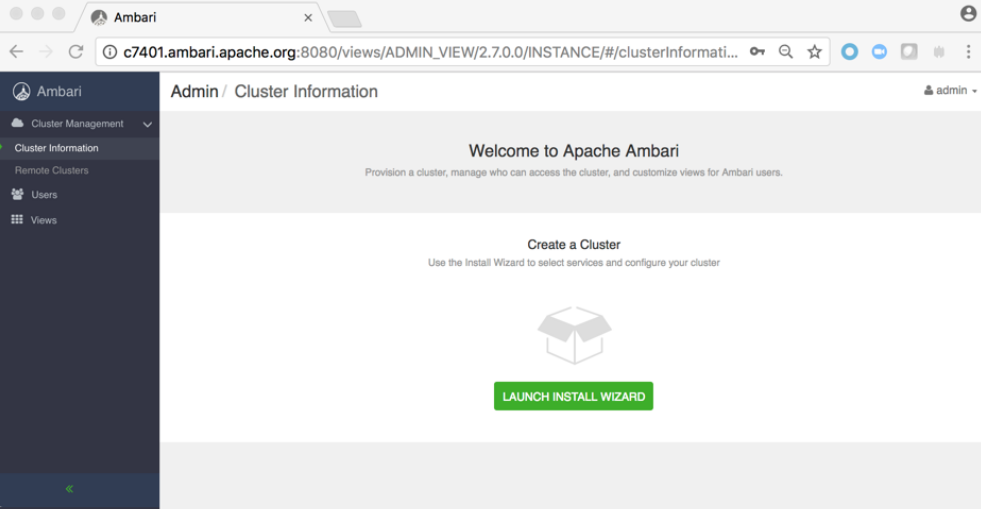
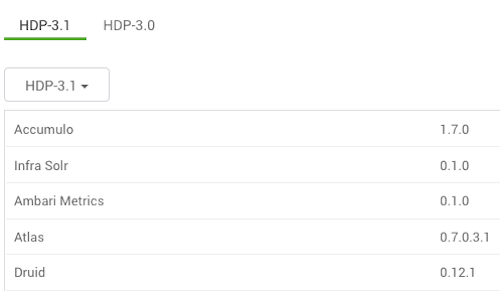
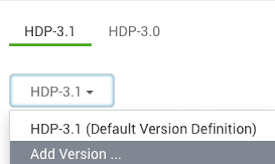
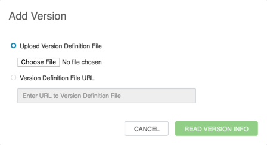

安装、配置和部署集群
================================================================================
## 1.启动Ambari服务器
+ 在Ambari Server主机上运行以下命令：
  ```shell
  ambari-server start
  ```
+ 要检查Ambari Server进程：
  ```shell
  ambari-server status
  ```
+ 要停止Ambari服务器：
  ```shell
  ambari-server stop
  ```
```
提示

如果您计划为Hive或Oozie使用现有数据库实例，则必须准备在安装Hadoop集群之前使用现有数据库。
```
在Ambari Server启动时，Ambari会运行数据库一致性检查以查找问题。如果发现任何问题，Ambari Server
启动将中止并显示以下消息：数据库配置一致性检查失败。Ambari将有关数据库一致性检查结果的更多详细信
息写入`/var/log/ambari-server/ambari-server-checkdatabase.log`文件。

您可以通过使用以下选项跳过此检查来强制Ambari Server启动：
```shell
ambari-server start --skip-database-check
```
如果您遇到数据库问题，请选择跳过此检查，**在更正数据库一致性问题之前，请不要对群集拓扑进行任何更
改或执行群集升级**。请联系Hortonworks支持并提供ambari-server-check-database.log输出以获
取帮助。

## 2.登录Apache Ambari

### 先决条件
Ambari Server必须正在运行。

使用Web浏览器登录Ambari Web：
### 第一步
1. 将您的Web浏览器指向
    ```
    http://<your.ambari.server>:8080
    ```
    其中`<your.ambari.server>`是ambari服务器主机的名称。
2. 使用默认用户名/密码登录Ambari服务器：**admin/admin**。您可以稍后更改这些凭据。对于新群集，
“群集安装”向导将显示“欢迎”页面。

## 3.启动Ambari群集安装向导
在Ambari Welcome页面中，选择Launch Install Wizard。



## 4.命名您的群集
1. 在“命名群集”中，键入要创建的群集的名称。名称中不能使用空格或特殊字符。
  ```
  提示

  如果您计划对群集进行Kerberize，请考虑限制群集名称（不超过12个字符），以适应Kerberos主体将附加到群集名称字符串并且某些身份
  提供者对总主体名称长度施加限制的事实。
  ```
2. 选择下一步。

## 5.选择版本
在此步骤中，您将选择群集的软件版本和交付方法。使用公共存储库需要Internet连接。使用本地存储库要求
您已在网络中可用的存储库中配置软件。

*1.选择堆栈*

可用版本显示在TAB中。当您选择TAB时，Ambari会尝试发现该堆栈的特定版本可用。该列表显示在DROPDOWN
中。对于该特定版本，将显示可用的服务，其中的版本显示在表中。



*2.选择版本*

如果Ambari可以访问Internet，则特定版本将在DROPDOWN中列为选项。如果您有未列出的版本的版本定义
文件，则可以单击 *添加版本*...并上载VDF文件。此外，如果您无法访问Internet或不确定要安装哪个特
定版本，则列表中还会包含 *默认版本定义*。
```
提示

如果您的Ambari服务器可以访问Internet但必须通过Internet代理服务器，请确保为Internet代理设置Ambari服务器。
```


*3.选择存储库*

Ambari为您提供了从公共存储库（如果您可以访问Internet）或本地存储库安装软件的选择。无论您选择哪
种方式，都可以编辑存储库的基本URL。将显示可用的操作系统，您可以从列表中添加/删除操作系统以适合您
的环境。

UI显示基于操作系统系列（OS系列）的存储库基本URL。请务必根据您运行的操作系统设置正确的OS系列。

| OS | 适用操作系统 |
| :------------- | :------------- |
| redhat7 | Red Hat7、CentOS 7、Oracle Linux 7、Amazon Linux 2 |
| sles12 | SUSE Linux Enterprise Server 12 |
| ubuntu14 | Ubuntu 14 |
| ubuntu16 | Ubuntu 16 |
| ubuntu18 | Ubuntu 18 |
| debian9 | Debian 9 |

*4.高级选项*

有高级存储库选项可用：
+ **跳过存储库基本URL验证（高级）**：单击“下一步”时，Ambari将尝试连接到存储库基本URL并验证您
是否已输入验证存储库。如果没有，将显示一个错误，您必须在继续之前纠正。
+ **使用RedHat Satellite/Spacewalk**：只有在计划使用本地存储库时才会启用此选项。为软件存储
库选择此选项时，您负责在Satellite/Spacewalk中配置存储库通道，并确认所选堆栈版本的存储库在群集
中的主机上可用。

### 1.使用本地RedHat Satellite或Spacewalk存储库
许多Ambari用户使用RedHat Satellite或Spacewalk来管理其群集中的操作系统存储库。配置Ambari以
使用Satellite或Spacewalk基础架构的一般过程是：
1. 确保已为与要使用的产品对应的公共存储库创建了通道。
2. 确保创建的通道在群集中的所有计算机上都可用。
3. 安装Ambari服务器并启动它。
4. 在开始集群安装之前，请更新Ambari，以便它知道不将存储库管理委派给Satellite或Spacewalk，并
在安装或升级软件包时使用适当的通道名称。
```
提示

在继续之前，请准备好您的通道名称。
```

#### 1.1.配置Ambari以使用RedHat Satellite或Spacewalk
`Ambari Server`使用版本定义文件（`VDF`）来了解版本中包含的产品和组件版本。为了使Ambari能够与
Satellite或Spacewalk良好协作，您必须为群集中的特定操作系统版本创建自定义VDF文件，以告知Ambari
在安装或升级群集时要使用哪些RedHat Satellite或Spacewalk通道名称。

要创建自定义VDF文件，我们建议将现有VDF从`HDP 3.1`存储库表下载到本地桌面。下载后，在首选编辑器
中打开VDF文件，并更改每个存储库的`<repoid/>`标记，以匹配先前配置的Satellite或Spacewalk通道
名称。在本例中，我在Satellite或Spacewalk中创建了以下频道：

Hortonworks存储库的示例通道名称:

| Hortonworks存储库 | RedHat Satellite或Spacewalk通道名称 |
| :------------- | :------------- |
| HDP-3.1.0.0 | hdp_3.1.0.0 |
| HDP-3.1-GPL* | hdp_3.1_gpl |
| HDP-UTILS-1.1.0.22 | hdp_utils_1.1.0.22 |

如果要在群集中使用LZO压缩，请参阅 [配置LZO压缩](https://docs.hortonworks.com/HDPDocuments/Ambari-2.7.3.0/administering-ambari/content/amb_configuring_lzo_compression.html) 以获取更多信息。
```xml
<repository-info>
    <os family="redhat7">
        <package-version>3_0_0_0_*</package-version>
        <repo>
            <baseurl>http://public-repo-1.hortonworks.com/HDP/centos7/3.x/updates/3.1.0.0</baseurl>
            <repoid>hdp_3.1.0.0</repoid>
            <reponame>HDP</reponame>
            <unique>true</unique>
        </repo>
        <repo>
            <baseurl>http://public-repo-1.hortonworks.com/HDP-GPL/centos7/3.x/updates/3.1.0.0</baseurl>
            <repoid>hdp_3.1_gpl</repoid>
            <reponame>HDP-GPL</reponame>
            <unique>true</unique>
            <tags>
                <tag>GPL</tag>
            </tags>
        </repo>
        <repo>
            <baseurl>http://public-repo-1.hortonworks.com/HDP-UTILS-1.1.0.22/repos/centos7</baseurl>
            <repoid>hdp_utils_1.1.0.22</repoid>
            <reponame>HDP-UTILS</reponame>
            <unique>false</unique>
        </repo>
    </os>
</repository-info>
```

#### 1.2.将自定义VDF导入Ambari
要将自定义VDF导入Ambari，请按照下列步骤操作：
1. 在群集安装向导的“*选择版本*”步骤中，单击列出HDP版本的下拉列表，然后选择“*添加版本*”。

    
    
2. 在添加版本中，选择 *上传版本定义文件*，然后单击 *选择文件*。浏览到本地桌面上已存储VDF文件的
目录，单击“*选择文件*”，然后单击“*读取版本信息*”。

    


## 6.安装选项


## 7.确认主机


## 8.选择服务


## 9.分配Masters


## 10.分配Slaves和客户端


## 11.自定义服务


## 12.Review


## 13.安装、启动和测试


## 14.完成
