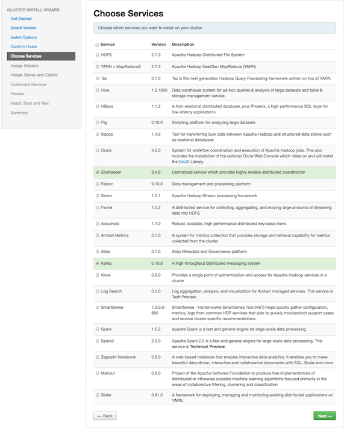
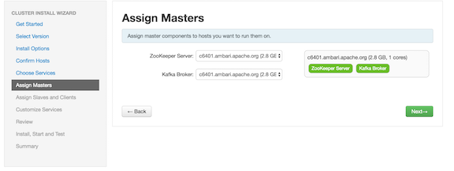
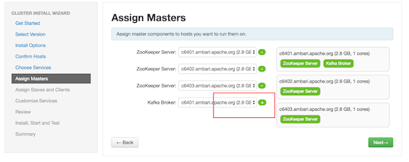
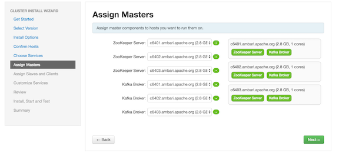
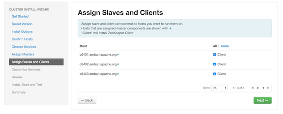
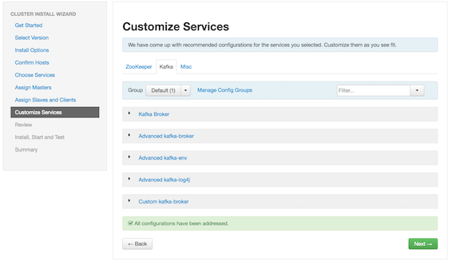

安装Kafka
================================================================================
虽然您可以在不受Ambari管理的群集上安装Kafka，但本章介绍如何在Ambari管理的群集上安装Kafka。

## 1.先决条件
在安装Kafka之前，必须在群集上安装并运行ZooKeeper。

请注意，以下基础文件系统支持与Kafka一起使用：
+ **EXT4**：支持和推荐
+ **EXT3**：支持
```
警告：
Kafka不支持加密文件系统，如SafenetFS。可能会发生索引文件损坏。
```

## 2.使用Ambari安装Kafka
部署并运行Kafka后，验证安装。您可以使用命令行界面创建Kafka主题，发送测试消息和使用消息。

程序:
1. 单击Ambari“*服务*”选项卡。
2. 在Ambari“*操作*”菜单中，选择“*添加服务*”。这将启动“*添加服务*”向导，显示“*选择服务*”页面。
默认情况下会启用某些服务。
3. 在“*选择服务*”页面上滚动浏览组件的字母列表，然后选择“*Kafka*”。

    

4. 单击“*下一步*”继续。
5. 在`Assign Masters`页面上，查看Kafka节点的节点分配。

    以下屏幕显示单节点Kafka群集的节点分配：

    

6. 如果您希望Kafka以高可用运行，则必须为Kafka brokers分配多个节点，从而使Kafka brokers在多
个节点上运行。

    单击“*+*”符号以向集群添加更多代理节点：

    

    以下屏幕显示了多节点Kafka群集的节点分配：

    

7. 单击“*下一步*”继续。
8. 在`Assign Slaves and Clients`页面上，选择要运行ZooKeeper客户端的节点：

    

9. 单击“*下一步*”继续。
10. Ambari显示“*自定义服务*”页面，其中列出了一系列服务：

    


dd
