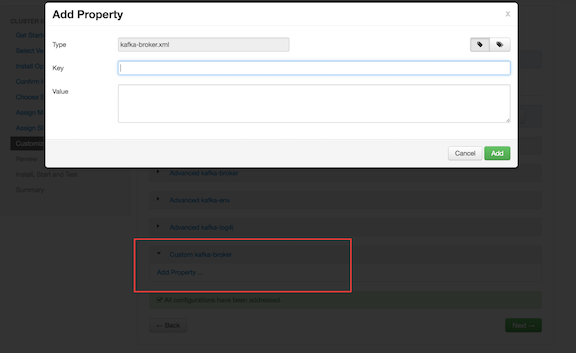

在Ambari管理的集群上自定义Kafka设置
================================================================================
要在Ambari安装过程中自定义配置设置，请单击“*自定义服务*”页面上的“*Kafka*”选项卡：

如果要在使用Ambari安装Kafka后访问配置设置：
1. 单击Ambari仪表板上的Kafka。
2. 选择配置。

要查看和修改设置，请滚动类别并展开类别（例如“*Kafka Broker*”，如图所示），或使用“过滤器”框搜
索属性。

高级`kafka-env`类别中的设置由Ambari配置; 你不应该修改这些设置：

dd
